---
paths:
  - "docs/**/*"
---

# Documentation Guidelines

Non-obvious conventions for writing Quokka documentation that renders correctly under mdBook.

## Math (MathJax)

Quokka uses a **custom MathJax setup** (`docs/javascripts/mathjax-init.js`) with `mathjax-support = false` in `book.toml`. This means mdBook's built-in math preprocessor is **disabled** — markdown processes inline math as regular text, and MathJax only sees whatever markdown leaves behind.

Two consequences follow, and both produce pages that build with exit 0 while rendering the wrong symbols:

1. `_..._` pairs are read as emphasis and become `<em>` tags.
2. CommonMark **unescapes a backslash before any ASCII punctuation**, so `\,` reaches MathJax as a bare `,`.

The only registered delimiters are `\(...\)` for inline math and `\[...\]` for display math. `$...$` is **not** a delimiter here.

### Display math

Use `<script type="math/tex; mode=display">` blocks. The custom init converts these to protected `<div>` elements before MathJax runs, preventing markdown from touching the content.

```html
<script type="math/tex; mode=display">
\frac{\partial N_\gamma}{\partial t} + \nabla \cdot \mathbf{F}_\gamma = \dot{N}^*_\gamma
</script>
```

- Content inside `<script>` tags is safe from markdown processing — underscores, braces, and backslashes all pass through untouched.
- For aligned equations, `\\[2pt]` works normally (no need to double-escape).

### Inline math

Use `\\(` and `\\)` delimiters. Two escaping rules apply inside them, and both exist because markdown gets one full pass at the content first.

**Rule 1 — escape every `_` as `\_`** to stop markdown reading `_..._` as emphasis.

```
\\(N\_\gamma\\) is the photon number density, with rate \\(\Gamma\_{\gamma {\rm H}^0} = c \sigma\_\gamma N\_\gamma\\).
```

- `\_` renders as a literal `_` in the HTML, which MathJax then reads as a subscript. The escape disappears and leaves exactly the operator you wanted.
- A single-underscore block like `\\(N\_\gamma\\)` is technically safe without escaping, but **always escape for consistency** — a second `_` added later in a copy-paste will silently break it.

**Rule 2 — double the backslash of any TeX macro whose next character is punctuation**: write `\\,`, `\\{`, `\\}`, `\\%`. Markdown collapses `\\` to one backslash, so MathJax receives the macro intact. Every row below builds cleanly and ships a wrong page:

| Written as | MathJax receives | Reader sees |
| ---------- | ---------------- | ----------- |
| `\,` | `,` | a stray **comma** where a thin space belonged |
| `\{` `\}` | `{` `}` | braces **vanish** (bare `{}` is TeX grouping, not a symbol) |
| `\%` | `%` | `%` opens a **TeX comment** that swallows the rest of the expression |

`\_` and `\^` are the deliberate exceptions to rule 2 — there the surviving bare character *is* the operator, so doubling them would print a literal underscore or caret.

```
correct:   \\(\rho\\,\kappa\_{\rm IR}\\,\hat c\\, t\\) and \\(+0.4\\%\\)
broken:    \\(\rho\,\kappa\_{\rm IR}\,\hat c\, t\\) and \\(+0.4\%\\)
```

When an expression needs so much doubling that it becomes unreadable, promote it to a display block instead — content inside `<script type="math/tex">` needs no doubling at all.

### Inline math in tables

Table cells need the same escaping:

```markdown
| \\(N\_\gamma\\) | Ionizing photon number density (\\(\mathrm{cm}^{-3}\\)) |
```

### Units in text

Wrap physical units in inline math with `\mathrm`:

```markdown
\\(\mathrm{cm}^{-3}\\)  or  \\(\mathrm{erg}\ \mathrm{g}^{-1}\ \mathrm{K}^{-1}\\)
```

Not plain-text `cm^-3` (the minus signs and superscripts won't render).

### `$...$` does not work

`$` is never registered as a delimiter, so `$R = R_\odot$` renders as those literal characters on the page. This slips in from copy-pasted LaTeX and from markdown editors that rewrite `\\(...\\)` into `\$...\$`. Neither form is valid here.

## Verifying a docs change

Build with `./scripts/bash/docs_build.sh` (needs `mdbook`, `mdbook-bib`, `mdbook-plantuml`; install once via `./scripts/bash/install_mdbook.sh`). Output goes to the untracked `docs/site/`.

A green build proves the book is structurally sound — every chapter resolves and `SUMMARY.md` is complete. It proves **nothing about the math**, because MathJax runs in the reader's browser and no TeX is ever parsed at build time. Never offer "the docs build cleanly" as evidence that an equation is correct.

Check the math separately:

```bash
python3 ~/superpowers/.claude/skills/quokka-feature/scripts/check_docs_math.py docs/markdown
python3 ~/superpowers/.claude/skills/quokka-feature/scripts/check_docs_math.py --fix docs/markdown/<file>.md
```

`--fix` only doubles eaten backslashes, which is mechanical and safe; it leaves `$...$` alone because converting those requires deciding between inline and display.

Reading the built HTML is not a substitute: `\(` in `docs/site/**/*.html` is MathJax's *input*, so the corruption above is still invisible there. To confirm what a reader actually sees, render the page's math through `mathjax-full` in Node and read back the output glyphs.

Because `create-missing = false`, adding a page means adding its `SUMMARY.md` entry in the same change — a dangling entry fails the build, and `scripts/check_mdbook_summary.py` fails on any page unreachable from `SUMMARY.md`.

## Citations

Use pandoc-style `[@key]` syntax. The bib file is `docs/markdown/references.bib`, processed by `mdbook-bib`.

```markdown
The method of [@Skinner_2019] is used for ...
```

- Citation keys are case-sensitive and match BibTeX keys exactly.
- Multiple citations: `[@CW84; @Toro2013]`.
- The bibliography renders on a dedicated page; reference it with `[References](bibliography.html)`.

## Diagrams

Use PlantUML in fenced code blocks:

````markdown

```plantuml
@startuml
skinparam ActivityBackgroundColor #F8F9FA
...
@enduml
```

````

The `plantuml` preprocessor (configured in `book.toml`) converts these to inline SVG via the public PlantUML server. Only use for non-sensitive code architecture diagrams.

## Cross-references

Internal links use relative paths from the markdown source:

```markdown
[installation guide](installation.md)
[Known Issues and Errata](known_issues.md)
```

Section anchors are auto-generated from headings (lowercase, hyphenated): `[VODE tolerances](photoionization.md#vode-tolerances)`.

## Images

Use relative paths into `docs/markdown/media/`:

```markdown

```

## heading structure

- `# Title` — page title (H1, one per file)
- `## Section` — major sections (H2)
- `### Subsection` — subsections (H3)
- `#### Minor heading` — used sparingly (H4)

Numbered sections (e.g., `## 1. Governing Equations`) are fine for physics documentation. Avoid going deeper than H4.
