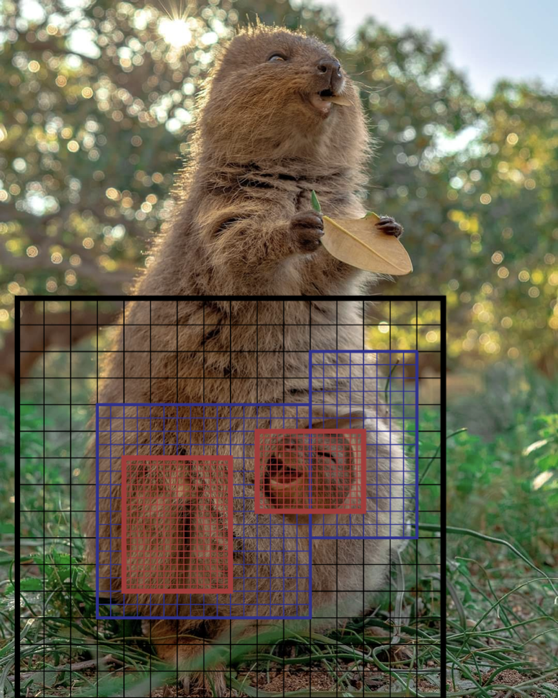

# QuokkaCode
PPM radiation hydrodynamics with patch-based AMR, written in C++.

*Patch-based AMR uses overlapping grids of different resolutions, just like this baby quokka overlaps with the parent quokka:*

