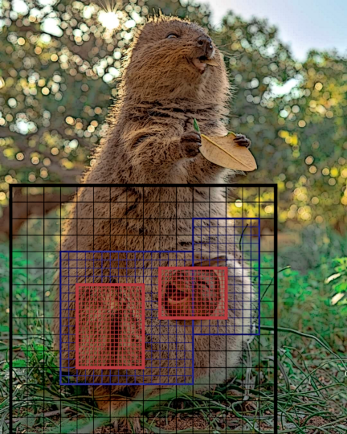

# Quokka
*Quadrilateral, Umbra-producing, Orthogonal, Kangaroo-conserving Kode for Astrophysics!*

NOTE: The code documentation is still a work in progress. Please open a Discussion for technical support, or open an Issue for any bug reports.

Quokka is a two-moment radiation hydrodynamics code that uses the piecewise-parabolic method, with AMR and subcycling in time. Runs on CPUs (MPI+vectorized) or NVIDIA GPUs (MPI+CUDA) with a single-source codebase. Written in C++17. (100% Fortran-free.)

...with advanced Adaptive Quokka Refinement:tm: technology:

