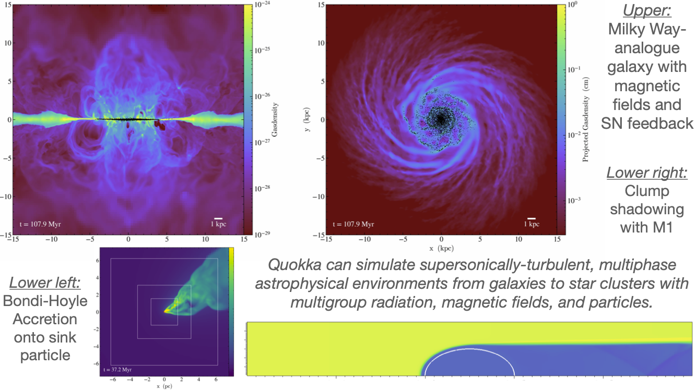

# QUOKKA
*Quadrilateral, Umbra-producing, Orthogonal, Kangaroo-conserving Kode for Astrophysics!*

**For detailed instructions on installing the code, please refer to the [Quokka Documentation](https://quokka-astro.github.io/quokka/index.html). You can start a [Discussion](https://github.com/BenWibking/quokka/discussions) for technical support, or open an [Issue](https://github.com/BenWibking/quokka/issues) for any bug reports.**

Quokka is a two-moment radiation hydrodynamics code that uses the piecewise-parabolic method, with AMR and subcycling in time. Runs on CPUs (MPI+vectorized) or NVIDIA GPUs (MPI+CUDA) with a single-source codebase. Written in C++20. (100% Fortran-free.)

This is a [a Kelvin-Helmholz instability simulated with Quokka](https://vimeo.com/714653592) on a 512x512 uniform grid:

## Dependencies
* C++ compiler (with C++20 support)
* CMake 3.16+
* Python 3.8+
* MPI library with GPU-aware support (OpenMPI, MPICH, or Cray MPI)
* HDF5 1.10+ (serial version)
* CUDA 12.0+ (optional, for NVIDIA GPUs)
* ROCm 6.3+ (optional, for AMD GPUs)
* ADIOS2 2.9+ with GPU-aware support (optional, for writing terabyte-sized or larger outputs)

## Problems?
If you run into problems, please start a [Discussion](https://github.com/BenWibking/quokka/discussions) for technical support. If you discover a bug, please let us know by opening an [Issue](https://github.com/BenWibking/quokka/issues). You can also join our [Zulip community](https://quokka-astro.zulipchat.com/join/3sahu2rgvkengbkzwkpndc5h/).

## Acknowledgements
We thank Kandra Labs, Inc. (“Zulip”) for providing hosted [Zulip](https://zulip.com/) chat for our open-source community.
