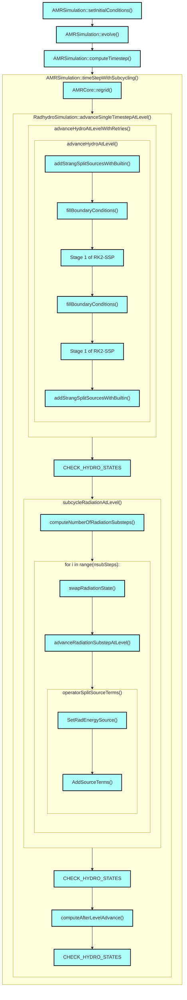

# Flowchart

```mermaid
%%{init: {
  'flowchart': {
    'rankSpacing': 25,
    'curve': 'natural',
    'padding': 15
  }
}}%%

flowchart TB
    %% Define styles
    classDef lightBlue fill:#B0FFFF,stroke:#000,stroke-width:2px
    
    %% Main flow
    A["AMRSimulation::setInitialConditions()"]:::lightBlue
    B["AMRSimulation::evolve()"]:::lightBlue
    C["AMRSimulation::computeTimestep()"]:::lightBlue
    
    %% Create the flow
    A --> B --> C
    
    %% Main timeStep subgraph
    subgraph timeStep ["AMRSimulation::timeStepWithSubcycling()"]
        direction TB
        D["AMRCore::regrid()"]:::lightBlue
        
        %% advanceSingleTimestep subgraph
        subgraph advanceSingle ["RadhydroSimulation::advanceSingleTimestepAtLevel()"]
            direction TB
            
            %% advanceHydro subgraph
            subgraph advanceHydro ["advanceHydroAtLevelWithRetries()"]
                direction TB
                
                subgraph innerAdvance ["advanceHydroAtLevel()"]
                    direction TB
                    H1["addStrangSplitSourcesWithBuiltin()"]:::lightBlue
                    H2["fillBoundaryConditions()"]:::lightBlue
                    H3["Stage 1 of RK2-SSP"]:::lightBlue
                    H4["fillBoundaryConditions()"]:::lightBlue
                    H5["Stage 1 of RK2-SSP"]:::lightBlue
                    H6["addStrangSplitSourcesWithBuiltin()"]:::lightBlue
                    
                    H1 --> H2 --> H3 --> H4 --> H5 --> H6
                end
            end
            
            E["CHECK_HYDRO_STATES"]:::lightBlue
            
            %% Subcycle radiation subgraph
            subgraph subcycle ["subcycleRadiationAtLevel()"]
                direction TB
                F1["computeNumberOfRadiationSubsteps()"]:::lightBlue
                
                subgraph forLoop ["for i in range(nsubSteps):"]
                    direction TB
                    G1["swapRadiationState()"]:::lightBlue
                    G2["advanceRadiationSubstepAtLevel()"]:::lightBlue
                    
                    subgraph operator ["operatorSplitSourceTerms()"]
                        direction TB
                        K1["SetRadEnergySource()"]:::lightBlue
                        K2["AddSourceTerms()"]:::lightBlue
                        
                        K1 --> K2
                    end
                    
                    G1 --> G2 --> operator
                end
                
                F1 --> forLoop
            end
            
            I["CHECK_HYDRO_STATES"]:::lightBlue
            J["computeAfterLevelAdvance()"]:::lightBlue
            K["CHECK_HYDRO_STATES"]:::lightBlue
            
            advanceHydro --> E --> subcycle --> I --> J --> K
        end
        
        D --> advanceSingle
    end
    
    C --> timeStep
```

Download the flowchart as a PDF: [quokka-flowchart.pdf](flowchart-v2.pdf)
