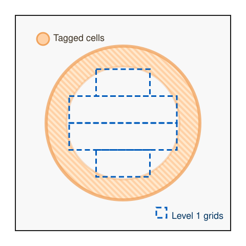

# Adaptive Mesh Refinement Guidelines

Quokka relies on the Berger-Collela AMR algorithm [@berger1989local] provided by AMReX to create a hierarchy of nested grids. This page distills practical advice for planning and tuning AMR runs so the mesh tracks the physics you care about without wasting resolution elsewhere.

## Understanding the Refinement Workflow

AMReX walks through a predictable sequence each time it builds or adjusts the mesh hierarchy. Cells are tagged inside `ErrorEst`, those tags are coarsened according to `blocking_factor/ref_ratio`, clustered by the Berger-Rigoutsos algorithm [@berger1991algorithm], and then promoted to new grids that honor `blocking_factor` and `max_grid_size`. The resulting hierarchy is averaged down so coarse levels remain consistent with fine ones. Keeping this loop in mind helps interpret why the mesh responds the way it does when the problem evolves or when you revisit the `ErrorEst` logic.

## Setting AMR Parameters

Several inputs shape how aggressively the hierarchy responds to refinement tags:

| Parameter | Description | Typical Values | Performance Impact |
|-----------|-------------|----------------|-------------------|
| `blocking_factor` | Minimum grid dimension; grids must be integer multiples of this value | 8-32 | Large values improve GPU throughput but can force broad refinement |
| `grid_efficiency` | Minimum fraction of tagged cells in each grid | 0.7-1.0 | Higher values reduce wasted work yet may spawn extra boxes |
| `max_grid_size` | Maximum dimension of a grid patch | 64-128 | Smaller sizes improve load balance; larger sizes cut communication |
| `ref_ratio` | Refinement ratio between adjacent levels | 2 or 4 | Larger ratios sharpen features faster but deepen the hierarchy |

Choose these controls as a set: a generous `blocking_factor` demands tighter tagging or higher `grid_efficiency` to avoid carpet refinement, while a smaller blocking factor allows surgical meshes but can stress GPUs. When in doubt, run short experiments that sweep one parameter at a time and compare the resulting plotfile headers to see how many grids are created per level.

## Performance and Scaling Considerations

GPU runs typically favor `blocking_factor ≥ 32` so each patch keeps SMs busy; values below 32 almost always break memory coalescing across a warp and leave expensive kernels underutilized even when occupancy looks fine. CPU multigrid solves prefer at least 8. If you push those limits, guard your memory footprint by trimming the number of refinement levels or enlarging `max_grid_size` so patches do not proliferate. Also watch how frequently you trigger `regrid` calls—rapid regridding magnifies the cost of tag evaluation and repartitioning, so coarse control logic or hysteresis in `ErrorEst` can pay dividends on very dynamic problems.

## Observing and Adjusting the Hierarchy

Inspect the grid structure early in a run by opening the plotfile header or by enabling verbose regridding logs in AMReX. When the layout diverges from expectations, compare the tagged volume to the resulting grid inventory—discrepancies usually trace back to either tag dilution during coarsening or to efficiency limits that extend each patch. The spherical collapse study documented in [GitHub issue #978](https://github.com/quokka-astro/quokka/issues/978) is a useful reminder that large blocking factors can still trigger whole-domain refinement if tags are sparse, so monitor that scenario whenever you upscale a production run.

### Example: Berger-Rigoutsos in Practice

Compile Quokka with `-DAMReX_SPACEDIM=2`, then run the HydroBlast2D driver with the bundled `inputs/blast2d_amr_example.in`. That input sets `amr.n_cell = 128 128 4`, `amr.ref_ratio = 2 2 1`, `amr.blocking_factor = 32 32 4`, `amr.grid_eff = 0.8`, and `amr.n_error_buf = 1`. The third entry in each list is ignored in 2D, so the effective blocking factor is 32. The pressure-gradient trigger in `ErrorEst` tags a thin ring around the blast front. AMReX coarsens those tags by 16 cells before clustering, so the Berger-Rigoutsos pass finds four rectangles that tile the annulus: two long bands `(lo, hi) = (64,96)→(191,127)` and `(64,128)→(191,159)` plus two shorter bridges `(96,64)→(159,95)` and `(96,160)→(159,191)`. Running `amrex_fboxinfo --full plt00040` on the resulting plotfile shows the same coordinates, confirming that the level-one patches are multiples of 32 cells in each direction and fully envelop the tagged region after refinement. Comparing those boxes with the tags in the plotfile (as sketched above) is a quick way to verify that the clustering step is behaving the way you expect.

## Troubleshooting Patterns

Start with the simplest levers. Reduce `blocking_factor` temporarily to verify the tagging logic, then restore the larger production value once you confirm the tags are reasonable. Next, nudge `grid_efficiency` upward until the refined region stabilizes without spawning many more boxes. If the hierarchy thrashes between steps, consider caching diagnostic arrays that record why cells were tagged; a quick visualization of those masks often pinpoints whether gradients, thresholds, or boundary effects are misbehaving.

## Further Reading

For deeper dives into refinement theory and AMReX implementation details, consult the original Berger & Colella paper [@berger1989local], the Berger-Rigoutsos clustering method [@berger1991algorithm], and the [AMReX-Astro Castro regridding notes](https://amrex-astro.github.io/Castro/docs/regridding.html). The [AMReX source documentation](https://github.com/AMReX-Codes/amrex) also clarifies lower-level options that Quokka exposes through its input files.
