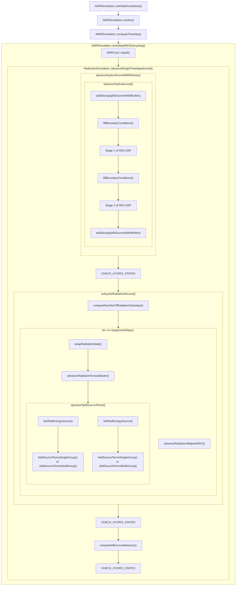

# Flowchart

```mermaid
%%{init: {
  'flowchart': {
    'rankSpacing': 25,
    'curve': 'natural',
    'padding': 15
  }
}}%%

flowchart TB
    %% Main flow
    A["AMRSimulation::setInitialConditions()"]
    B["AMRSimulation::evolve()"]
    C["AMRSimulation::computeTimestep()"]
    
    %% Create the flow
    A --> B --> C
    
    %% Main timeStep subgraph
    subgraph timeStep ["AMRSimulation::timeStepWithSubcycling()"]
        direction TB
        D["AMRCore::regrid()"]
        
        %% advanceSingleTimestep subgraph
        subgraph advanceSingle ["RadhydroSimulation::advanceSingleTimestepAtLevel()"]
            direction TB
            
            %% advanceHydro subgraph
            subgraph advanceHydro ["advanceHydroAtLevelWithRetries()"]
                direction TB
                
                subgraph innerAdvance ["advanceHydroAtLevel()"]
                    direction TB
                    H1["addStrangSplitSourcesWithBuiltin()"]
                    H2["fillBoundaryConditions()"]
                    H3["Stage 1 of RK2-SSP"]
                    H4["fillBoundaryConditions()"]
                    H5["Stage 2 of RK2-SSP"]
                    H6["addStrangSplitSourcesWithBuiltin()"]
                    
                    H1 --> H2 --> H3 --> H4 --> H5 --> H6
                end
            end
            
            E["CHECK_HYDRO_STATES"]
            
            %% Subcycle radiation subgraph
            subgraph subcycle ["subcycleRadiationAtLevel()"]
                direction TB
                F1["computeNumberOfRadiationSubsteps()"]
                
                subgraph forLoop ["for i in range(nsubSteps):"]
                    direction TB
                    G1["swapRadiationState()"]
                    G2["advanceRadiationForwardEuler()"]

                    subgraph operator ["operatorSplitSourceTerms()"]
                        direction TB
                        K1["SetRadEnergySource()"]
												K2["AddSourceTermsSingleGroup() or AddSourceTermsMultiGroup()"]
                        K1 --> K2
                    end
                    
										G5["advanceRadiationMidpointRK2()"]

                    subgraph operator ["operatorSplitSourceTerms()"]
                        direction TB
                        K3["SetRadEnergySource()"]
												K4["AddSourceTermsSingleGroup() or AddSourceTermsMultiGroup()"]
                        K3 --> K4
                    end
                    
                    G1 --> G2 --> operator
                end
                
                F1 --> forLoop
            end
            
            I["CHECK_HYDRO_STATES"]
            J["computeAfterLevelAdvance()"]
            K["CHECK_HYDRO_STATES"]
            
            advanceHydro --> E --> subcycle --> I --> J --> K
        end
        
        D --> advanceSingle
    end
    
    C --> timeStep
```
