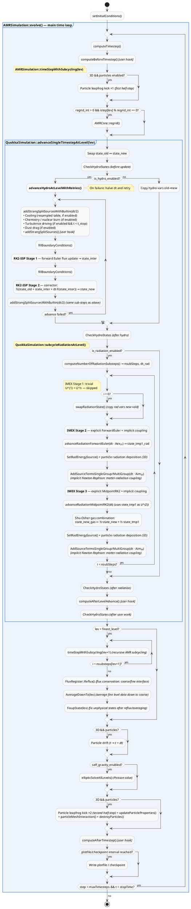

# Flowchart

```plantuml
@startuml
skinparam ActivityBackgroundColor #F8F9FA
skinparam ActivityBorderColor #9E9E9E
skinparam PartitionBackgroundColor #EEF4FB
skinparam PartitionBorderColor #2979FF
skinparam PartitionFontStyle bold
skinparam NoteBackgroundColor #FFF9C4
skinparam NoteBorderColor #F9A825
skinparam ArrowColor #424242
skinparam ActivityFontSize 13

start

:setInitialConditions();

partition "AMRSimulation::evolve() — main time loop" {
  repeat
    :computeTimestep();
    :computeBeforeTimestep() //[user hook]//;
    if (3D && particles enabled?) then (yes)
      :Particle leapfrog kick ×1 //(first half-step)//;
    endif

    note right
      **AMRSimulation::timeStepWithSubcycling(lev)**
    end note
    if (regrid_int > 0 && istep[lev] % regrid_int == 0?) then (yes)
      :AMRCore::regrid();
    endif

    partition "QuokkaSimulation::advanceSingleTimestepAtLevel(lev)" {
      :Swap state_old ↔ state_new;
      :CheckHydroStates //(before update)//;

      if (is_hydro_enabled?) then (yes)
        :**advanceHydroAtLevelWithRetries()**;
        note right
          On failure: halve dt and retry
        end note
        repeat
          :addStrangSplitSourcesWithBuiltin(dt/2)\n• Cooling (resampled table, if enabled)\n• Chemistry / nuclear burn (if enabled)\n• Turbulence driving (if enabled && t < t_stop)\n• Dust drag (if enabled)\n• addStrangSplitSources() //[user hook]//;
          :fillBoundaryConditions();
          :**RK2-SSP Stage 1** — forward Euler flux update → state_inter;
          :fillBoundaryConditions();
          :**RK2-SSP Stage 2** — corrector:\n½(state_old + state_inter + dt·F(state_inter)) → state_new;
          :addStrangSplitSourcesWithBuiltin(dt/2) //(same sub-steps as above)//;
        repeat while (advance failed?) is (yes)
        -> no;
      else (no)
        :Copy hydro vars old→new;
      endif

      :CheckHydroStates //(after hydro)//;

      if (is_radiation_enabled?) then (yes)
        note right
          **QuokkaSimulation::subcycleRadiationAtLevel()**
        end note
        :computeNumberOfRadiationSubsteps() → nsubSteps, dt_rad;
        repeat
          if (i > 0?) then (yes)
            :swapRadiationState() //(copy rad vars new→old)//;
          endif
          note right
            IMEX Stage 1: trivial
            U^(1) = U^n — skipped
          end note
          :**IMEX Stage 2** — explicit ForwardEuler + implicit coupling;
          :advanceRadiationForwardEuler(dt · Aex₂₁) → state_tmp1_rad;
          :SetRadEnergySource() + particle radiation deposition //(3D)//;
          :AddSourceTermsSingleGroup/MultiGroup(dt · Aim₂₂)\n//(implicit Newton–Raphson: matter–radiation coupling)//;
          :**IMEX Stage 3** — explicit MidpointRK2 + implicit coupling;
          :advanceRadiationMidpointRK2(dt) //(uses state_tmp1 as U^(2))//;
          :Shu-Osher gas combination:\nstate_new_gas ← ½·state_new + ½·state_tmp1;
          :SetRadEnergySource() + particle radiation deposition //(3D)//;
          :AddSourceTermsSingleGroup/MultiGroup(dt · Aim₃₃)\n//(implicit Newton–Raphson: matter–radiation coupling)//;
        repeat while (i < nsubSteps?) is (yes)
        -> no;
      endif

      :CheckHydroStates //(after radiation)//;
      :computeAfterLevelAdvance() //[user hook]//;
      :CheckHydroStates //(after user work)//;
    }

    if (lev < finest_level?) then (yes)
      repeat
        :timeStepWithSubcycling(lev+1) //(recursive AMR subcycling)//;
      repeat while (i < nsubsteps[lev+1]?) is (yes)
      -> no;
      :FluxRegister::Reflux() //(flux conservation: coarse/fine interface)//;
      :AverageDownTo(lev) //(average fine level data down to coarse)//;
      :FixupState(lev) //(fix unphysical states after reflux/averaging)//;
    endif

    if (3D && particles?) then (yes)
      :Particle drift //(t → t + dt)//;
    endif
    if (self_gravity_enabled?) then (yes)
      :ellipticSolveAllLevels() //(Poisson solve)//;
    endif
    if (3D && particles?) then (yes)
      :Particle leapfrog kick ×2 //(second half-step)// + updateParticleProperties()\n+ particleMeshInteraction() + destroyParticles();
    endif
    :computeAfterTimestep() //[user hook]//;
    if (plotfile/checkpoint interval reached?) then (yes)
      :Write plotfile / checkpoint;
    endif

  repeat while (step < maxTimesteps && t < stopTime?) is (yes)
  -> no;
}

stop
@enduml
```
