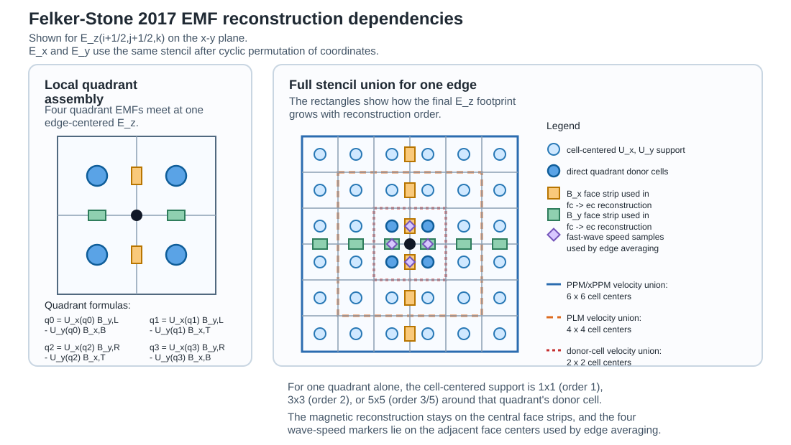

# Felker-Stone 2017 EMF Stencil

This note summarizes the actual array dependencies in `MHDSystem::ComputeEMF_FelkerStone2017` for one edge-centered EMF. The figure is drawn for
`E_z(i+1/2,j+1/2,k)` on the x-y plane; `E_x` and `E_y` use the same stencil after a cyclic permutation of the coordinates.

The code path is:

- `MHDSystem::ComputeEMF_FelkerStone2017` in `src/hydro/mhd_system.hpp`
- `MHDSystem::ReconstructTo` in `src/hydro/mhd_system.hpp`
- `HyperbolicSystem::ReconstructStatesConstant`, `ReconstructStatesPLM`, `ReconstructStatesPPM`, and `ReconstructStatesPPM_EP` in `src/hyperbolic_system.hpp`

The implementation first converts cell-centered conserved variables to cell-centered velocities, reconstructs the two transverse velocity components to the edge with both permutations
`cc -> fc[x] -> ec[y]` and `cc -> fc[y] -> ec[x]`, and averages the two paths. The two transverse magnetic-field components are reconstructed directly from face center to edge center.
Four quadrant EMFs are then formed around the edge and averaged with either the Londrillo-Del Zanna (2004) or Balsara (2025) edge-average.

For `E_z`, the quadrant assembly is

- `q0 (-,-)`: `U_x(q0) * B_y,L - U_y(q0) * B_x,B`
- `q1 (-,+)`: `U_x(q1) * B_y,L - U_y(q1) * B_x,T`
- `q2 (+,+)`: `U_x(q2) * B_y,R - U_y(q2) * B_x,T`
- `q3 (+,-)`: `U_x(q3) * B_y,R - U_y(q3) * B_x,B`

## Order-dependent footprint

Per quadrant, the cell-centered velocity support is centered on that quadrant's donor cell:

- Order 1: `1 x 1`
- Order 2 (PLM): `3 x 3`
- Order 3 (PPM): `5 x 5`
- Order 5 (xPPM / `PPM_EP`): `5 x 5`

Because the final edge EMF uses all four quadrants, the full union at one edge becomes:

| Reconstruction order | Velocity footprint union | Magnetic-face footprint union |
| --- | --- | --- |
| 1 | `2 x 2` cell centers | 2 samples on each central face strip |
| 2 | `4 x 4` cell centers | 4 samples on each central face strip |
| 3 or 5 | `6 x 6` cell centers | 6 samples on each central face strip |

The face-centered magnetic support stays on the two face strips that intersect at the target edge:

- `B_x` is reconstructed along the central x-face strip `x = i+1/2`
- `B_y` is reconstructed along the central y-face strip `y = j+1/2`

The upwind edge average adds only local face wave-speed data adjacent to the edge. For the natural transverse plane of a given edge component, there is no out-of-plane dependency in the `FelkerStone2017` implementation. If a different edge component is projected onto the wrong 2D plane for visualization, those off-plane inputs should be shaded differently; the figure legend reserves gray nodes for that case.
