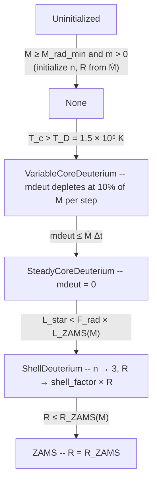

# Particles, star formation and feedback

## Star Particle Type

Star particles model individual protostars forming from gravitational collapse. Unlike `StochasticStellarPop` particles, each Star particle represents a single star and evolves through a physically-detailed protostellar model tracking deuterium burning, radius evolution, and luminosity.

### Particle Attributes

Each Star particle stores $13 + N_\text{groups}$ real-valued components and 1 integer component, where $N_\text{groups}$ is the number of radiation frequency groups:

| Index | Name | Description |
|-------|------|-------------|
| 0 | `mass` | Current particle mass ($M_\star$) |
| 1 | `vx` | Velocity $x$-component |
| 2 | `vy` | Velocity $y$-component |
| 3 | `vz` | Velocity $z$-component |
| 4 | `birth_time` | Simulation time when the particle formed |
| 5 | `death_time` | Reserved for future use (initialized to $-1$) |
| 6 | `amx` | Angular momentum $x$-component |
| 7 | `amy` | Angular momentum $y$-component |
| 8 | `amz` | Angular momentum $z$-component |
| 9 | `mdeut` | Deuterium mass reservoir |
| 10 | `n` | Polytropic index ($1.5 \leq n \leq 3.0$) |
| 11 | `mdot` | Mass accretion rate (set by the accretion module) |
| 12 | `radius` | Stellar radius $R_\star$ (persistent; updated by state transitions) |
| 13 … $12 + N_\text{groups}$ | `lum`, `lum_1`, … | Luminosity per radiation group (updated every timestep) |

The `lum` field occupies the last $N_\text{groups}$ slots, matching the layout convention of `CICRad` particles.

The integer component stores the **burning state** (index 0):

| Value | Name | Description |
|-------|------|-------------|
| 0 | `Uninitialized` | Newly created; stellar model not yet started |
| 1 | `None` | Gravitational contraction; no nuclear burning |
| 2 | `VariableCoreDeuterium` | Core deuterium burning at variable rate |
| 3 | `SteadyCoreDeuterium` | Steady-state core deuterium burning |
| 4 | `ShellDeuterium` | Shell deuterium burning; inflated radius |
| 5 | `ZAMS` | Zero-Age Main Sequence reached |

### Formation

Star particles form from Jeans-unstable cells using the same instability criterion as Sink particles: a cell is eligible when its density exceeds the local Jeans density,

$$
\rho_J = \frac{\pi c_s^2}{G \lambda_J^2} \quad \text{with} \quad \lambda_J = J \cdot \Delta x, \quad J = 0.25.
$$

When formation triggers, the excess mass $(\rho_\text{cell} - \rho_J) \Delta V$ is removed from the gas and placed in a new Star particle at the cell center. The particle is initialized with `burn_state = Uninitialized`, `mdeut = mass`, `n = 1.5`, and `mdot = 0`.

### Stellar Structure Model

The stellar interior is approximated by a **polytropic model** with index $n$. The polytropic index traces the internal entropy state of the star and lies in the range $[1.5, 3.0]$:

- $n = 1.5$: fully convective (pre-main-sequence default)
- $n = 3.0$: radiation-pressure dominated (near ZAMS for massive stars)

**Radius initialization.** When a particle first leaves the `Uninitialized` state, the stellar radius is initialized from the accretion rate using an empirical fit:

$$
R_\star = R_\odot \cdot \max\!\left(2,\; 2.5 \left(\frac{\dot{M}}{10^{-5}\,M_\odot\,\text{yr}^{-1}}\right)^{0.2}\right).
$$

The radius is stored as a persistent particle field (`radius`, index 13) and subsequently modified only by specific state transitions (see below), not recomputed every timestep.

**Polytropic index initialization.** The initial $n$ is set from the accretion rate:

$$
\alpha_G = 1.475 + 0.07 \log_{10}\!\left(\frac{\dot{M}}{M_\odot\,\text{yr}^{-1}}\right), \quad n = \text{clamp}\!\left(5 - \frac{3}{\alpha_G},\; 1.5,\; 3.0\right).
$$

**Central conditions.** Given the polytropic structure, the central density and pressure are obtained from pre-tabulated Lane-Emden factors $(\rho_\text{mean}/\rho_c)$ and $(P_c / (G M^2 / R^4))$ interpolated over $n \in [1.5, 3.0]$. The central temperature is then solved from the full equation of state

$$
P_c = \frac{\rho_c k_B T_c}{\mu m_H} + \frac{a T_c^4}{3}
$$

using a bisection solver.

### Burning State Transitions

The protostellar evolution advances through the following state machine each timestep. The stellar model activates once $M_\star \geq M_\text{rad,min} = 0.01\,M_\odot$ and $\dot{M} > 0$:



The radius $R_\star$ is updated at three transition points only:
- **Uninitialized → None**: $R_\star$ is initialized with the empirical fit from $\dot{M}$.
- **SteadyCoreDeuterium → ShellDeuterium**: $R_\star \mathrel{\times}= \text{shell\_factor} = 2.1$ (inflated radius for shell burning).
- **ShellDeuterium → ZAMS**: $R_\star = R_\text{ZAMS}(M)$ (Tout et al. 1996 fitting formula).

Key parameters:

| Symbol | Value | Description |
|--------|-------|-------------|
| $T_D$ | $1.5 \times 10^6$ K | Deuterium ignition temperature |
| $F_\text{rad}$ | $0.33$ | Radiative barrier fraction |
| shell_factor | $2.1$ | Radius inflation in shell-burning phase |
| $M_\text{rad,min}$ | $0.01\,M_\odot$ | Minimum mass to start stellar model |

### Luminosity

The total luminosity stored in `lum` is updated at the end of every stellar property update:

$$
L_\text{total} = L_\star + L_\text{disk}
$$

**Stellar luminosity** combines the ZAMS luminosity with accretion heating, clamped at the Hayashi limit ($T_\text{Hayashi} = 3000$ K):

$$
L_\star = \max\!\left(L_\text{ZAMS}(M) + F_\text{acc} F_k \frac{G M \dot{M}}{R},\quad 4\pi R^2 \sigma_\text{SB} T_\text{Hayashi}^4\right)
$$

where $F_\text{acc} = 0.5$ is the fraction of accreted energy radiated and $F_k = 0.5$ is the fraction of accretion energy intercepted from the inner disk.

**Disk luminosity** from the outer disk:
$$
L_\text{disk} = (1 - F_k) \frac{G M \dot{M}}{R}
$$

**ZAMS luminosity and radius** follow the polynomial fitting formulae of Tout et al. (1996).

Luminosity is zero for `Uninitialized` particles. It becomes non-zero once the stellar model activates and is stored in the `lum` particle field after each call to `updateStellarProperties`.

### Update Sequence

The stellar property update is operator-split from the hydrodynamics and runs once per coarse timestep:

1. Hydrodynamics advances the gas state by $\Delta t$
2. Accretion computes the new $\dot{M}$ and updates $M_\star$
3. `updateStellarProperties` runs per-particle:
   - Reads current $M$, $\dot{M}$, $n$, $R_\star$, `mdeut`, `burn_state`
   - If `Uninitialized` and conditions not met: returns early (no state change)
   - On first activation: initializes $n$ and $R_\star$ from $\dot{M}$
   - Advances `burn_state`; updates `mdeut`; updates $R_\star$ at state transitions
   - Computes and stores luminosity in `lum` and radius in `radius`
4. Radiation from the luminosity is deposited into the radiation field

### Physical Model Parameters

| Parameter | Symbol | Value | Description |
|-----------|--------|-------|-------------|
| $F_\text{acc}$ | — | $0.5$ | Fraction of accreted energy radiated by the star |
| $F_k$ | — | $0.5$ | Fraction of accretion energy from inner disk |
| $F_\text{rad}$ | — | $0.33$ | Radiative barrier for ZAMS transition |
| $T_D$ | — | $1.5 \times 10^6$ K | Deuterium ignition temperature |
| $T_\text{Hayashi}$ | — | $3000$ K | Hayashi track temperature limit |
| shell_factor | — | $2.1$ | Radius multiplier entering shell-burning phase |
| $\mu$ | — | $0.613$ | Mean molecular weight |

### Test Problem

The `ParticleStar` problem provides a canonical validation test. A $32^3$ uniform grid with one super-Jeans-density cell creates a single Star particle in the first timestep. The test validates:

- Mass conservation to machine precision during formation and accretion
- Correct burn state progression from `Uninitialized` after accretion begins
- Stored luminosity consistency with the `StellarPhysics` recomputation (within 1% to account for the one-timestep lag between accretion and the property update)
- Polytropic index remaining in the valid range $[1.5, 3.0]$

---

## StochasticStellarPop Particle Type

StochasticStellarPop particles carry the following real-valued attributes:

- **Mass**: Current particle mass ($M_{\star}$)
- **Velocity**: Three-dimensional velocity vector $(v_x, v_y, v_z)$
- **Birth time**: Simulation time when the particle formed
- **Death time**: When the particle explodes as a supernova
- **Mass at birth**: Initial mass before mass loss
- **Luminosity**: Radiation luminosity (if radiation is enabled)

Each particle also stores an integer **evolution stage** that tracks its lifecycle:

- `SNProgenitor`: High-mass star ($M > 8 M_{\odot}$) that will explode as a supernova
- `SNRemnant`: Compact remnant left after supernova explosion
- `LowMassStar`: Low-mass star that will not explode (not used in the current star formation implementation)
- `LowMassComposite`: Composite particle representing a population of low-mass stars

## Star Formation

### Overview

The star formation module adds star particles through a stochastic prescription that plugs into the Stochastic Stellar Population specialisation.

- Runs once per hydro timestep and evaluates each cell independently.
- Always spawns a `LowMassComposite` particle when star formation is triggered.
- Adds high-mass particles ($> 8~M_{\odot}$) probabilistically so the Chabrier (2005) initial mass function (IMF) is satisfied in expectation.

### Jeans instability filter

Eligible cells are first identified through a Jeans-length check before any stochastic sampling occurs.

- Compute the Jeans density $\rho_J = J^2 \pi c_{\text{eff}}^2 / (G \Delta x^2)$, where $J = 0.25$ is the Jeans number and $c_{\text{eff}} = c_s \sqrt{1 + 0.74 / \beta}$ is the effective sound speed, accounting for thermal pressure and magnetic pressure with $\beta = P_{\text{thermal}} / P_{\text{magnetic}}$.
- Mark the cell as eligible when $\rho > \rho_J$.
- Only eligible cells continue to the sampling steps below.

### Controlling the formation rate

Two efficiency parameters tune how aggressively eligible gas is converted into star particles during each hydro step.

- \(\epsilon_{ff}\): efficiency per free-fall time, defined through \(\epsilon_{ff} = (\dot M_{\star} \, t_{ff}) / (M_{cell} \, \Delta t)\).
- \(\epsilon_{\star}\): fraction of the cell mass used when a particle is spawned.
- The target stellar mass for the step is \(\epsilon_{ff} M_{cell} (\Delta t / t_{ff})\).
- Bernoulli probability for spawning: \( P = \frac{\epsilon_{ff}}{\epsilon_{\star}} \frac{\Delta t}{t_{ff}} \).
- The expectation value \(\langle M_{\star} \rangle = P \epsilon_{\star} M_{cell}\) matches the target mass provided \(\Delta t < t_{ff}\); the CFL condition typically enforces that inequality.

### Sampling the stellar population

Once a cell passes the filter and the Bernoulli draw succeeds, we construct the composite stellar population represented by the spawned particles.

- Every accepted draw creates one low-mass particle that represents all stars with \(M < 8 M_{\odot}\).
- High-mass stars follow the Chabrier (2005) IMF: log-normal below \(1 M_{\odot}\) and a slope of \(2.35\) above it.
- Pre-computed IMF integrals provide the mass fraction \(f_{\star,high}\) and mean mass \(\langle m \rangle_{\star,high}\) of the high-mass component.
- The expected number of massive stars is \(f_{\star,high} \epsilon_{\star} M_{cell} / \langle m \rangle_{\star,high}\); a Poisson variate with that mean sets the actual count.
- Each massive star draws its mass from the high-mass end of the IMF, while the low-mass particle retains the remaining fraction \(1 - f_{\star,high}\) of the spawned mass.
- If the Poisson draw returns zero, only the low-mass particle is inserted and it inherits the local gas velocity.

### Assigning particle velocities

Sampled star particles receive velocities that combine the local bulk flow with an isotropic runaway kick.

- Each massive star draws a speed from a power-law distribution \(p(v) \propto v^{-1.8}\) truncated between 3 and 385 km s\(^{-1}\), then converts it to cgs units.
- A random direction is chosen by sampling \(\cos \theta\) uniformly in \([-1, 1]\) and \(\phi\) in \([0, 2\pi)\); the resulting kick is added to the gas velocity of the parent cell.
- The total momentum of all massive stars is accumulated, and the low-mass composite particle receives the opposite momentum so that the cell-level particle system conserves momentum.

### Practical considerations

A few implementation notes help interpret corner cases and limitations of the current recipe.

- Star formation is operator-split from the hydrodynamics. When \(t_{ff}\) is unresolved (\(\Delta t \gtrsim t_{ff}\)), the true star formation rate is not captured, and this scheme provides one possible approximation; no explicit limiter is enforced beyond the CFL-controlled hydro step.
- All spawned particles are inserted at the cell centre. Other physics modules are responsible for any subsequent repositioning or feedback coupling.


## Supernova Feedback

### Overview

Quokka includes a particle framework for modeling stellar populations and their feedback effects on the interstellar medium (ISM). The primary feedback mechanism is supernova (SN) explosions, which inject energy and momentum into the surrounding gas. The SN module implements several physically-motivated schemes that adapt to the local resolution and density conditions.

### Supernova Feedback

#### Physical Parameters

When a progenitor star reaches its death time, it explodes as a Type II supernova with the following canonical parameters:

| Parameter | Symbol | Value | Description |
|-----------|--------|-------|-------------|
| Blast energy | $E_{\text{blast}}$ | $10^{51}$ erg | Thermal energy injected into the ISM |
| Ejecta mass | $m_{\text{ej}}$ | $10 M_{\odot}$ | Mass expelled during explosion |
| Terminal momentum | $p_{\text{snr},0}$ | $2.8 \times 10^5 M_{\odot} \, \text{km s}^{-1}$ | Asymptotic momentum of the SNR (configurable via `particles.SN_p_term_Msunkmps`) |
| Remnant mass | $m_{\text{dead}}$ | $\geq 1.4 M_{\odot}$ | Mass of the compact remnant |
| Kinetic energy | $E_{\text{kin}}$ | $0.5 m_{\text{ej}} v_{\text{star}}^2$ | Kinetic energy of the ejecta |

The terminal momentum is density-dependent and scales as:

$$
p_{\text{snr}} = p_{\text{snr},0} \, n_{\text{H}}^{-0.17}
$$

where $n_{\text{H}}$ is the ambient hydrogen number density averaged over the deposition kernel.

#### Deposition Kernel

SN feedback is deposited into a $(2 \times 3 + 1)^3 = 343$ cell cubic stencil centered on the particle's location. The kernel weights are pre-computed to approximate a spherical distribution with radius $r = 3 \Delta x$, where $\Delta x$ is the cell width, around the host cell center. The kernel weights $W_{ijk}$ are normalized such that $\sum_{i,j,k} W_{ijk} = 1$.

#### Resolution-Adaptive Schemes

The feedback implementation uses the **resolution factor** $R_M$ to determine whether the Sedov-Taylor phase is resolved:

$$
R_M = \frac{M_{\text{SNR}}}{M_{\text{sf}}}
$$

where:
- $M_{\text{SNR}} = M_{\text{gas}} + m_{\text{ej}}$ is the total SNR mass (gas in stencil plus ejecta)
- $M_{\text{sf}} = 1679 M_{\odot} \, n_{\text{H}}^{-0.26} \left(p_{\text{snr},0} / p_{\text{snr},0}^{\text{canonical}}\right)^2$ is the shell-formation mass, scaled so that the kinetic energy $p_{\text{snr}}^2 / (2 M_{\text{sf}})$ is invariant when $p_{\text{snr},0}$ is changed

When $R_M < 1$, the Sedov-Taylor phase is resolved and the blast wave dynamics can be captured. When $R_M \geq 1$, the resolution is insufficient and the code transitions to momentum-dominated feedback following Kim & Ostriker (2017).

##### Available Schemes

Quokka provides four SN feedback schemes controlled by `particles.SN_scheme`:

1.  **`SN_thermal_only`**: Pure thermal energy injection

    - Deposits $E_{\text{blast}} + E_{\text{kin}}$ into gas total energy
    - Deposits ejecta mass $m_{\text{ej}}$ and momentum $m_{\text{ej}} \vec{v}_{\text{ej}}$ into gas momentum. No further momentum injection
    - Simplest scheme, appropriate when Sedov-Taylor phase is well-resolved. Should only be used for testing.

2.  **Thermal and momentum schemes**: The following schemes include resolution-dependent momentum injection. In these schemes, an energy of $E_{\text{blast}}$ + $E_{\text{kin}}$ is injected into the gas total energy, and a fraction $f$ of the asymptotic momentum $p_{\text{snr}}$ is injected as momentum: $p_{\text{inject}} = f \, p_{\text{snr}}$. The difference between the injected total energy and kinetic energy remains as thermal energy. Note that there is always some amount of thermal energy injected, even when $f = 1$. The momentum fraction $f$ is determined by the resolution factor $R_M$ as follows:

    a. **`SN_thermal_or_thermal_momentum`** (default):

       - When $R_M < 0.027$: Pure thermal (like `SN_thermal_only`) with $f = 0$
       - When $0.027 \leq R_M < 1$: Partial momentum injection with $f = 0.529 \sqrt{R_M}$. Based on Kim & Ostriker (2017) calibration, $f^2 = 0.28 R_M$ means that 28% of the total energy is kinetic energy in this case.
       - When $R_M \geq 1$: Full momentum injection with $f = 1$

    b. **`SN_thermal_kinetic_or_thermal_momentum`**:

       - When $R_M < 0.027$: Pure kinetic injection with $f = \sqrt{2 R_M}$
       - When $0.027 \leq R_M < 1$: Partial momentum injection with $f = 0.529 \sqrt{R_M}$
       - When $R_M \geq 1$: Full momentum injection with $f = 1$

    c. **`SN_pure_kinetic_or_thermal_momentum`**:

       - Always injects full terminal momentum regardless of resolution with $f = 1$

#### Momentum Deposition

For schemes with momentum injection, the following momentum deposition procedure guarantees Galilean invariance for a single SN event:

1. **Compute COM velocity** of the SNR (gas + ejecta):

$$
\vec{v}_{\text{COM}} = \frac{\vec{P}_{\text{gas}} + m_{\text{ej}} \vec{v}_{\text{ej}}}{M_{\text{gas}} + m_{\text{ej}}}
$$

where $\vec{P}_{\text{gas}}$ is the total momentum of gas in the stencil (kernel-weighted).

2. **Deposit momentum** such that each cell receives:

$$
\Delta \vec{p}_{ijk} = \left[\rho_{\text{new}} \vec{v}_{\text{COM}} - \vec{p}_{\text{old}}\right] + \vec{p}_{\text{radial}}
$$

where $\vec{p}_{\text{radial}} = f \, p_{\text{snr}} \, W_{ijk} \, \hat{\mathbf{r}}_{ijk}$ is the radial momentum component.

3. **Energy deposition** includes a cross term:

$$
\Delta E_{ijk} = \left(E_{\text{blast}} + E_{\text{kin}}\right) W_{ijk} + \vec{v}_{\text{COM}} \cdot \vec{p}_{\text{radial}}
$$

The cross term $\vec{v}_{\text{COM}} \cdot \vec{p}_{\text{radial}}$ accounts for the kinetic energy change from the radial expansion, ensuring Galilean invariance. This term sums to zero over all cells in the stencil, (momentum is conserved), ensuring energy conservation.

**Background smoothing**. To ensure the cross term cancels when summing over all cells in the stencil, the velocity field (but not the density) must be smoothed such that $\sum_i \vec{v}_{\text{COM}} \cdot \vec{p}_{\text{radial},i} = \vec{v}_{\text{COM}} \cdot \sum_i \vec{p}_{\text{radial},i} = 0$. In our tests, this smoothing also dramatically reduces peak velocities in SNR. In a shearing/turbulent background, this artificially homogenizes the gas velocity and changes kinetic energy unrelated to the SN. We provide a parameter `particles.SN_smooth_gas_velocity=0` to turn off this smoothing: $\Delta \vec{p}_{ijk} = m_{\text{ej}} \vec{v}_{\text{ej}} / V + \vec{p}_{\text{radial}}$ and $\Delta E_{ijk} = \left(E_{\text{blast}} + E_{\text{kin}}\right) W_{ijk} + \vec{v}_{i} \cdot \vec{p}_{\text{radial}}$. In this case, the cross term sums to a non-zero value: $\sum_i \vec{v}_i \cdot \vec{p}_{\text{radial},i} = (\vec{v}_{\text{COM}} + \delta v_i) \cdot \sum_i \vec{p}_{\text{radial},i} = \sum_i \delta v_i \cdot \vec{p}_{\text{radial},i}$, where $\delta v_i$ is the velocity of cell $i$ relative to the COM frame.

### Runtime Parameters

| Parameter | Type | Default | Description |
|-----------|------|---------|-------------|
| `particles.SN_scheme` | String | `SN_thermal_or_thermal_momentum` | Feedback scheme (see above) |
| `particles.SN_p_term_Msunkmps` | Float | `2.8e5` | Terminal momentum $p_{\text{snr},0}$ in units of $M_\odot\,\mathrm{km\,s}^{-1}$. The shell-formation mass $M_\mathrm{sf}$ is scaled as $(p/p_\mathrm{canonical})^2$ to preserve the kinetic energy $p^2/(2M_\mathrm{sf})$. |
| `particles.disable_SN_feedback` | Boolean | `0` | Disable SN feedback entirely |
| `particles.verbose` | Integer | `0` | Verbosity level for particle diagnostics |
| `particles.stellar_velocity_limit` | Float | $10^8$ cm/s | Maximum allowed stellar velocity (aborts if exceeded) |
| `particles.SN_smooth_gas_velocity` | Integer | `1` | Smooth gas velocity in the stencil to enforce energy conservation |

### 	Implementation Notes

#### Operator Splitting

SN feedback is operator-split from the hydrodynamics and applied after each timestep:

1. Hydrodynamics advances the gas state by $\Delta t$
2. Particle positions are updated by drift
3. SN candidates (particles reaching death time) are identified
4. Feedback is deposited into a temporary buffer
5. Buffer is added to the state using a reproducibility-aware algorithm
6. Particle evolution stage is updated to `SNRemnant`

#### Numerical Reproducibility

The deposition uses a roundoff-resistant algorithm to ensure bit-for-bit reproducibility across different processor counts. The algorithm:

1. Deposits feedback into a temporary buffer with a count field
2. Communicates the buffer across ranks, which introduces roundoff errors due to non-associative floating-point arithmetic
3. Removes low-order bits controlled by `particles.reproducibility_roundoff_redundancy` to remove this error

#### AMR Considerations

- Feedback is always deposited at the finest level covering the particle
- If a particle sits at a coarse-fine boundary, feedback is deposited into fine-level cells (known limitation that needs to be fixed in the future)
- The reflux operation ensures conservation across AMR boundaries
- The kernel stencil size is fixed in cell widths, so the physical size adapts to local resolution
- The use of `setForceFinestLevel(true)` is recommended to ensure that all SN progenitors, and thus SN events, exist at finest level. 

#### Limitations

- Accurate radiative cooling must be present to resolve the pressure-confined snowplow phase
- The spherical kernel is approximated on a Cartesian grid, introducing mild anisotropy
- The terminal momentum formula assumes solar metallicity and Type II SNe physics
- No explicit treatment of metal enrichment (can be added via passive scalars)

### Physical Motivation

The resolution-dependent momentum injection is based on the realization that under-resolved SN explosions lose energy to artificial radiative losses within a few timesteps. The momentum-based schemes compensate by directly injecting momentum when the Sedov-Taylor phase cannot be captured.

The terminal momentum $p_{\text{snr}}$ represents the asymptotic momentum that a supernova remnant reaches in the pressure-confined snowplow phase, after most of the kinetic energy has been radiated away. This value (Kim & Ostriker 2017) is calibrated from high-resolution simulations and depends weakly on the ambient density.

The $R_M$ factor effectively measures whether the simulation has sufficient resolution and density to capture the Sedov-Taylor expansion. When $R_M \ll 1$, the blast wave will expand through many cells before reaching the shell-formation radius, allowing the hydrodynamics to naturally capture the momentum buildup. When $R_M \sim 1$ or larger, the explosion is under-resolved and the code preemptively injects the expected terminal momentum.

### Examples

#### Basic SN Test

The `SN` problem provides a canonical test with one SN progenitor in a uniform medium:

```
particles.SN_scheme = SN_thermal_or_thermal_momentum
problem.boost_vel_x = 1.0e8 # boost velocity in x direction
```

This test is run three times, with ambient density of $10, 1.0$, and $0.1 ~\mathrm{cm}^{-3}$, corresponding to a shell-formation radius of 7, 22, and 70 pc, respectively. The spatial resolution is 5 pc. The default `SN_thermal_or_thermal_momentum` scheme is used. The three ambient densities implies $R_M \approx (3 \Delta x / R_{\text{sf}})^3 = 10, 0.3$, and $0.01$, respectively, placing the scheme in the under-resolved, partially resolved, and well-resolved regimes, respectively.

In each of the three tests, the simulation is run twice, one initially at rest and one with an initial boost velocity of $200$ km/s, to demonstrate Galilean invariance. The temperature and velocity profiles are identical in the boosted and rest frames (to some tolerance).

#### Random Blast Test

The `RandomBlast` problem provides a testbed for multiple SN explosions with various ambient conditions and bulk flows.
