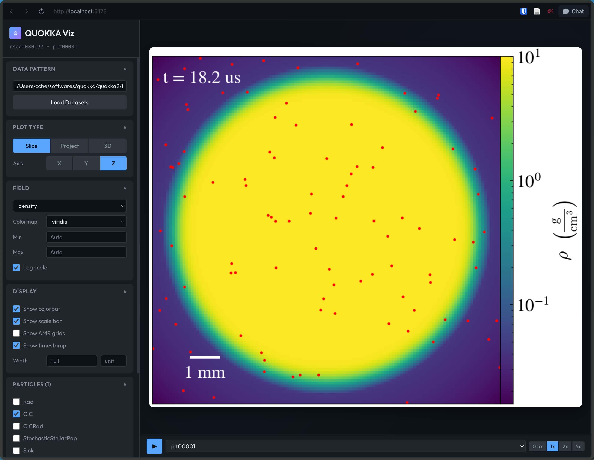

# Postprocessing

There are several ways to post-process the output of Quokka simulations. AMReX PlotfileTools, yt, and VisIt all allow you to analyze the outputs after they are written to disk.

## AMReXplorer

[AMReXplorer](https://github.com/AMReX-Codes/amrexplorer) is a Qt 6 desktop application for interactively exploring 2D and 3D AMReX plotfiles. Follow the [installation instructions](https://github.com/AMReX-Codes/amrexplorer/blob/main/INSTALL.md), then open a Quokka plotfile from the command line:

    amrexplorer /path/to/plotfile

AMReXplorer supports AMR level selection, value probing, line plots, grid and contour overlays, plotfile-sequence animation, and image or video export. See the [AMReXplorer User Guide](https://github.com/AMReX-Codes/amrexplorer/blob/main/docs/user-guide.md) for the complete workflow and controls.

## AMReX PlotfileTools

These are self-contained C++ programs (included with AMReX in the `Tools/Plotfile` subdirectory) that will output a 2D slice (axis-aligned), a 1D slice (axis-aligned), or compute a volume integral given an AMReX plotfile. This works as an alternative to yt and VisIt for basic tasks.

-   To compute a volume integral, use [fvolumesum](https://github.com/AMReX-Codes/amrex/blob/development/Tools/Plotfile/fvolumesum.cpp).
-   To compute a 2D slice plot (axis-aligned planes only), use [fsnapshot](https://github.com/AMReX-Codes/amrex/blob/development/Tools/Plotfile/fsnapshot.cpp).
-   To compute a 1D slice (axis-aligned directions only, with output as ASCII), use [fextract](https://github.com/AMReX-Codes/amrex/blob/development/Tools/Plotfile/fextract.cpp).

Other tools:

-   [fboxinfo](https://github.com/AMReX-Codes/amrex/blob/development/Tools/Plotfile/fboxinfo.cpp) prints out the indices of all the Boxes in a plotfile
-   [fcompare](https://github.com/AMReX-Codes/amrex/blob/development/Tools/Plotfile/fcompare.cpp) calculates the absolute and relative errors between plotfiles in L-inf norm
-   [fextrema](https://github.com/AMReX-Codes/amrex/blob/development/Tools/Plotfile/fextrema.cpp) calculates the minimum and maximum values of all variables in a plotfile
-   [fnan](https://github.com/AMReX-Codes/amrex/blob/development/Tools/Plotfile/fnan.cpp) determines whether there are any NaNs in a plotfile
-   [ftime](https://github.com/AMReX-Codes/amrex/blob/development/Tools/Plotfile/ftime.cpp) prints the simulation time of each plotfile
-   [fvarnames](https://github.com/AMReX-Codes/amrex/blob/development/Tools/Plotfile/fvarnames.cpp) prints the names of all the variables in a given plotfile

## yt

yt can load Quokka AMReX plotfiles through its Quokka frontend, which is now available in the main [yt](https://github.com/yt-project/yt) repository. Until a released yt version includes the frontend, install yt from the main branch with the optional Quokka dependencies:

    pip install "yt[quokka] @ git+https://github.com/yt-project/yt.git"

After installation, load a plotfile with `yt.load("plt00000")` or point yt to any other Quokka plotfile directory. The upstream Quokka frontend documentation is available in the [yt documentation source](https://github.com/yt-project/yt/blob/main/doc/source/examining/loading_data.rst#quokka-data), and a tutorial notebook is available at [README.ipynb](https://github.com/Rongjun-ANU/README-of-yt-frontend-for-QUOKKA/blob/main/README.ipynb).

> **Tip**
>
> One of the most useful things to do is to convert the data into a uniform-resolution NumPy array with the [covering_grid](https://yt-project.org/doc/examining/low_level_inspection.html#examining-grid-data-in-a-fixed-resolution-array) function.
>

### quick_plot script for batch processing

The `quick_plot` script in `scripts/python/` wraps yt for batch visualization of Quokka outputs. It can process multiple snapshots and generate slice or projection plots. For usage details, see the documentation at the top of the script or run `quick_plot -h`.

### yt-studio for web-based visualization

[yt-studio](https://github.com/chongchonghe/yt-studio) provides a web interface and Python API for visualizing Quokka simulation data. Install it with `pip install git+https://github.com/chongchonghe/yt-studio.git`, then start the web interface with `yt-studio` and open http://localhost:5173 in your browser. It supports slice plots, projection plots, volume rendering, multiple colormaps, high-resolution export, optional particle overlays, and AMR grid annotations. For scripts and notebooks, use the `QuokkaPlotter` methods such as `slice()` and `project()`.

## VisIt

VisIt can read cell-centered output variables from AMReX plotfiles. Currently, there is no support for reading either face-centered variables or particles. (However, by default, cell-centered averages of face-centered variables are included in Quokka plotfiles.)

In order to read an individual plotfile, you can select the `plt00000/Header` file in VisIt's Open dialog box.

If you want to read a timeseries of plotfiles, you can create a file with a ``.visit`` extension that lists the ``plt*/Header`` files, one per line, with the following command: :

    ls -1 plt*/Header | tee plotfiles.visit

Then select ``plotfiles.visit`` in VisIt's Open dialog box.

> **Warning**
>
> There are rendering bugs with unscaled box dimensions. Slices generally work. However, do not expect volume rendering to work when using, e.g. parsec-size boxes with cgs units.
