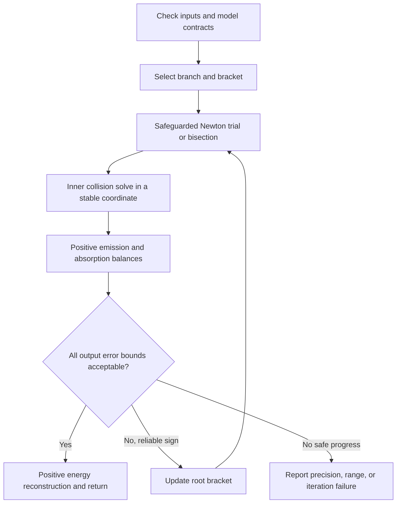

# A stable radiation–matter solve


## The algorithm in plain language

The solver updates gas and radiation in one cell. Dust has no stored heat in this model. Its temperature adjusts so that its energy exchanges balance. The outputs are gas energy, each radiation-group energy, and dust temperature.

Use dust temperature as the outer unknown. At each trial, solve the gas–dust collision equation for gas temperature. This cheap inner solve needs no opacity call. Then evaluate emission and absorption as separate positive sums and solve their balance with gas transfer. Finally, reconstruct each energy with positive arithmetic.

Both solves keep a root bracket. Safeguarded Newton steps speed up the search; bisection supplies fallback steps. Accept only when a proved residual test or a true narrow bracket gives adequate bounds for every output. A small Newton step alone is insufficient. Unsupported accuracy, range, or iteration limits produce a failure status.

The runtime uses ordinary double precision, scalar brackets, and prederived error allowances. It needs neither an analytic opacity inverse nor arbitrary-precision or interval arithmetic. The sections below build from the stable gas inverse to gray, multigroup, and variable-opacity accuracy.



## Symbols and conventions

This chapter follows the physical notation of [He, Wibking, and Krumholz (2024a)](https://doi.org/10.1093/mnras/stae1244) and their [multigroup paper (2024b)](https://academic.oup.com/mnras/article/535/4/3059/7903407), especially the group means in equations (21)–(23) of the latter. We write gas temperature as \\(T\\) and extend the notation to a separate dust temperature \\(T_{\rm d}\\). Superscript \\((0)\\) means the fixed, source-adjusted input to this local implicit stage; it need not be the start of the full timestep.

The papers use \\(E_{\rm gas}\\) for **total** gas energy density. This thermal solve instead uses internal energy density \\(e_{\rm gas}=C_vT\\), where \\(C_v=\rho C_V\\) is heat capacity per volume and \\(C_V\\) is specific heat per mass. Here \\(\rho\\) retains its usual meaning of mass density. The group means \\(\chi_{0B,g}=\rho\kappa_{P,g}\\) and \\(\chi_{0E,g}=\rho\kappa_{E,g}\\) have units of inverse length; the subscript 0 denotes the comoving frame, not the initial state. As in the papers, \\(B_g=\int_{\nu_{g-}}^{\nu_{g+}}B_\nu\,\mathrm d\nu\\) is an integrated Planck intensity. For compact error formulas we define \\(\mathcal B_g=4\pi B_g/c\\), which has units of energy density.

The auxiliary symbols for brackets, positive ratios, conditioning margins, and rounding budgets belong to this analysis. In particular, \\(\mathcal C=c/\widehat c\\) is a speed ratio, not an opacity; \\(\mathcal H=\widehat c\Delta t\\) is a length, not Planck's constant. Opacity slopes below are derivatives with respect to temperature, not the frequency power-law indices in the multigroup paper.

All logarithms are natural. A prime denotes a derivative with respect to the displayed function’s argument. A hat denotes a computed value; a star denotes the exact solution for the stored input data. Subscripts \\(g\\), \\(h\\), and \\(c\\) denote a radiation group, heating, and cooling. Error bounds apply to positive quantities unless a structural zero is stated explicitly. The following table collects the mathematical symbols used below, including local auxiliary symbols.

| Symbol | Meaning |
|:---|:---|
| \\(\rho,C_V,E_{\rm gas},B_g\\) | Mass density, specific heat per mass, total gas energy density, and group-integrated Planck intensity. |
| \\({T_{\rm d}},T,{T^{(0)}}\\) | Dust temperature, gas temperature, and fixed adjusted initial gas temperature. |
| \\(e_{\rm gas}=C_vT\\), \\(E_g\\), \\(E_g^{(0)}\\) | Gas internal energy density, final group energy density, and fixed adjusted initial group energy density. |
| \\(C_v,\mathcal D\\) | Positive constant gas heat capacity per volume and time-integrated gas–dust collision coefficient. |
| \\(\Delta t, c,\widehat c\\) | Timestep, light speed, and reduced light speed. Here \\(\widehat c\\) is a model parameter, not a rounding mark. |
| \\(\mathcal H=\Delta t\widehat c\\), \\(\mathcal C=c/\widehat c\\) | Radiation coupling scale and reduced-light-speed energy factor. |
| \\(N_g,g\\) | Number of radiation groups and group index, \\(1\le g\le N_g\\). |
| \\(\chi_{0E,g},\chi_{0B,g}\\) | Energy-mean absorption and Planck-mean emission opacities per unit length. |
| \\(\mathcal B_g,a_R\\) | Exact band-integrated equilibrium radiation energy and the radiation constant. For a full gray band, \\(\mathcal B=a_R{T_{\rm d}}^4\\). |
| \\(\tau_g,f_g,s_g\\) | \\(\mathcal H\chi_{0E,g}\\), absorbed fraction \\(\tau_g/(1+\tau_g)\\), and emitted share \\(\mathcal H\chi_{0B,g}\mathcal B_g/(E_g^{(0)}+\mathcal H\chi_{0B,g}\mathcal B_g)\\). |
| \\(M_g,H_g,M,H\\) | Positive group emission and absorption contributions to matter exchange, and their separate sums. |
| \\(F,R_h,R_c,R\\) | Signed outer residual; positive heating and cooling ratios; either applicable ratio. |
| \\(\Phi,T({T_{\rm d}}),m_T\\) | Gas-to-dust map, its inverse, and gas elasticity \\({T_{\rm d}}T^{\prime}({T_{\rm d}})/T({T_{\rm d}})\\). |
| \\(q,q_h,q_c\\) | Magnitude \\(C_v\vert T-{T^{(0)}}\vert\\) of gas transfer and its heating or cooling form. |
| \\(d,z,K_h,K_w,K_s\\) | Temperature gap \\(\vert {T_{\rm d}}-{T^{(0)}}\vert\\), inner coordinate, and the three positive inner balances. |
| \\(L_0(T_b,d),T_b\\) | Analytic positive inner lower seed and its reference temperature. |
| \\(T_{{\rm d},-},T_{{\rm d},+},T_+\\) | Outer bracket endpoints; also the explicit constant-opacity upper endpoint and associated gas temperature where specified. |
| \\({E^{(0)}},E,\chi_0,p,\ell,V,T_{\rm rad}\\) | Gray input and output radiation energy, common opacity, slope \\({T_{\rm d}}\chi_0^{\prime}/\chi_0\\), effective slope \\(p/(1+\tau)\\), weight \\(\mathcal C\tau/(1+\tau)\\), and \\(({E^{(0)}}/a_R)^{1/4}\\). Unsubscripted \\(\tau\\) denotes \\(\mathcal H\chi_0\\). |
| \\(\epsilon,\mu\\) | Gray slope-band distance from the endpoints and a lower outer logarithmic slope margin. |
| \\(m,v,\delta\\) | Lower emission slope bound, nonnegative upper absorption slope bound, and multigroup margin \\(\min(1,m)-v\\). |
| \\(P_g,a_g,\beta_g\\) | Logarithmic slopes of \\(\chi_{0B,g}\\), \\(\chi_{0E,g}\\), and \\(\mathcal B_g\\). |
| \\(L_g,\beta_{\max,g},P_{\max,g},a_{\max,g}\\) | Bounds on output log sensitivity, band slope, and absolute coefficient slopes over the full comparison interval. |
| \\(\nu,\nu_{g-},\nu_{g+},C_P,b_P,\zeta\\) | Frequency, band endpoints, positive Planck integral constants, and spectral coordinate \\(b_P\nu/{T_{\rm d}}\\). |
| \\(u,\lambda,\operatorname{RN}\\) | Binary64 unit roundoff \\(2^{-53}\\), \\(-\log(1-u)\\), and round to nearest with the specified tie rule. |
| \\(e_y,\eta_y,b_y\\) | Log-error allowances: callback or operand error, arithmetic-graph error, and final error, respectively. Subscripts identify the quantity. |
| \\(d_M,d_H\\) | Maximum active-leaf depths in the two positive summation trees. |
| \\(y,y_{\ast},\widehat y\\) | A generic positive quantity, its reference value, and its computed value. |
| \\(\varepsilon_{\rm rel}\\) | Required relative tolerance for a component. |
| \\(z_0\\) | Gray initial equilibrium ratio \\(a_R{T^{(0)}}^4/{E^{(0)}}\\). |
| \\(\theta,\theta_0,\theta_{\rm rad},Q,G,Z\\) | Temperature, initial and radiation temperatures, evolution rate, implicit residual, and \\((\theta/\theta_{\rm rad})^4\\) in the no-dust bifurcation illustration. |

## The physical equations and the source of cancellation

The bounds below describe the nested solver and its specified arithmetic graphs. They do not certify the earlier conservation-based elimination. The C++ implementation follows the graphs, but a formal C++ or GPU refinement proof remains open.

Hold density and all adjusted inputs fixed during the local step. For an ideal gas, \\(e_{\rm gas}=C_vT\\). With zero dust heat capacity, the equations are
<a id="eq:group"></a>
<a id="eq:gas"></a>
<a id="eq:energy"></a>
<script type="math/tex; mode=display">
\begin{aligned}
 E_g-E_g^{(0)} &= \mathcal H[\chi_{0B,g}({T_{\rm d}})\mathcal B_g({T_{\rm d}})-\chi_{0E,g}({T_{\rm d}})E_g],\\
 C_v(T-{T^{(0)}})+\mathcal D\sqrt T\,(T-{T_{\rm d}})&=0,\\
 C_v(T-{T^{(0)}})+\mathcal C\sum_g(E_g-E_g^{(0)})&=0.
\end{aligned}
\tag{1}
</script>

We assume \\(C_v,\mathcal D,{T^{(0)}},\mathcal H,\mathcal C>0\\) and \\(E_g^{(0)},\chi_{0E,g},\chi_{0B,g}\ge0\\). These equations describe a local source step. They do not include a transport solve. Rosseland opacity controls transport and does not enter these local balances. In the gray thermal model, use the same Planck mean for emission and absorption. Separate group means are allowed in the more general equations above.

In the papers' intensity convention, the first equation is
<script type="math/tex; mode=display">
E_g-E_g^{(0)}=\widehat c\Delta t\left[\frac{4\pi}{c}\chi_{0B,g}(T_{\rm d})B_g(T_{\rm d})-\chi_{0E,g}(T_{\rm d})E_g\right].
</script>
Thus the factors of density and \\(4\pi/c\\) are already included in the compact coefficients and band energy; they must not be applied twice.

Equation [1](#eq:group) has the positive solution
<a id="eq:positive"></a>
<script type="math/tex; mode=display">
E_g({T_{\rm d}})=\frac{E_g^{(0)}+\mathcal H \chi_{0B,g}({T_{\rm d}})\mathcal B_g({T_{\rm d}})}{1+\mathcal H\chi_{0E,g}({T_{\rm d}})}.

\tag{2}
</script>

This formula retains a small surviving radiation energy under strong absorption. Computing the same energy as its initial value plus a nearly opposite exchange can lose that small result. Tightening the root tolerance cannot restore digits already lost during reconstruction.

Gas recovery has a separate risk. Equation [1](#eq:energy) allows one to subtract the net radiation exchange from \\(C_v{T^{(0)}}\\). If the errors in emission and absorption are large compared with the final gas energy, the recovered gas can be inaccurate even when dust temperature is accurate. Exact conservation does not give componentwise relative accuracy. Nor does subtracting two already rounded radiation energies give a reliable estimate of their exchange error.

Newton and bisection address the search for a root. Neither repairs an unstable residual or output formula. A two-variable Newton method can retain both temperatures, but still needs scaled equations, reliable stopping tests, and safe output reconstruction. Here we eliminate only an equation whose inverse is well conditioned, then use safeguarded Newton for speed within a scalar bracket.

## First ingredient: a stable gas inverse

Rearrange the collision equation, without involving any radiation subtraction:
<a id="eq:phi"></a>
<script type="math/tex; mode=display">
{T_{\rm d}}=\Phi(T):=T+\frac{C_v(T-{T^{(0)}})}{\mathcal D\sqrt T},\qquad
 \Phi'(T)=1+\frac{C_v}{2\mathcal D\sqrt T}\left(1+\frac {T^{(0)}}T\right)>0.

\tag{3}
</script>

The map tends to minus infinity at zero and to plus infinity at infinity. Thus every \\({T_{\rm d}}>0\\) has exactly one positive gas temperature \\(T({T_{\rm d}})\\). It lies between \\({T_{\rm d}}\\) and \\({T^{(0)}}\\). Differentiating the inverse gives
<a id="eq:gas-slope"></a>
<script type="math/tex; mode=display">
T'({T_{\rm d}})=\frac1{\Phi'(T({T_{\rm d}}))}>0,\qquad
 0<m_T:=\frac{{T_{\rm d}}T'({T_{\rm d}})}{T({T_{\rm d}})}\le2.

\tag{4}
</script>

On cooling, \\({T_{\rm d}}\le {T^{(0)}}\\), the upper bound improves to one. On heating,
<a id="eq:heating-slope"></a>
<script type="math/tex; mode=display">
C_v{T_{\rm d}}T'({T_{\rm d}})\ge C_v(T({T_{\rm d}})-{T^{(0)}})=q_h.

\tag{5}
</script>

These inequalities follow by substituting [3](#eq:phi) and multiplying by its positive derivative. They are independent of the relative energy scales and the collision strength.

### Use a coordinate suited to the branch

A formula can be algebraically correct and still recover a small number by subtraction. To avoid this, use three inner coordinates. Each row solves \\(K=1\\):

| Branch | Coordinate | Gas temperature | Positive ratio |
| --- | --- | --- | --- |
| Heating | \\(z=T-{T^{(0)}}\\) | \\(T={T^{(0)}}+z\\) | \\(K_h=(z+C_vz/(\mathcal D\sqrt{{T^{(0)}}+z}))/d\\) |
| Weak cooling | \\(z={T^{(0)}}-T\le {T^{(0)}}/2\\) | \\(T={T^{(0)}}-z\\) | \\(K_w=(z+C_vz/(\mathcal D\sqrt{{T^{(0)}}-z}))/d\\) |
| Strong cooling | \\(z=T\le {T^{(0)}}/2\\) | \\(T=z\\) | \\(K_s=({T_{\rm d}}+C_v({T^{(0)}}-z)/(\mathcal D\sqrt z))/z\\) |


Here \\(d=\vert {T_{\rm d}}-{T^{(0)}}\vert\\). Heating and weak cooling recover \\(q=C_vz\\) directly. Strong cooling recovers \\(q=C_v({T^{(0)}}-z)\\); that subtraction is safe because \\(z\le {T^{(0)}}/2\\). At \\({T_{\rm d}}={T^{(0)}}\\), return \\((T,q)=({T^{(0)}},0)\\) exactly.

Differentiation gives
<a id="eq:inner-slopes"></a>
<script type="math/tex; mode=display">
\tfrac12\le\frac{\mathrm d\log K_h}{\mathrm d\log z}\le1,\quad
 1\le\frac{\mathrm d\log K_w}{\mathrm d\log z}\le\tfrac32,\quad
 1\le-\frac{\mathrm d\log K_s}{\mathrm d\log z}\le\tfrac52.

\tag{6}
</script>

Thus each chart has a uniform inverse slope bound. Weak cooling never recovers a tiny \\(T\\) by subtracting two nearly equal values. Strong cooling solves for that small temperature directly. The proof does not require accurate relative dust-transfer energy as a final output; it controls the internal transfer magnitude to evaluate the outer balance reliably.

### Initialize and select the charts safely

For heating and weak cooling, a positive lower seed is
<script type="math/tex; mode=display">
L_0(T_b,d)=\frac{d}{1+C_v/(\mathcal D\sqrt{T_b})}.
</script>

Use \\(T_b={T^{(0)}}\\) for heating and \\(T_b={T^{(0)}}/2\\) for weak cooling. The exact coordinate lies between this seed and \\(d\\), with the additional upper limit \\({T^{(0)}}/2\\) for weak cooling. Strong cooling uses \\([{T_{\rm d}},{T^{(0)}}/2]\\) when applicable. The checked gray initializer widens the rounded seed outward by factors \\(1\pm32u\\), with explicit range conditions.

If \\({T_{\rm d}}>{T^{(0)}}/2\\) on cooling, the weak chart applies directly. Otherwise evaluate the strong balance at \\({T^{(0)}}/2\\) with a guarded comparison. A certified value below one selects strong cooling; a value above one selects weak cooling. A value in the acceptance window can return the boundary itself. Its error bound covers a true root on either side. A rounded comparison must not silently assume which chart contains the root.

## Second ingredient: a positive outer balance

Define separate nonnegative contributions
<a id="eq:mh"></a>
<script type="math/tex; mode=display">
\begin{aligned}
 M_g({T_{\rm d}})&=\frac{\mathcal C \mathcal H \chi_{0B,g}({T_{\rm d}})\mathcal B_g({T_{\rm d}})}{1+\tau_g({T_{\rm d}})},&
 H_g({T_{\rm d}})&=\frac{\mathcal C\tau_g({T_{\rm d}})E_g^{(0)}}{1+\tau_g({T_{\rm d}})},&
 \tau_g({T_{\rm d}})&=\mathcal H\chi_{0E,g}({T_{\rm d}}),\\
 M({T_{\rm d}})&=\sum_g M_g({T_{\rm d}}),& H({T_{\rm d}})&=\sum_g H_g({T_{\rm d}}).
\end{aligned}
\tag{7}
</script>

The exact scalar residual is
<a id="eq:F"></a>
<script type="math/tex; mode=display">
F({T_{\rm d}})=C_v[T({T_{\rm d}})-{T^{(0)}}]+M({T_{\rm d}})-H({T_{\rm d}}).

\tag{8}
</script>

Every positive root reconstructs all three physical equations. Conversely, each physical solution gives such a root. The elimination neither creates nor loses positive solutions.

Do not evaluate the nearly cancelling signed residual to decide convergence. Instead use
<a id="eq:R"></a>
<script type="math/tex; mode=display">
R_h({T_{\rm d}})=\frac{q_h+M}{H}\quad({T_{\rm d}}\ge {T^{(0)}}),\qquad
 R_c({T_{\rm d}})=\frac{M}{q_c+H}\quad({T_{\rm d}}\le {T^{(0)}}),

\tag{9}
</script>

where \\(q_h=C_v(T-{T^{(0)}})\\) and \\(q_c=C_v({T^{(0)}}-T)\\). Both roots satisfy \\(R=1\\). Both ratios increase under the conditions below. Some older notes use the reciprocal cooling ratio; the sign direction then reverses, but the absolute log-error bound is identical.

Ratios require positive denominators. Resolve a structural zero by exact algebra before division. At \\({T^{(0)}}\\), compare \\(M({T^{(0)}})\\) and \\(H({T^{(0)}})\\): smaller emission selects heating; larger emission selects cooling, provided the root is unique under the stated domain conditions. An uncertain comparison needs an accuracy certificate or continued bracketing. It cannot provide an unchecked branch decision.

### Constant opacities give a unique root

For constant coefficients, \\(H\\) is constant. Each exact physical Planck band is continuous, zero at zero, increasing, and satisfies
<a id="eq:bandlower"></a>
<script type="math/tex; mode=display">
{T_{\rm d}}\mathcal B_g'({T_{\rm d}})\ge\mathcal B_g({T_{\rm d}}).

\tag{10}
</script>

Therefore \\(F\\) is strictly increasing, because \\(T({T_{\rm d}})\\) is strictly increasing. Near zero, \\(T({T_{\rm d}})\\) approaches a value below \\({T^{(0)}}\\) and \\(M({T_{\rm d}})\\) tends to zero, so \\(F<0\\). Set
<a id="eq:upper"></a>
<script type="math/tex; mode=display">
T_+={T^{(0)}}+H/C_v,\qquad T_{{\rm d},+}=T_++H/(\mathcal D\sqrt{T_+}).

\tag{11}
</script>

At this point \\(F(T_{{\rm d},+})=M(T_{{\rm d},+})\ge0\\). Continuity and strict increase give exactly one positive root.

More is true. From [5](#eq:heating-slope) and \\({T_{\rm d}}M^{\prime}\ge M\\),
<a id="eq:constant-margin"></a>
<script type="math/tex; mode=display">
\frac{\mathrm d\log R_h}{\mathrm d\log {T_{\rm d}}}\ge1,\qquad
 \frac{\mathrm d\log R_c}{\mathrm d\log {T_{\rm d}}}
 =\frac{{T_{\rm d}}M'}M+\frac{C_v{T_{\rm d}}T'}{q_c+H}\ge1.

\tag{12}
</script>

This lower slope is the key accuracy property. A small log residual bounds the dust-temperature error without an energy-ratio amplification factor.

### Zero net exchange still changes individual groups

If \\(M({T^{(0)}})=H\\), then \\({T_{\rm d}}=T={T^{(0)}}\\). Reconstruct every group with [2](#eq:positive). Emission in one group can balance absorption in another, so zero net exchange does not mean unchanged radiation.

If emission is identically zero and coefficients are constant, [11](#eq:upper) is the exact solution; no outer iteration is needed. If absorption is also zero, return \\({T_{\rm d}}=T={T^{(0)}}\\). These are structural cases, not guesses based on a small computed number.

## Third ingredient: finite error propagation

For positive values, measure error by \\(\left\vert\log(\widehat y/y_{\ast})\right\vert\\). A bound \\(b_y\\) on this error gives
<a id="eq:relative"></a>
<script type="math/tex; mode=display">
\left|\widehat y/y_{\ast}-1\right|\le \exp(b_y)-1.

\tag{13}
</script>

This is a finite bound, not a first-order approximation.

Suppose \\(\mathrm d\log R/\mathrm d\log {T_{\rm d}}\ge\mu>0\\) on the entire segment from a trial \\({T_{\rm d}}\\) to a root \\(T_{{\rm d},\ast}\\). Integration, using \\(R(T_{{\rm d},\ast})=1\\), gives
<a id="eq:inverse"></a>
<script type="math/tex; mode=display">
\left|\log({T_{\rm d}}/T_{{\rm d},\ast})\right|\le\frac{|\log R({T_{\rm d}})|}{\mu}.

\tag{14}
</script>

Equation [4](#eq:gas-slope) bounds gas-temperature log error by twice the dust-coordinate error. Suppose the radiation slope obeys \\(\vert\mathrm d\log E_g/\mathrm d\log {T_{\rm d}}\vert\le L_g\\) throughout that segment. Its log error is then at most \\(L_g\\) times the coordinate error.

Let \\(b_{T_{\rm d}}\\) bound the returned dust-coordinate error. The inner solve and output arithmetic introduce their own errors. The final component bounds will have the form
<a id="eq:master"></a>
<script type="math/tex; mode=display">
\boxed{b_{\rm dust}=b_{T_{\rm d}},\qquad b_{e_{\rm gas}}=53\lambda+2b_{T_{\rm d}},\qquad
 b_{E_g}=\eta_{E_g}+L_gb_{T_{\rm d}}.}

\tag{15}
</script>

Sections below derive \\(53\lambda\\), \\(\eta_{E_g}\\), and \\(b_{T_{\rm d}}\\). This decomposition separates three distinct questions: how well the root is located, how sensitive each physical output is to that location, and how accurately each output is evaluated.

## Roundoff and reliable stopping tests

Assume binary64 round to nearest, correctly rounded square root, and the specified operation order. Every nonzero arithmetic node in the proved positive graphs must be finite and normal. Structural zeros remain exact. Width subtraction has a separate exception described below. Let
<script type="math/tex; mode=display">
u=2^{-53},\qquad\lambda=-\log(1-u).
</script>

One normal rounded operation contributes at most \\(\lambda\\) in log error. Products and quotients add operand budgets. A positive sum inherits the largest operand budget, plus its rounding. Square root halves its input budget and adds its own rounding. These rules fail for unrestricted subtraction of nearly equal uncertain operands.

### The inner allowance

For each inner chart, the specified rounded balance graph has log error at most \\(8\lambda\\). Accept a residual in \\(1\pm16u\\). This window contributes at most \\(17\lambda\\), so the exact balance has log residual at most \\(25\lambda\\). The smallest chart slope is \\(1/2\\); hence its coordinate error is at most \\(50\lambda\\). Stable recovery adds at most \\(2\lambda\\).

The accepted inner result therefore satisfies
<a id="eq:inner-budget"></a>
<script type="math/tex; mode=display">
\left|\log(\widehat T/T({T_{\rm d}}))\right|\le52\lambda,\qquad
 \left|\log(\widehat q/q({T_{\rm d}}))\right|\le52\lambda\quad(q>0).

\tag{16}
</script>

At equilibrium \\(q=0\\) exactly. One final multiplication \\(\widehat e_{\rm gas}=\operatorname{RN}(C_v\widehat T)\\) explains the \\(53\lambda\\) term in [15](#eq:master). The guarded cooling boundary has the same allowance.

### A small residual and a narrow bracket are different certificates

For an outer balance with log evaluation error at most \\(\eta_R\\), the test
<a id="eq:res-stop"></a>
<script type="math/tex; mode=display">
1-128u\le\widehat R\le1+128u
 \quad\Longrightarrow\quad
 b_{T_{\rm d}}=\frac{129\lambda+\eta_R}{\mu}

\tag{17}
</script>

follows from [14](#eq:inverse). A small Newton step alone gives no such bound.

Alternatively, retain a true root bracket with positive normal endpoints and return a temperature inside it. The checked width graph proves
<a id="eq:width"></a>
<script type="math/tex; mode=display">
\operatorname{RN}\left(\frac{\operatorname{RN}(T_{{\rm d},+}-T_{{\rm d},-})}{T_{{\rm d},-}}\right)\le16u
 \quad\Longrightarrow\quad b_{T_{\rm d}}\le32\lambda.

\tag{18}
</script>

For the inner solve, a \\(4u\\) width threshold gives an \\(8\lambda\\) coordinate allowance, which fits [16](#eq:inner-budget). If \\(T_{{\rm d},+}\le2T_{{\rm d},-}\\), Sterbenz’s theorem makes the subtraction exact, even if its result is subnormal. Otherwise the difference is normal. The quotient and remaining nodes must satisfy their range contracts. Flush-to-zero would invalidate the exact-subnormal case.

The width route avoids division by the outer slope margin, but it needs a genuine bracket. More iterations cannot always manufacture that bracket: an uncertain sign cannot discard a possible root. A steep balance can also skip the residual window between adjacent floats. These facts motivate both stopping routes and explicit precision-limit outcomes.

### Use only reliable signs

In general, \\(\widehat R<e^{-\eta_R}\\) proves \\(R<1\\), and \\(\widehat R>e^{\eta_R}\\) proves \\(R>1\\), provided the comparison thresholds have safe rounding allowances. For the concrete \\(78\lambda\\) and \\(94\lambda\\) budgets below, values outside \\(1\pm128u\\) have reliable signs. Values inside the window supply a residual certificate. If that certificate is too loose for a requested output, do not turn the uncertain residual into a sign.

Bisection of floating-point ranks always chooses an interior represented value when one exists. Every reliable endpoint update reduces the rank span. The checked gray driver has a conditional finite-termination theorem with sufficient rank fuel and ready arithmetic/inner calls. This is not a practical fixed iteration-count theorem. The C++ implementation additionally restricts Newton proposals to the middle half of the bracket ranks; its control flow is tested but not formally refined to the gray driver.

## Gray opacity: the simplest complete bounds

For one full-spectrum band, put \\(j=\alpha=\chi_0({T_{\rm d}})\\), \\(\mathcal B=a_R{T_{\rm d}}^4\\), \\(\tau=\mathcal H\chi_0\\), and \\(V=\mathcal C\tau/(1+\tau)\\). Then \\(M=V\mathcal B\\) and \\(H=V{E^{(0)}}\\). The physical root lies between \\({T^{(0)}}\\) and \\(T_{\rm rad}=({E^{(0)}}/a_R)^{1/4}\\) when \\({E^{(0)}}>0\\). Heating has \\({T^{(0)}}<T<{T_{\rm d}}<T_{\rm rad}\\); cooling reverses that order.

### Constant and smooth temperature-dependent opacities

Write
<script type="math/tex; mode=display">
p({T_{\rm d}})=\frac{{T_{\rm d}}\chi_0'({T_{\rm d}})}{\chi_0({T_{\rm d}})},\qquad
 \ell({T_{\rm d}})=\frac{p({T_{\rm d}})}{1+\tau({T_{\rm d}})}.
</script>

The heating logarithmic slope of \\((q_h+V\mathcal B)/(V{E^{(0)}})\\) is a weighted average of \\({T_{\rm d}}q_h^{\prime}/q_h-\ell\\) and \\(4\\). The first quantity is at least \\(1-\ell\\). For cooling, direct differentiation of \\(V\mathcal B/(q_c+V{E^{(0)}})\\) gives a lower bound \\(\min(4,4+\ell)\\). Thus the whole-domain condition
<a id="eq:grayband"></a>
<script type="math/tex; mode=display">
-4+\epsilon<p({T_{\rm d}})<1-\epsilon,\qquad
 0<\epsilon<5/2,\qquad\mu=\min(1,\epsilon)

\tag{19}
</script>

provides a common positive margin. Moreover \\(\vert p\vert\le4-\epsilon\\), and
<a id="eq:grayoutput"></a>
<script type="math/tex; mode=display">
\left|\frac{\mathrm d\log E}{\mathrm d\log {T_{\rm d}}}\right|\le4+|p|\le8-\epsilon.

\tag{20}
</script>

The conditions concern smooth functions, so power laws are a special case. The bounds must hold on the whole trial-to-root interval, including any outward enlargement of the initial bracket.

With an opacity log-error allowance \\(e_{\chi_0}\le8\lambda\\), the specialized gray graph gives \\(\eta_R\le71\lambda\\) and \\(\eta_E\le17\lambda\\). It computes \\(a_R{T_{\rm d}}^4\\) by two squarings and a multiplication, whose total error is \\(4\lambda\\). It uses the equivalent positive radiation form
<script type="math/tex; mode=display">
E=\begin{cases}({E^{(0)}}+\tau\mathcal B)/(1+\tau),&\widehat\tau\le1,\\
 ({E^{(0)}}/\tau+\mathcal B)/(1+1/\tau),&\widehat\tau>1.
 \end{cases}
</script>

Each graph has its own range obligations. No small weight is formed by subtracting a rounded weight from one.

Combining the allowances gives the following log-error bounds:

| Certificate | Dust temperature | Gas energy | Radiation energy |
| --- | --- | --- | --- |
| Residual | \\(200\lambda/\mu\\) | \\((53+400/\mu)\lambda\\) | \\([17+200(8-\epsilon)/\mu]\lambda\\) |
| Bracket | \\(32\lambda\\) | \\(117\lambda\\) | \\((273-32\epsilon)\lambda\\) |


For \\(\epsilon=1/2\\), the residual exponents are \\(400\lambda\\), \\(853\lambda\\), and \\(3017\lambda\\). Equation [13](#eq:relative) bounds the relative errors by \\(512u\\), \\(1024u\\), and \\(4096u\\), respectively. These numbers belong to the specialized gray graph; they must not be copied unchanged into a multigroup implementation.

As \\(p\\) approaches \\(-4\\) on cooling or \\(1\\) on heating, a uniform residual-to-temperature margin can disappear in the allowed family. This does not say every such cell is ill conditioned. Optical-depth saturation and the actual branch state can give a stronger margin. At a vanishing margin, use a justified bracket certificate or restrict the model/domain; do not claim the same small residual bound.

### A gray equilibrium shortcut and initialization

Evaluate \\(z_0=a_R{T^{(0)}}^4/{E^{(0)}}\\) with its \\(5\lambda\\) graph allowance. Below \\(1-64u\\), heating is certain; above \\(1+64u\\), cooling is certain. Within the window, return \\({T_{\rm d}}=T={T^{(0)}}\\) and \\(E={E^{(0)}}\\). The log-error bounds are \\(35\lambda/2\\) for dust, \\(37\lambda/2\\) for gas energy, and \\(70\lambda\\) for radiation. This is a relative near-equilibrium certificate, not a temperature-floor shortcut.

Outside the window, form \\(T_{\rm rad}\\) by division and two square roots. Its log allowance is \\(7\lambda/4\\). Multiplying outward by \\(1\pm8u\\) with the checked rounding gives an enclosing endpoint. Together with \\({T^{(0)}}\\), it supplies a true initial root bracket. The unchanged-radiation shortcut applies only to this gray setting; multigroup net equilibrium still requires group reconstruction.

## Constant multigroup opacity: spectral sensitivity matters

For a fixed frequency band,
<a id="eq:planck"></a>
<script type="math/tex; mode=display">
\mathcal B_g({T_{\rm d}})=C_P\int_{\nu_{g-}}^{\nu_{g+}}
       \frac{\nu^3}{\exp(b_P\nu/{T_{\rm d}})-1}\,\mathrm d\nu,
 \qquad C_P,b_P>0.

\tag{21}
</script>

Differentiating the integrand multiplies it by \\(\zeta/(1-e^{-\zeta})\ge1\\), where \\(\zeta=b_P\nu/{T_{\rm d}}\\). Integration proves [10](#eq:bandlower). On compact positive temperature intervals, polynomial bounds near zero frequency and exponential bounds at high frequency justify differentiation under the integral.

The band elasticity \\(\beta_g={T_{\rm d}}\mathcal B_g^{\prime}/\mathcal B_g\\) is therefore at least one. It is exactly four for the full spectrum, approaches one in a finite Rayleigh–Jeans band, and can be large in a Wien band. For constant coefficients,
<a id="eq:spectral"></a>
<script type="math/tex; mode=display">
\frac{{T_{\rm d}}E_g'}{E_g}=s_g\beta_g,\qquad
 s_g=\frac{\mathcal H\chi_{0B,g}\mathcal B_g}{E_g^{(0)}+\mathcal H\chi_{0B,g}\mathcal B_g}\in[0,1].

\tag{22}
</script>

Useful whole-bracket bounds on \\(\beta_g\\) are
<a id="eq:spectralbound"></a>
<script type="math/tex; mode=display">
\beta_{\max,g}=\begin{cases}
 1+b_P\nu_{g+}/T_{{\rm d},-},&\nu_{g+}<\infty,\\
 5+b_P\nu_{g-}/T_{{\rm d},-},&\nu_{g+}=\infty,\\
 4,&\text{full spectrum (sharper case)}.
 \end{cases}

\tag{23}
</script>

Use \\(L_g=\beta_{\max,g}\\), or sharpen it to \\(s_g(T_{{\rm d},+})\beta_{\max,g}\\) with a separately bounded fraction evaluation. If \\(\chi_{0B,g}=0\\) and \\(E_g>0\\), use \\(L_g=0\\).

The finite-band estimate follows from \\(\zeta/(1-e^{-\zeta})\le1+\zeta\\). For a tail, integration after scaling frequency by temperature gives a \\(4\\) term plus a boundary contribution. Bounding the remaining tail integral below by its first exponential term bounds that contribution by \\(1+b_P\nu_{g-}/T_{{\rm d},-}\\). These are analytic properties of the exact integral, not properties automatically inherited by an interpolated table.

### Count errors in the actual positive graph

At one trial, let \\(e_{\chi_{0E,g}}\\), \\(e_{\chi_{0B,g}}\\), and \\(e_{\mathcal B,g}\\) bound callback log errors. Form rounded \\(\mathcal H\chi_{0E,g}\\), \\(1+\mathcal H\chi_{0E,g}\\), and \\(\mathcal H\chi_{0B,g}\\). For emission, divide \\(\mathcal H\chi_{0B,g}\\) by the denominator, multiply by \\(\mathcal C\\), and then by \\(\mathcal B_g\\). For absorption, divide \\(\tau_g\\) by that same denominator, multiply by \\(\mathcal C\\), and then by \\(E_g^{(0)}\\). For radiation, form the emitted numerator term, add \\(E_g^{(0)}\\), and divide by the denominator. Round each stated operation separately.

The proved leaf allowances are
<a id="eq:leaves"></a>
<script type="math/tex; mode=display">
\begin{aligned}
 \eta_{M_g}&=e_{\chi_{0E,g}}+e_{\chi_{0B,g}}+e_{\mathcal B,g}+6\lambda,\\
 \eta_{H_g}&=e_{\chi_{0E,g}}+5\lambda,\\
 \eta_{E_g}&=e_{\chi_{0E,g}}+e_{\chi_{0B,g}}+e_{\mathcal B,g}+6\lambda.
\end{aligned}
\tag{24}
</script>

The absorption estimate retains the shared numerator–denominator dependence in \\(\tau/(1+\tau)\\). Summing the positive leaves in trees gives
<a id="eq:trees"></a>
<script type="math/tex; mode=display">
\eta_M=\max_g\eta_{M_g}+d_M\lambda,\qquad
 \eta_H=\max_g\eta_{H_g}+d_H\lambda.

\tag{25}
</script>

Each group must occur once. A balanced tree has depth at most \\(\lceil\log_2N_g\rceil\\). A sequential reduction needs its own larger depth allowance. Exact-zero sums are handled separately.

One addition and one division in [9](#eq:R) now give
<a id="eq:outer-budget"></a>
<script type="math/tex; mode=display">
\begin{aligned}
 \eta_{R_h}&=\max(52\lambda,\eta_M)+\eta_H+2\lambda,\\
 \eta_{R_c}&=\eta_M+\max(52\lambda,\eta_H)+2\lambda.
\end{aligned}
\tag{26}
</script>

For exact stored constant coefficients, \\(e_{\mathcal B,g}\le8\lambda\\), and \\(N_g\le1024\\) with balanced trees, these imply
<script type="math/tex; mode=display">
\eta_M\le24\lambda,\quad\eta_H\le15\lambda,\quad
 \eta_R\le78\lambda,\quad\eta_{E_g}\le14\lambda.
</script>

The margin is one, so the final log budgets are

| Certificate | Dust temperature | Gas energy | Radiation energy |
| --- | --- | --- | --- |
| Residual | \\(207\lambda\\) | \\(467\lambda\\) | \\((14+207L_g)\lambda\\) |
| Bracket | \\(32\lambda\\) | \\(117\lambda\\) | \\((14+32L_g)\lambda\\) |


For \\(L_g\le4\\), convenient relative allowances are \\((256u,512u,1024u)\\) on the residual path and \\((64u,128u,256u)\\) on the bracket path. For general bands, retain the \\(L_g\\)-dependent exponent.

### Why a tiny group can still need a stricter temperature solve

The bound contains no ratio of one group’s energy to another’s. It does contain spectral sensitivity. A small Wien-band energy can change rapidly with temperature. Adjacent binary64 temperatures can therefore imply a group-energy mismatch larger than a requested tolerance, even with exact band evaluation. The constant-opacity audit includes a normal-range example with a band \\([700,701]\\) in normalized units: reconstruction at any represented dust temperature has group relative error greater than \\(676u\\). This is an analytic audit example, not a kernel-checked C++ execution result.

A true narrow temperature bracket is still useful, but is not an unconditional certificate for every group tolerance. For constant coefficients, monotone endpoint outputs provide an alternative component certificate after accounting for evaluator errors. Also, all exact component changes have the same sign, so
<script type="math/tex; mode=display">
\mathcal C|E_g({T_{\rm d}})-E_g(T_{{\rm d},\ast})|\le|F({T_{\rm d}})|,\qquad
 |C_vT({T_{\rm d}})-C_vT(T_{{\rm d},\ast})|\le|F({T_{\rm d}})|.
</script>

Dividing by a tiny group energy can make this energy-share estimate weak. The sensitivity bound is usually the more direct relative statement. The default design uses scalar sensitivity allowances, not runtime interval evaluation of the physical equations.

## Variable multigroup opacity: bound two aggregate slopes

Reevaluate both \\(M\\) and \\(H\\) at every trial when coefficients vary. A cached absorption total is then incorrect. Require, throughout the comparison domain,
<a id="eq:aggregate"></a>
<script type="math/tex; mode=display">
{T_{\rm d}}M'({T_{\rm d}})\ge mM({T_{\rm d}}),\qquad {T_{\rm d}}H'({T_{\rm d}})\le vH({T_{\rm d}}),\qquad
 m>0,\ v\ge0,\quad\delta:=\min(1,m)-v>0.

\tag{27}
</script>

For heating, [5](#eq:heating-slope) yields
<script type="math/tex; mode=display">
\frac{\mathrm d\log R_h}{\mathrm d\log {T_{\rm d}}}
 \ge\frac{q_h+mM}{q_h+M}-v\ge\delta.
</script>

For cooling, \\(q_c^{\prime}=-C_vT^{\prime}<0\\), so
<script type="math/tex; mode=display">
\frac{\mathrm d\log R_c}{\mathrm d\log {T_{\rm d}}}
 \ge m-\frac{vH}{q_c+H}\ge\delta.
</script>

Thus [14](#eq:inverse) holds with \\(\mu=\delta\\). These are sufficient conditions; their failure does not by itself prove that a particular root is ill conditioned.

If these conditions hold globally for \\({T_{\rm d}}>0\\), then \\({T_{\rm d}}F^{\prime}-vF>0\\): the gas term is positive, \\({T_{\rm d}}M^{\prime}-vM>0\\), and \\(vH-{T_{\rm d}}H^{\prime}\ge0\\). Hence \\({T_{\rm d}}^{-v}F\\) is strictly increasing. The same growth bounds give a negative limit near zero and a positive residual eventually, establishing existence and uniqueness. This global argument is analytic. The formal variable-opacity accepted-result theorem assumes a root and conditions on its comparison interval.

### Translate callback derivative bounds into the conditions

Where the components are positive, define
<script type="math/tex; mode=display">
P_g=\frac{{T_{\rm d}}\chi_{0B,g}'}{\chi_{0B,g}},\qquad a_g=\frac{{T_{\rm d}}\chi_{0E,g}'}{\chi_{0E,g}},\qquad
 \beta_g=\frac{{T_{\rm d}}\mathcal B_g'}{\mathcal B_g},\qquad f_g=\frac{\tau_g}{1+\tau_g}.
</script>

Then
<a id="eq:coeffslopes"></a>
<script type="math/tex; mode=display">
\frac{{T_{\rm d}}M_g'}{M_g}=\beta_g+P_g-f_ga_g,\qquad
 \frac{{T_{\rm d}}H_g'}{H_g}=(1-f_g)a_g.

\tag{28}
</script>

Lower bounds of \\(m\\) for every active emission and upper bounds of \\(v\\) for every active absorption imply [27](#eq:aggregate) by summation. At structural zeros use derivative inequalities directly, without taking a logarithm of zero.

For equal means \\(\chi_{0B,g}=\chi_{0E,g}\\), three simple sufficient classes are

| Common coefficient slope | \\(m\\) | \\(v\\) | \\(\delta\\) |
| --- | --- | --- | --- |
| \\(\vert P_g\vert\le1/4\\) | 3/4 | 1/4 | 1/2 |
| \\(0\le P_g\le1/2\\) | 1 | 1/2 | 1/2 |
| \\(-1/2\le P_g\le0\\) | 1/2 | 0 | 1/2 |


Sharper group-specific or aggregate estimates can admit wider ranges. The wider gray interval cannot simply be assigned to each spectral group: a finite band has lower elasticity one, not four.

For varying coefficients, the radiation derivative is
<a id="eq:varoutput"></a>
<script type="math/tex; mode=display">
\frac{{T_{\rm d}}E_g'}{E_g}=s_g(P_g+\beta_g)-f_ga_g.

\tag{29}
</script>

It can be negative. A sufficient whole-domain output bound is
<a id="eq:varL"></a>
<script type="math/tex; mode=display">
L_g=\beta_{\max,g}+P_{\max,g}+a_{\max,g},

\tag{30}
</script>

where the last two terms bound the absolute coefficient slopes. Constant-case monotone endpoint and energy-share arguments need new hypotheses before reuse here.

Autodiff derivatives can propose Newton steps. Values sampled at a few temperatures do not prove a whole-domain slope bound. If an opacity also depends on gas temperature, compose it with \\(T({T_{\rm d}})\\): its total log derivative equals its partial dust log derivative plus \\(m_T\\) times its partial gas log derivative. Its value-error budget must include the effect of using the approximate inner temperature. This extension requires those additional contracts; it is not covered merely by the accuracy of autodiff at one point.

### The variable-opacity error budget

Assume each coefficient and band callback has log error at most \\(8\lambda\\), \\(N_g\le1024\\), and balanced summation. Equations [24](#eq:leaves)–[26](#eq:outer-budget) give
<script type="math/tex; mode=display">
\eta_M\le40\lambda,\quad\eta_H\le23\lambda,\quad
 \eta_R\le94\lambda,\quad\eta_{E_g}\le30\lambda.
</script>

Consequently the final log bounds are

| Certificate | Dust temperature | Gas energy | Radiation energy |
| --- | --- | --- | --- |
| Residual | \\(223\lambda/\delta\\) | \\((53+446/\delta)\lambda\\) | \\((30+223L_g/\delta)\lambda\\) |
| Bracket | \\(32\lambda\\) | \\(117\lambda\\) | \\((30+32L_g)\lambda\\) |


These allowances are uniform over inputs satisfying the same margin, sensitivity, callback, and arithmetic contracts. They are not uniform over all smooth black-box functions.

## Where accuracy and uniqueness can fail

### A physical multigroup counterexample

In normalized units, take one active band with
<script type="math/tex; mode=display">
\mathcal B({T_{\rm d}})=\int_0^1\frac{\nu^3}{e^{\nu/{T_{\rm d}}}-1}\,\mathrm d\nu,\qquad
 \chi_{0B}(T_{\rm d})=\chi_{0E}(T_{\rm d})={T_{\rm d}}^{-2},
</script>

and \\(C_v=1\\), \\(\mathcal D=1/100\\), \\({T^{(0)}}=100\\), \\(\mathcal C=100\\), \\(\mathcal H=1\\), \\({E^{(0)}}=0\\). The opacity slope is \\(-2\\), safely inside a gray slope band. But the scalar equation is
<script type="math/tex; mode=display">
F({T_{\rm d}})=T({T_{\rm d}})-100+\frac{100\mathcal B({T_{\rm d}})}{1+{T_{\rm d}}^2},\qquad
 {T_{\rm d}}=T+\frac{100(T-100)}{\sqrt T}.
</script>

Elementary exponential inequalities give \\(\mathcal B({T_{\rm d}})\le {T_{\rm d}}/3\\) and \\(\mathcal B(1)>4/21\\). The monotone gas map gives \\(T(1/100)<T(5)<92\\) and \\(T(1)>91\\). Thus \\(F\\) has signs minus, plus, minus, plus at \\(1/100,1,5,100\\), respectively. Continuity gives three distinct positive roots, each reconstructing positive radiation and gas. The formal counterexample proves this implication from explicit band-value premises; the integral estimates are analytic.

This example explains why the aggregate conditions are needed. It is a failure of uniqueness in the discrete physical model, not solely a failure of arithmetic.

### A timestep can create multiple implicit roots

For a smooth evolution law \\(\dot\theta=Q(\theta)\\), backward Euler solves
<script type="math/tex; mode=display">
G(\theta)=\theta-\theta_0-\Delta t\,Q(\theta)=0,\qquad
 G'(\theta)=1-\Delta t\,Q'(\theta).
</script>

Positive feedback can drive the slope through zero as the timestep grows, producing a fold under the usual nondegeneracy conditions. The continuous initial-value problem can still have a unique trajectory. Branch selection, nonlinear accuracy, and time-discretization accuracy are different questions.

The earlier no-dust gray analysis makes this concrete. At a heating root, with opacity proportional to \\(\theta^p\\), set \\(Z=(\theta/\theta_{\rm rad})^4\\). A negative physical scalar-residual slope is equivalent to
<script type="math/tex; mode=display">
\frac{p}{1+\tau}>\frac{\theta}{\theta-\theta_0}+\frac{4Z}{1-Z}.
</script>

The right side exceeds one. An exponent above one can therefore cause trouble without reaching two, if the coupling and temperature ratios permit it. On a bounded temperature domain, an arbitrarily small excess above one need not suffice. This earlier analytic criterion explains the endpoint; it is not a theorem that all \\(p>1\\) cases bifurcate. Continuation and smaller timesteps can help track the continuous-time branch, but cannot repair a missing conditioning margin at a fold.

### Finite range and model changes remain separate obligations

A positive formula avoids cancellation but can still overflow or underflow. The quoted bounds require the stated finite-normal graphs. A scaled equivalent formula needs its own graph proof before it inherits their constants. An exact zero is different from an underflowed positive value.

The current model has \\(\mathcal D>0\\). At \\(\mathcal D=0\\), gas stays at \\({T^{(0)}}\\) and dust must solve \\(M=H\\); dust temperature can be undetermined or no positive solution can exist in degenerate cases. Without dust, evaluate the opacities and emission at gas temperature and solve \\(C_v(T-T^{(0)})+M(T)-H(T)=0\\) directly for \\(T\\). The monotonicity argument simplifies, but its implementation still needs its own arithmetic correspondence. Temperature-dependent collision coefficients, finite dust heat capacity, floors, chemistry, and a nonideal EOS change the equations and need further analysis.

## Putting the proof into a usable solver

A production interface should supply the allowed temperature domain, a root-in-domain justification, structural-zero declarations, callback value-error bounds, a positive conditioning margin, and output sensitivity bounds. The prototype requires these contracts for certified mode. A Boolean declaration does not prove them. Missing contracts can support an explicitly estimated result, but not the theorem-backed accuracy claim.

For each required positive output, compute its log bound from [15](#eq:master) and require \\(\exp(b_y)-1\le\varepsilon_{\rm rel}\\). Bound evaluation itself must round safely upward. The prototype uses scalar outward adjustments and the inequality
<script type="math/tex; mode=display">
e^{b_y}-1\le\frac{b_y}{1-b_y}\qquad(0\le b_y<1)
</script>

to avoid relying on an unproved transcendental-library error bound. These are scalar error allowances; the physical solve uses ordinary double values. An exactly zero group receives an exact absolute-zero statement because relative error at zero is undefined.

For constant zero emission, the direct solution in [11](#eq:upper) has a separate rounded-graph proof. Given absorption budget \\(\eta_H\\), its dust and gas log allowances are \\(3\eta_H/2+5\lambda\\) and \\(\eta_H+3\lambda\\). With \\(\eta_H\le15\lambda\\), these are \\(27.5\lambda\\) and \\(18\lambda\\). Group reconstruction keeps its own allowance. This shortcut must not be used with a temperature-dependent absorption total as though it were constant.

Do not apply a later conservation correction that subtracts large energies without a new component error bound. The output certificates concern the returned reconstruction. They do not automatically survive a floor projection or a repair step.

### What is established, and what remains conditional

The informal argument is now one chain: the gas map gives a safe inverse; positive balances give a root margin; finite integration gives coordinate sensitivity; explicit rounded graphs give evaluator budgets; reliable acceptance gives a coordinate certificate; stable reconstruction gives separate component errors.

The source proofs were checked as a 36-module gray development, a 22-module constant-multigroup closure, and a 24-module variable-multigroup closure. This repository packages the 48 unique modules in one reproducible check. The checked closures contain no admissions or new custom unproved axioms. They use the standard classical real-analysis foundations. Shared modules occur in more than one closure.

The gray development includes initialization, inner and outer driver composition, and conditional termination. The multigroup results join the specified arithmetic graphs to accepted-result accuracy. They do not establish a complete source-level proof of the C++ implementation. The physical Planck integral bounds, some global existence arguments, and the stated spectral audit example remain analytic parts of this explanation.

In particular, an assumed \\(8\lambda\\) band oracle is not a certification of the existing Planck table. Callback accuracy, adjusted-input formation, and the C++ compiler/hardware correspondence remain separate obligations. CPU tests are evidence about the implementation; they do not establish GPU execution correctness. GPU use also requires the rounding, operation-order, and subnormal behavior assumed by the graphs.

## Using the live integration

The new path is opt-in through `NestedRadiationCoupling_Traits<problem_t>`.
Both `AddSourceTermsSingleGroup` and `AddSourceTermsMultiGroup` call it when
`enabled = true`. Set `thermal_only = true` only for a model without extra
line cooling, cosmic-ray heating, dust heating, photoelectric heating, or chemistry.
The current adapter requires the ideal EOS backend, positive gas–dust collision
coefficient, `beta_order = 0`, and thermal groups. It excludes the evolving
full-spectrum opacity-fit model. Other problems continue using the existing solver.
An enabled path does not silently fall back after failure or apply energy floors.

Specialize these `RadSystem<problem_t>` hooks:

- `NestedCouplingOptions()` supplies the temperature domain, iteration limits,
  and requested relative tolerance. `allow_estimated` is false by default.
- `NestedCouplingContract(rho, boundaries)` supplies domain-wide margin,
  sensitivity, and evaluator-error assumptions. The default is unverified.
- `NestedCouplingValues(rho, temperature, radiation, boundaries)` optionally
  supplies analytic bands, derivatives for Newton proposals, and structural-zero
  declarations. Its default uses existing opacity and emission hooks, with no
  derivatives and no inferred structural zeros.

The production Planck table is **not certified** by these proofs. If using it,
explicitly set `allow_estimated = true` and keep `contract.certified = false`.
Result bounds then depend on unverified callback assumptions. Do not mark the
contract certified merely to enable this path. The standalone kernel preserves
`accepted_estimated` versus `accepted_conditional` in its result status.
The simulation adapter requires success, then stores the energies; it makes no
additional whole-simulation accuracy claim.

The adapter converts the existing collision coefficient (which includes a
factor `chat/c`) back to `D = dt*K`. Radiation sources use the existing RSLA
scaling before the solve. Flux updates and state storage retain their existing
semantics. Errors in input formation, IMEX stage combinations, total-to-internal
energy conversions, transport, and compiler transformations are outside the
local theorem. Use strict floating-point settings; fast-math, reassociation,
FMA contraction, and flush-to-zero are not covered. For GCC/Clang host code,
add `-fno-fast-math -ffp-contract=off` to the problem target. Keep
`DISABLE_FMAD=ON` for CUDA/HIP. The `NestedRadCoupling` target supplies these
host flags explicitly. A kernel call compiled with `__FAST_MATH__` fails.

`NestedRadCoupling` exercises both live entry points with manufactured heating,
cooling, and equilibrium states. Its AMReX kernels can run on CPU or GPU, but
a CPU pass alone is not GPU validation.

## Reproducing the proof and numerical checks

The [verification README](https://github.com/quokka-astro/quokka/tree/development/verification)
describes the proof boundary and dependencies. From the repository root:

```sh
python3 verification/radiation_coupling/check.py
cmake -S tests/radiation_coupling -B build/coupling-kernel
cmake --build build/coupling-kernel
ctest --test-dir build/coupling-kernel --output-on-failure
quokka build -d 1d NestedRadCoupling
quokka run -d 1d NestedRadCoupling
```

The exact proof sources are in `verification/radiation_coupling/BlackBox` and
`MultiGroup`. The clean checker compiles all 48 unique modules, then independently
checks them with `coqchk`. No `.vo` files or historical duplicate packages are
needed. Rocq is a verification dependency, not a simulation runtime dependency.

## Cross-reference to the proof and kernel names

The Rocq files and C++ kernel retain their checked identifiers. The notation change in this chapter does not change their equations or error constants.

| Proof/kernel name | Notation in this chapter |
| --- | --- |
| `x` | \\(T_{\rm d}\\) |
| `t` | \\(T\\) |
| `T` | \\(T^{(0)}\\) |
| `A` | \\(C_v\\) |
| `D` | \\(\mathcal D\\) |
| `h` | \\(\mathcal H\\) |
| `chi` | \\(\mathcal C\\) |
| `r[g]` | \\(E_g^{(0)}\\) |
| `alpha[g]` | \\(\chi_{0E,g}\\) |
| `p[g] / j_g` | \\(\chi_{0B,g}\\) |
| `B[g]` | \\(\mathcal B_g=4\pi B_g/c\\) |
