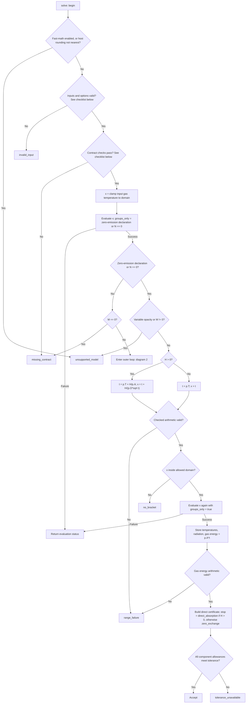
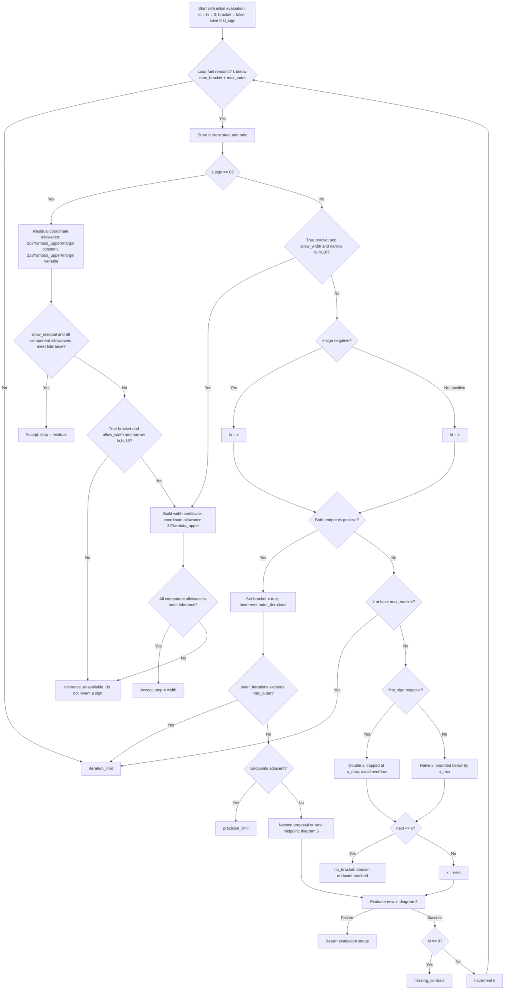
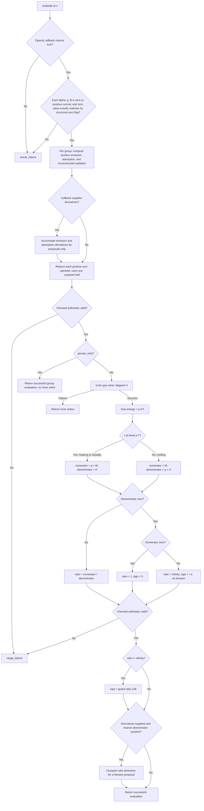
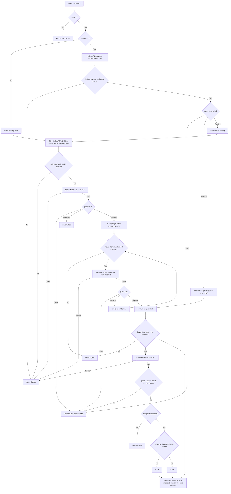
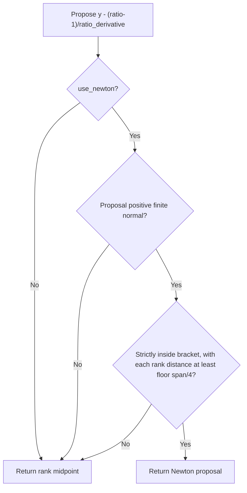

# Radiation solver: detailed C++ control flow

These diagrams expand the [algorithm overview and error analysis](radiation_solver_accuracy.md). They follow `mgsolve::solve`, `evaluate`, `inner`, and `safeguard` in `src/radiation/nested/multigroup_solver.hpp`. Each rectangle names an operation; each diamond labels a test. Terminal nodes name the C++ status or stopping reason. Calls to **Evaluate** and **Inner** refer to the diagrams below. A failed call returns its status immediately to its caller.

The physical notation remains that of the explainer: dust temperature is \\(T_{\rm d}\\), gas temperature is \\(T\\), and the adjusted input gas temperature is \\(T^{(0)}\\). Diagram labels use the exact C++ names where this makes a condition easier to locate: `x = T_d`, `t = T`, `p.T = T^(0)`, `p.A = C_v`, `p.D = D`, `p.h = H`, and `p.chi = C` (the last three are the explainer's calligraphic symbols). `M` and `H` inside an evaluation are the separate emission and absorption sums; they are not `p.h`.

The large diagrams retain full-size labels. Scroll within a diagram to follow a path; the numbered panels connect through named calls.

## Exact tests used in the diagrams

| Test | C++ condition and meaning |
| --- | --- |
| `normal(y)` | `min_normal <= y <= max_double`: positive, finite, normal binary64. |
| `nonnegative(y)` | `y == 0` or `normal(y)`. Negative, subnormal, infinite, and NaN values fail. |
| `guard(R,k)` | Returns −1 for `R < 1-k*u`, +1 for `R > 1+k*u`, and 0 otherwise. The endpoints belong to the acceptance window; `u = 2^-53`. This test is applied after the evaluator's range checks. |
| `narrow(lo,hi,k)` | Both endpoints must be positive normal and ordered. Equal endpoints pass. Otherwise the computed gap must be positive finite and the computed `gap/lo` must be normal and at most `k*u`. |
| `adjacent(lo,hi)` | The positive binary64 bit ranks differ by at most one. There is no represented interior value. |
| `meets(certificate,tol)` | Dust, gas, and **every** radiation-group relative allowance must be at most `tol`. Exact-zero groups carry an absolute-zero sentinel. |
| **Accept** | `accepted_conditional` when `contract.certified` is true; otherwise `accepted_estimated`. This describes the caller's contract, not a runtime proof that the callback satisfies it. |
| **Range failure** | A checked graph operation produces a non-normal value, except an explicitly permitted exact zero. A zero produced by underflow is rejected. Derivatives are proposal-only and do not pass through this graph check. |

## 1. Entry checks and the constant zero-emission shortcut

**Input checks:** `p.A`, `p.D`, `p.T`, `p.h`, `p.chi`, `x_min`, and `x_max` must be positive normal; `x_min <= x_max`; tolerance must be positive finite; each of the three iteration limits must be in `[1,65536]`; each input group energy must be zero or positive normal. Compile-time checks require IEEE binary64 and at most 1024 groups. Device execution assumes nearest rounding; only the host path queries the rounding mode.

**Contract checks, in execution order:** either `certified` or `allow_estimated` must be true; the margin must be positive normal and at most one (exactly one for constant opacity); a certified contract must declare a root in the domain and coefficient log-error budgets in `[0,0]` for constant opacity or `[0,8u]` for variable opacity, plus a band budget in `[0,8u]`; every sensitivity must be nonnegative finite. Estimated mode skips the root-declaration and callback-budget checks, but still checks margin and sensitivities.

The direct path uses dust-coordinate log allowance `27.5*lambda_upper` and gas allowance `18*lambda_upper` when `H > 0`; for zero exchange these become zero and `lambda_upper`. It still constructs group allowances and calls `meets`. This shortcut does not depend on `allow_residual` or `allow_width`, and cannot be selected from a sampled zero emission alone.

## 2. Outer dust-temperature search and stopping

The ordering matters. Acceptance uses the current bracket **before** the current reliable sign updates an endpoint. An ambiguous ratio can only use residual acceptance or an already adequate width certificate. If neither is available, it returns `tolerance_unavailable` immediately. Width acceptance requires the component budgets, not just a small temperature interval.

## 3. One trial evaluation

The coefficient validation repeats for every group. A structural-zero flag asserts zero throughout the domain; the evaluator only checks consistency at the current sample. Derivative flags affect speed, not acceptance. Bad derivatives can produce an unusable proposal, which the safeguard discards.

## 4. Inner gas solve: branch selection, initialization, and iteration

The chart balances are defined in the explainer. Heating and weak cooling solve for the temperature increment or decrement; strong cooling solves for gas temperature itself. The strong balance decreases, so its endpoint-update signs are reversed. The C++ implementation tests the strong chart at `p.T/2` for **every** cooling trial, even when an analytic branch test could avoid that evaluation. The direct equality return and initialization-window returns are inner successes, not final outer acceptance. `max_inner` limits the iteration loop; evaluations during chart selection and lower-endpoint search also contribute to the reported inner count.

## 5. Shared Newton safeguard

This is a midpoint of **binary64 ranks**, not the arithmetic mean of the temperatures. The safeguard is also used by the inner loop. A zero, infinite, or NaN derivative need not abort the solve: its proposal is rejected if it fails these tests. The caller handles exhausted precision and iteration budgets.

## Live-update failure handling

`SolveNestedRadiationCoupling` maps the simulation state into this kernel. Compile-time assertions restrict the enabled path to its supported ideal-gas, thermal-dust model. The multigroup caller also asserts that external dust heating is zero. After the kernel returns, the adapter requires an accepted status, gas temperature at or above its floor, and each group energy at or above its radiation floor. A failed check triggers an AMReX assertion; it does not project the solution onto a floor or silently call the old solver. Successful results proceed through the existing flux update and state storage.
