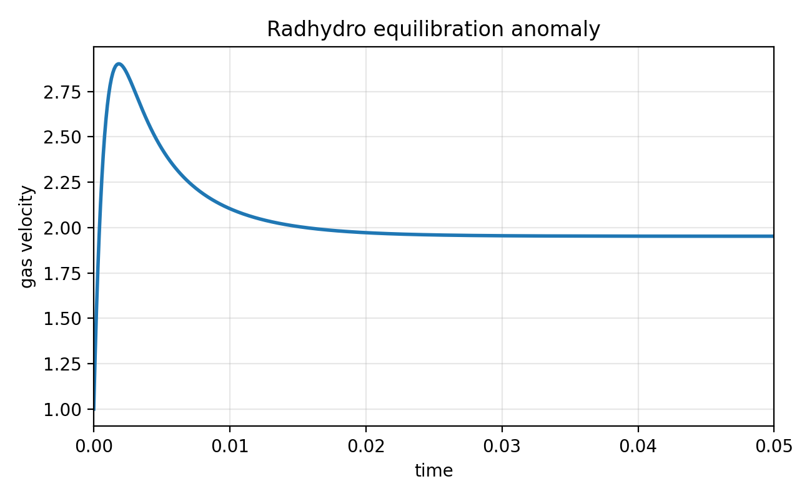

# Moving matter-radiation equilibration anomaly

This test problem demonstrates the anomalous acceleration described by Lowrie, Wollaeger, and Morel for Newtonian hydrodynamics coupled to radiation transport. The setup is a uniform infinite-medium equilibration problem viewed in a frame moving with respect to the material rest frame. In the fully relativistic solution, the gas velocity is constant. In Quokka's mixed-frame Newtonian radiation hydrodynamics update, the gas momentum changes during the matter-radiation source update.

The test is diagnostic rather than a validation against a desired invariant solution. It is intended to make the anomalous behavior easy to reproduce and quantify.

## Setup

The gas is uniform, periodic, and initially moving in the \\(x\\)-direction. The material and radiation are out of thermal equilibrium:

<script type="math/tex; mode=display">
\begin{aligned}
\rho_0 &= 1, \\
c &= \hat c = 100, \\
v_0 &= 10^{-2} c = 1, \\
T_0 &= 1, \\
a_r &= 1, \\
\kappa_P &= \kappa_F = 1.
\end{aligned}
</script>

The default CTest input uses \\(E_{r,0}=4\\), while the long diagnostic input uses \\(E_{r,0}=3 \times 10^5\\). In both cases the gas internal energy law is

<script type="math/tex; mode=display">
e_\mathrm{gas} = T^4 ,
</script>

so that the radiation-matter energy exchange is a simple equilibration problem with \\(a_rT_0^4 = 1\\). The radiation flux is initialized as the \\(O(v/c)\\) boosted isotropic field,

<script type="math/tex; mode=display">
F_{r,x,0} = \frac{4}{3} v_0 E_{r,0}.
</script>

## Expected behavior

For this problem the fully relativistic solution has no acceleration. A Newtonian conservative momentum update coupled to the lab-frame radiation momentum deposition instead gives, to leading order at early time,

<script type="math/tex; mode=display">
\frac{dv}{dt} =
\frac{\kappa_F v}{c}
\left(E_r - a_r T^4\right).
</script>

Thus the short test asserts that the measured velocity increment is positive and close to the small-step Newtonian prediction. This verifies that Quokka is exercising the anomalous coupling path.

## Running

The registered test uses the short one-step input:

```bash
./scripts/bash/quokka buildrun -d 3d RadhydroEquilibrationAnomaly
```

The long diagnostic input writes a CSV history and drives the final velocity to order 2:

```bash
./scripts/bash/quokka run -d 3d RadhydroEquilibrationAnomaly --input inputs/RadhydroEquilibrationAnomalyLong.toml
```

The long run writes `tests/radhydro_equilibration_anomaly_velocity.csv`. The run used for this page reached a final velocity of \\(1.9522\\), with a transient peak of \\(2.9020\\).

## Result



*Gas velocity as a function of time for the long diagnostic input. The velocity starts at 1, rapidly accelerates above 2, and relaxes to a final value of about 1.95 after radiation-matter equilibration.*
