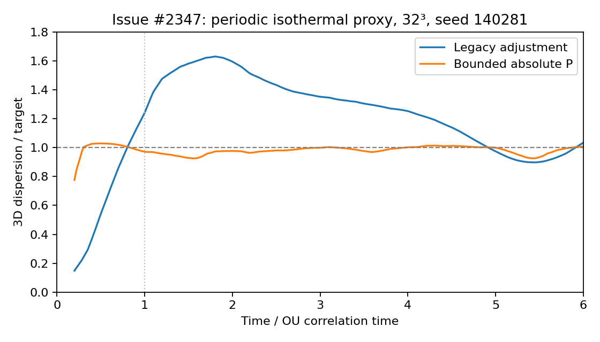

# Bounded turbulence amplitude control

Issue [#2347](https://github.com/quokka-astro/quokka/issues/2347) reports startup
overshoot from zero velocity. The legacy adjustment divides by each instantaneous
component dispersion and accumulates amplitude changes. Its response remains
unbounded as a nonzero component dispersion tends to zero.

## Opt-in configuration

```toml
turbulence.ampl_auto_adjust = 1
turbulence.ampl_auto_adjust_method = "proportional"
turbulence.ampl_proportional_gain = 60.0
turbulence.ampl_max_amplitude = 20.0
```

`legacy` remains the default method. Fixed-amplitude driving
(`ampl_auto_adjust = 0`) is unchanged. The new method requires a fresh simulation;
Quokka does not checkpoint the held forcing/controller state, so proportional
control explicitly rejects restarts rather than silently resetting it.

Let `a0[d] = ampl_factor[d]^(3/2)`, `A0 = sqrt(mean(a0[d]^2))`, and
`y = sqrt(sum(sigma[d]^2)) / target_vdisp`. At each available OU-pattern update,

```text
A = clamp(A0 + Kp * (1 - y), 0, Amax)
a[d] = (a0[d] / A0) * A
```

Here `sigma[d]` is the existing mass-weighted, center-of-mass-subtracted component
dispersion. `Kp` and `Amax` are dimensionless **acceleration-multiplier** units,
not the velocity-like `ampl_factor` input convention. For isotropic input,
`Amax = 20` means the largest equivalent logged `ampl_factor` is
`20^(2/3) = 7.3681`. Using absolute amplitude units prevents feedback strength and
the cap from collapsing when the initial amplitude is small. Unequal initial
component ratios are preserved by a common scalar multiplier.

This is positional **P** control: the reference amplitude is fixed, with no
accumulation, integral windup, derivative state, or division by measured velocity.
The output can be zero. The underlying OU process still advances then. Mode band,
projection, random-number sequence, OU variance, and correlation time are unchanged;
feedback necessarily changes the temporal statistics of the *applied* force.
Momentum/energy source integration and mean-force subtraction are unchanged.

The defaults are tested starting values, not universal tuning constants. More gain
reduces steady offset but can amplify sensitivity to a coarse update cadence. A cap
that is too small prevents reaching the target. Neither this controller nor a PID
controller can guarantee a turbulent spectrum has reached statistical stationarity
by one OU time. With no negative forcing or drag, an already over-target flow must
dissipate naturally; an inviscid stationary shear need not decay at all.

## CFD experiments

The baseline is development commit `8d4867a58d25387bd87d3aaaefb3d9a0aa6df931`.
These are **actual Quokka hydrodynamic runs**, not an ODE surrogate. They use the
periodic, isothermal `Turbulence` problem, initially at rest, with sound speed 1,
target dispersion 4.57 (approximately the issue's molecular-gas Mach number),
box length 1, modes 1–2, `k_driv = 4.649213465060362`, spectrum 2, power-law index
−2, angle exponent 1, solenoidal weight 0.5, initial amplitude factor 1.5,
32³ cells, and ten OU updates per correlation time. Runs cover six OU times.

This reproduces the reported **startup-control failure**, but is not an exact
reproduction of the original spherical cloud: reflecting boundaries, cooling,
gas–dust coupling, the density interface, and its custom problem code are absent.
Those production conditions still require validation. Controlling dispersion does
not by itself validate density statistics, spectra, or gravity-enabled evolution.

For seed 140281, legacy control peaks at 1.630 times the target. The selected
absolute-amplitude P controller markedly reduces this while reaching the target
quickly:



All reported means and standard deviations below are weighted by physical timestep,
over times 2–6. Peak is the maximum dispersion/target; t90 is in OU-time units.
The full measured results, including failed candidates, are in
[the experiment summary](../experiments/turbulence-controller-summary.csv), with
[a representative paired time series](../experiments/turbulence-controller-timeseries.csv).

| Seed | Legacy peak | P peak | P t90 | P late mean | P late standard deviation |
|---:|---:|---:|---:|---:|---:|
| 42 | 1.496 | 1.031 | 0.244 | 0.976 | 0.011 |
| 140281 | 1.630 | 1.029 | 0.269 | 0.987 | 0.021 |
| 140282 | 1.808 | 1.033 | 0.263 | 0.979 | 0.012 |
| 271828 | 1.661 | 1.031 | 0.242 | 0.997 | 0.011 |

### Why P rather than PI/PID?

The prototype used
`g = clamp(1 + kp*(1-y) + J - kd*filtered_dy/d(t/tau), 0, gmax)`, multiplying
the initial internal amplitude. `J` integrated `ki*(1-y)*dt/tau`, frozen when it
would drive saturation farther outward. Derivative acted on the measurement and
used a first-order filter of width 0.1 OU times. The prototypes shared the same
OU process, seed, and hydrodynamic method.

- Fixed amplitude reached 90% only at 4.22 OU times.
- Relative P (`kp=2`, cap 2) reduced the peak to 1.084 but reached 90% only at 3.01 times.
- Relative PI (`kp=2`, `ki=0.5`, cap 2) reached 90% at 2.77 times, with peak 1.148.
- Adding filtered D (`kd=0.2`) to that PI did not improve it: peak 1.151.
- Stronger relative P (`kp=16`, cap 10) reached 90% at 0.319 times, with peak 1.036.
- Filtered D (`kd=0.3` or 1) reduced that peak slightly but delayed reaching 90%.
- With a larger cap, `kp=16, ki=16` improved mean tracking but peaked at 1.115;
  `ki=64` peaked at 1.240. With initial amplitude 0.2, even the latter reached
  90% only at 1.49 times and later peaked at 1.347.
- Relative feedback underdrove when the initial amplitude was small. Absolute
  P units removed that dependence without an integrator. Absolute `Kp=16` was
  too weak at tiny initial amplitude; `Kp=30` still showed about 8% late offset.
  `Kp=60`, cap 20, was selected for broader tests.

The archived [prototype patch](../experiments/turbulence-controller-prototype.patch)
applies with `git apply --unidiff-zero` to the baseline commit and records the experimental P/PI/PID implementation
and diagnostics. It is **not** the production implementation. The summary's
`PID_*` values are prototype environment variables; for the absolute-P comparisons,
`PID_KP = Kp / ampl_factor^(3/2)` and
`PID_MAX = Amax / ampl_factor^(3/2)`. Unspecified prototype values are
`PID_KI=0`, `PID_KD=0`, `PID_FILTER=0.1`, `PID_MAX=2`, `PID_BASE=1`.
A missing `PID_MODE` selects legacy control. Its `exit` field retains the old
single-final-sample 7.5% test, which can fail despite reasonable time-averaged
behavior (or pass despite startup overshoot).

### Validation scope

Four paired seeds (140281, 42, 140282, 271828) were tested. Additional runs vary
initial amplitude (0.01, 0.2, 1.5, 3), grid resolution, OU cadence, hydro CFL,
initial velocity, and target Mach number. The initial-velocity variations use a
transverse sinusoidal shear. The 1.5-target initial shear stayed above target with
zero forcing, as expected for that nondissipating flow; this is an explicit
limitation, not a successful convergence test.

`TurbulenceStartup` checks the full transient envelope (peak ≤1.15), dispersion
at one OU time (0.9–1.15), and late mean (within 7.5%) over six OU times. The
unchanged `Turbulence` test checks legacy compatibility. Standalone tests cover
finite extreme values, invalid parameters, clipping, and integration with the
underlying generator. CPU results do not establish CUDA/HIP correctness.

## Reproduce the production test

```bash
cmake -S . -B build -G Ninja -DCMAKE_BUILD_TYPE=Release \
  -DAMReX_SPACEDIM=3 -DQUOKKA_PYTHON=OFF
cmake --build build --target Turbulence TurbulenceAmplitudeControllerTest TurbGenProportionalTest
ctest --test-dir build -R '^(Turbulence|TurbulenceStartup|TurbulenceAmplitudeController|TurbGenProportional)$' --output-on-failure
# Export timestep-resolved measurements for a separate run:
build/src/problems/Turbulence/Turbulence inputs/TurbulenceStartup.toml \
  problem.output_dispersion=1
```

The measured cloud build used GCC 14.2, one MPI rank, CPU Release, AMReX
`1de18774af5d8a368fa2a398f048e205a2c9f84f`, Microphysics
`66450c08895857ff555eba7bf14f73c9afc7b66e`, and HDF5 1.14.6. Missing MPI development
headers were supplied from the official Debian OpenMPI 5.0.7 development package.
No build-system workaround is included in the patch.

For a paired multi-seed comparison in a fresh output directory:

```bash
python scripts/python/turbulence_controller_sweep.py \
  build/src/problems/Turbulence/Turbulence /tmp/turbulence-sweep
```

The script refuses to overwrite existing run directories. Options vary seeds,
initial amplitude, resolution, cadence, CFL, target Mach number, and initial shear.
The [production-code results](../experiments/turbulence-controller-production.csv)
are separate from the archived prototype sweep.
