---
paths:
  - "docs/**/*"
---

# Documentation Guidelines

Non-obvious conventions for writing Quokka documentation that renders correctly under mdBook.

## Math (MathJax)

Quokka uses a **custom MathJax setup** (`docs/javascripts/mathjax-init.js`) with `mathjax-support = false` in `book.toml`. This means mdBook's built-in math preprocessor is **disabled** — markdown processes math content as regular text, which causes `_` (subscripts) to be eaten as emphasis markers.

### Display math

Use `<script type="math/tex; mode=display">` blocks. The custom init converts these to protected `<div>` elements before MathJax runs, preventing markdown from touching the content.

```html
<script type="math/tex; mode=display">
\frac{\partial N_\gamma}{\partial t} + \nabla \cdot \mathbf{F}_\gamma = \dot{N}^*_\gamma
</script>
```

- Content inside `<script>` tags is safe from markdown processing — underscores, braces, and backslashes all pass through untouched.
- For aligned equations, `\\[2pt]` works normally (no need to double-escape).

### Inline math

Use `\\(` and `\\)` delimiters. **Escape every `_` as `\_`** inside inline math blocks to prevent markdown from interpreting `_..._` pairs as emphasis.

```
\\(N\_\gamma\\) is the photon number density, with rate \\(\Gamma\_{\gamma {\rm H}^0} = c \sigma\_\gamma N\_\gamma\\).
```

- `\_` in markdown renders as literal `_` in HTML, which MathJax then processes as a subscript.
- Single-underscore blocks like `\\(N\_\gamma\\)` are technically safe without escaping, but **always escape for consistency** — a second `_` added later in a copy-paste will silently break.

### Inline math in tables

Table cells need the same escaping:

```markdown
| \\(N\_\gamma\\) | Ionizing photon number density (\\(\mathrm{cm}^{-3}\\)) |
```

### Units in text

Wrap physical units in inline math with `\mathrm`:

```markdown
\\(\mathrm{cm}^{-3}\\)  or  \\(\mathrm{erg}\ \mathrm{g}^{-1}\ \mathrm{K}^{-1}\\)
```

Not plain-text `cm^-3` (the minus signs and superscripts won't render).

## Citations

Use pandoc-style `[@key]` syntax. The bib file is `docs/markdown/references.bib`, processed by `mdbook-bib`.

```markdown
The method of [@Skinner_2019] is used for ...
```

- Citation keys are case-sensitive and match BibTeX keys exactly.
- Multiple citations: `[@CW84; @Toro2013]`.
- The bibliography renders on a dedicated page; reference it with `[References](bibliography.html)`.

## Diagrams

Use PlantUML in fenced code blocks:

````markdown

```plantuml
@startuml
skinparam ActivityBackgroundColor #F8F9FA
...
@enduml
```

````

The `plantuml` preprocessor (configured in `book.toml`) converts these to inline SVG via the public PlantUML server. Only use for non-sensitive code architecture diagrams.

## Cross-references

Internal links use relative paths from the markdown source:

```markdown
[installation guide](installation.md)
[Known Issues and Errata](known_issues.md)
```

Section anchors are auto-generated from headings (lowercase, hyphenated): `[VODE tolerances](photoionization.md#vode-tolerances)`.

## Images

Use relative paths into `docs/markdown/media/`:

```markdown

```

## heading structure

- `# Title` — page title (H1, one per file)
- `## Section` — major sections (H2)
- `### Subsection` — subsections (H3)
- `#### Minor heading` — used sparingly (H4)

Numbered sections (e.g., `## 1. Governing Equations`) are fine for physics documentation. Avoid going deeper than H4.
