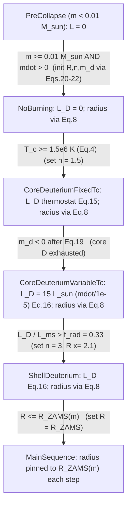
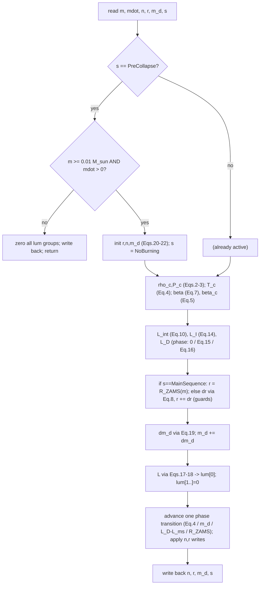

# Star Particle — Deuterium-Burning Protostellar Evolution Model — Design Spec

**Date:** 2026-07-21
**Target branch:** `chong/claude/star-particle-deuterium` (off `development`)
**Re-implements from:** `chong/particles/starparticles-copy-v2` (stale / broken)
**Builds on:** PR #1962 modular stellar-evolution framework (merged into `development`, commit `f4323d00`)
**Primary reference:** Offner, Klein, McKee & Krumholz (2009), ApJ 703, 131, **Appendix B** (arXiv:0904.2004,
source cached at `/tmp/arxiv-0904.2004/source/ms.tex`), implementing the one-zone model of
**Nakano et al. (1995, 2000)** and **Tan & McKee (2004)**, calibrated to Palla & Stahler (1991, 1992).
*All physics equations in §4 are transcribed from Appendix B; Nakano-2000 equation numbers are given where
Offner cites them.*
**Status:** Draft for review — implementation to follow after sign-off.

---

## 1. Motivation

PR #1962 landed the *framework* for compile-time-selectable stellar-evolution models on `development`:
a `Particle_Traits<problem_t>::stellar_model` trait (default `quokka::ToyStellarModel`), a `StellarUpdate`
dispatcher, the base `Star` particle layout, and a per-model extension seam (`nExtraReal` / `nExtraInt`). The
default `ToyStellarModel` is a stateless pair of analytic laws ($R \propto M^{0.4}$, $L \propto M^{3.5}$).

This work adds the **physically-detailed protostellar model** (Offner et al. 2009, Appendix B) as a second,
opt-in model (`quokka::DeuteriumBurningStellarModel`) plugged into that seam. It re-derives the physics from the
stale `starparticles-copy-v2` branch, **correcting three implementation defects (§2a) and re-aligning the
state machine to Offner (§2b)**.

### 2a. Bugs in the stale `evolve()`

| # | Stale behaviour | Consequence | Fix |
|---|---|---|---|
| B1 | `radius = rad_init(mdot)` recomputed at the **top of every step**, overwriting stored `radius`. | The persistent radius from transitions ($\times 2.1$, $= R_{\rm ZAMS}$) and all contraction is discarded next step. $R \le R_{\rm ZAMS}$ is unreachable, so shell$\to$ZAMS never fires. | Integrate the **radius update** (§4.5). `rad_init` seeds only the initial value at activation. |
| B2 | `mdeut += mdot*dt` then `-= 0.1*mdot*dt`, i.e. net $+0.9\,\dot m\,\Delta t$. | Reservoir *grows*; core-D exhaustion never triggers. | Exact Offner update (§4.7). |
| B3 | `beta_*` and the $\beta$ table computed but **never read**. | $\beta$ (needed by the radius update and thermostat) is unused. | $\beta$ enters §4.5 and §4.6.3 ($\beta = 1$ for low mass; table / Eddington quartic for $M \gtrsim 5\,M_\odot$). |

### 2b. State machine mis-aligned with Offner

Offner's deuterium burning proceeds **fixed-$T_c$ first, then variable-$T_c$**; the stale enum order
(`VariableCoreDeuterium` $\to$ `SteadyCoreDeuterium`) is reversed, and its shell-transition test
($L_{\star} < 0.33\,L_{\rm ZAMS}$) is **not** Offner's ($L_D / L_{\rm ms} > 0.33$). This spec adopts Offner's
exact stages and transitions (§4.8).

---

## 3. Goals / Non-goals

**Goals**
- `quokka::DeuteriumBurningStellarModel` conforming to the PR #1962 seam.
- Offner Appendix-B physics: radius update, $L_{\rm int}$/$L_I$/$L_D$, deuterium-mass update, six-phase machine.
- Per-model state ($m_d$, $n$, `burnState`) via `nExtraReal`/`nExtraInt` — **no base-layout churn** beyond one
  generic bookkeeping field (§5).
- Jeans-instability `Star` creation (reuse Sink criterion).
- Validation test `ParticleStar`; updated `docs/markdown/particles.md`.

**Non-goals**
- Modifying `ToyStellarModel` or the framework (it stays default).
- Depositing `lum` into the radiation field (validate the stored value only).
- Rotational accretion (stale `amx/amy/amz` **dropped**, §5).

---

## 4. `DeuteriumBurningStellarModel` — physics (Offner 2009, Appendix B)

The protostar is treated as a **polytrope of index $n$** whose contraction is governed by energy conservation.
Each call to `evolve()` advances the internal state over one coarse hydro step, using the mass and accretion
rate supplied by the accretion module. The model is a set of `AMREX_GPU_HOST_DEVICE` functions.

### 4.1 Inputs, outputs, and per-step derived quantities

State stored on the particle and read at the start of each step:

| Symbol | Units | Storage | Meaning |
|---|---|---|---|
| $m$ | g | `rdata[mass]` | current stellar mass (updated by the accretion module *before* this call) |
| $\dot m$ | g s$^{-1}$ | `rdata[mdot]` | current accretion rate (written by the accretion module) |
| $r$ | cm | `rdata[radius]` | stellar radius (persistent; evolved here) |
| $n$ | — | model extra `n` | polytropic index, $1.5 \le n \le 3.0$ |
| $m_d$ | g | model extra `mdeut` | mass of accreted gas whose deuterium is not yet burned |
| $s$ | — | model extra `burnState` (int) | evolutionary phase (§4.8) |

Per-step scalars derived from the above (not stored):

$$
\Delta t \equiv \texttt{dt}\ \text{(s)}, \qquad \Delta m \equiv \dot m\,\Delta t\ \text{(g, mass accreted this step)}.
$$

Outputs written back at the end of the step: updated $r$, $n$, $m_d$, $s$, and the luminosity into `lum[0]`
(with `lum[1..nGroups-1] = 0`).

> **Ordering / one-step lag.** `evolve()` runs *before* the accretion module of the *next* step, so the
> $m,\dot m$ read here are the values produced by the *previous* step's accretion. Per-step operation order
> inside `evolve()` (Offner Appendix B): **(1)** update $r$ and $m_d$; **(2)** compute the stored luminosity;
> **(3)** advance the evolutionary phase. This ordering is normative.

### 4.2 Physical constants and model parameters

Physical constants (CGS) come from `extern/Microphysics/constants/fundamental_constants.H` (`quokka::C::…`); use
those symbols in code rather than literals. Nominal values (for reference in this doc):

| Symbol | Code | Value | Meaning |
|---|---|---|---|
| $G$ | `C::Gconst` | $6.67428\times10^{-8}$ | cm$^3$ g$^{-1}$ s$^{-2}$ |
| $k_B$ | `C::k_B` | $1.380649\times10^{-16}$ | erg K$^{-1}$ |
| $m_H$ | `C::m_u` | $1.66053907\times10^{-24}$ g | mass unit used with $\mu$ (see note) |
| $a$ | `C::a_rad` | $4\sigma_{\rm SB}/c \approx 7.5657\times10^{-15}$ | radiation constant, erg cm$^{-3}$ K$^{-4}$ |
| $\sigma_{\rm SB}$ | `C::sigma_SB` | $5.6703744\times10^{-5}$ | erg cm$^{-2}$ s$^{-1}$ K$^{-4}$ |
| $M_\odot$ | `C::M_solar` | $1.9884\times10^{33}$ | g |
| $R_\odot$ | `C::R_solar` | $6.957\times10^{10}$ | cm |
| $L_\odot$ | — | $3.828\times10^{33}$ | erg s$^{-1}$ (not in the header; stale code hardcodes this) |
| $\mathrm{yr}$ | `seconds_per_year` | $3.1557\times10^{7}$ s | year in seconds |

Model parameters (Offner Appendix B; stale `StellarConstants`):

| Symbol | Value | Meaning |
|---|---|---|
| $f_k$ | $0.5$ | fraction of infall kinetic energy radiated in the inner disk before reaching the surface |
| $f_{\rm acc}$ | $0.5$ | fraction of accretion power radiated (rest drives a wind) |
| $f_{\rm rad}$ | $0.33$ | $L_D/L_{\rm ms}$ threshold for radiative-barrier (shell) transition |
| $T_H$ | $3000$ K | Hayashi-track surface temperature floor |
| $T_D$ | $1.5\times10^{6}$ K | deuterium ignition / thermostat temperature |
| $M_{\rm rad,min}$ | $0.01\,M_\odot$ | minimum mass to activate the model |
| $s_{\rm shell}$ | $2.1$ | radius inflation factor entering shell burning |
| $\mu$ | $0.613$ | mean molecular weight (fully ionized solar composition) |

> **Note on $m_H$ vs $m_u$.** Offner writes $\mu m_H$; the stale EOS solver uses $\mu\,m_u$ (atomic mass unit).
> The difference (proton $1.6726\times10^{-24}$ g vs $m_u\,1.6605\times10^{-24}$ g) is $\approx0.7\%$. This spec
> follows the code and uses $m_H \equiv m_u = $ `C::m_u`.

### 4.3 Polytropic structure: $a_g$, $\rho_c$, $P_c$

Polytropic gravitational structure factor (Offner; $E_{\rm grav} = -a_g\,G m^2/r$):

$$
a_g(n) = \frac{3}{5-n}. \tag{1}
$$

Central density and pressure of a polytrope of index $n$, mass $m$, radius $r$:

$$
\rho_c = \frac{\bar\rho}{f_\rho(n)}, \qquad \bar\rho = \frac{m}{\tfrac{4}{3}\pi r^3}, \tag{2}
$$

$$
P_c = f_P(n)\,\frac{G m^2}{r^4}. \tag{3}
$$

Here $f_\rho(n) = \bar\rho/\rho_c \in (0,1)$ and $f_P(n)$ are dimensionless Lane–Emden structure factors,
tabulated versus $n$. **These numeric tables are required input and are NOT reproduced here** — see §4.10-a.

### 4.4 Central temperature $T_c$ and gas-pressure fraction $\beta$

**Central temperature.** Given $\rho_c, P_c$, solve the gas+radiation EOS for $T_c$ (Offner):
$$
P_c = \frac{\rho_c\,k_B\,T_c}{\mu\,m_H} + \frac{1}{3}\,a\,T_c^4. \tag{4}
$$

This is monotonic in $T_c$ for $T_c>0$; solve by a bracketed root find (bisection or TOMS-748) on
$[\,T_{\rm lo}, T_{\rm hi}\,]$ with $T_{\rm lo}=1$ K and $T_{\rm hi} = 2\max(T_{\rm gas}, T_{\rm rad})$, where
$T_{\rm gas} = P_c\mu m_H/(k_B\rho_c)$ (pure-gas estimate) and $T_{\rm rad} = (3P_c/a)^{1/4}$ (pure-radiation
estimate). $T_c$ is used both for the no-burning$\to$fixed-$T_c$ transition (§4.8) and for $\beta_c$ below.

**Central gas-pressure fraction** (ratio of gas pressure to total pressure at the centre):

$$
\beta_c \equiv \frac{P_{\rm gas,c}}{P_c} = \frac{\rho_c\,k_B\,T_c}{\mu\,m_H\,P_c}. \tag{5}
$$

Equivalently, $\beta_c$ solves the **Eddington quartic** (Offner; obtained by substituting the gas EOS into (4)):

$$
P_c^{3} = \frac{3}{a}\left(\frac{k_B}{\mu\,m_H}\right)^{4}\frac{1-\beta_c}{\beta_c^{4}}\,\rho_c^{4}. \tag{6}
$$

**The $\beta$ used in the radius update (§4.5) and thermostat (§4.6.3).** Offner defines this as the
*mass-mean* gas-pressure fraction over the star and interpolates it from a pre-computed table $\beta(n,m)$; for
$n=3$ it is obtained from the quartic (6). This spec uses the following operational rule:

$$
\beta = \begin{cases}
1 & \text{radiation pressure negligible (low mass; see below)}\\[2pt]
\beta(n,m)\ \text{from table, or (6) for } n=3 & \text{otherwise.}
\end{cases} \tag{7}
$$

For the low-mass stars this model targets, radiation pressure is negligible and $\beta = \beta_c = 1$ to very good
approximation (Offner states this explicitly). The stale code returns $\beta = 1$ for $m < 5\,M_\odot$. **The
mean-$\beta$ table, the mean-vs-central distinction, and the derivative $d\log\beta/d\log m$ are required only for
$m \gtrsim 5\,M_\odot$ and are underspecified here — see §4.10-b.** For $\beta \equiv 1$ (constant), all
$d\log\beta/d\log m$ and $d\log(\beta/\beta_c)/d\log m$ terms below are exactly $0$.

### 4.5 Radius update (fixes B1)

Discretized Nakano et al. (2000) Eq. (5.8) (Offner Appendix B). Over a step of size $\Delta t$ with accreted
mass $\Delta m$, the radius change is
$$
\Delta r = 2\,\frac{\Delta m}{m}\left(1 - \frac{1-f_k}{a_g\,\beta} + \frac{1}{2}\frac{d\log\beta}{d\log m}\right) r
\;-\; \frac{2\,\Delta t}{a_g\,\beta}\,\frac{r^{2}}{G\,m^{2}}\,\bigl(L_{\rm int} + L_I - L_D\bigr). \tag{8}
$$

Term meanings: the first term is the change from accreting mass (specific energy of new material vs binding
energy); the second is contraction/expansion from the net luminosity, where $L_{\rm int}$ (radiated, §4.6.1) and
$L_I$ (dissociation/ionization sink, §4.6.2) drive contraction while $L_D$ (deuterium burning, §4.6.3) opposes it.
All quantities on the RHS use the values at the start of the step. Update:
$$
r \leftarrow r + \Delta r. \tag{9}
$$

Once the phase is *main sequence*, skip (8)–(9) and instead set $r = R_{\rm ZAMS}(m)$ (Eq. 13). **Radius is read
from storage, updated by (8)–(9), and written back — never re-seeded from `rad_init`** (the structural fix for
B1). Recommended numerical guards (non-Offner, flag §4.10-c): clamp $|\Delta r| \le 0.5\,r$ per step, and floor
$r \leftarrow \max(r,\,R_{\rm ZAMS}(m))$ so the shell$\to$MS transition is reachable.

### 4.6 Luminosities

#### 4.6.1 Internal luminosity and Tout et al. (1996) ZAMS fits

$$
L_H = 4\pi r^2 \sigma_{\rm SB} T_H^4 \quad\text{(Hayashi floor)}, \qquad
L_{\rm ms} = L_{\rm ZAMS}(m), \qquad
L_{\rm int} = \max\!\bigl(L_{\rm ms},\, L_H\bigr). \tag{10}
$$

$L_{\rm ZAMS}(m)$ and $R_{\rm ZAMS}(m)$ use the Tout et al. (1996) rational-polynomial fits at solar metallicity.
With $x \equiv m/M_\odot$:
$$
\frac{L_{\rm ZAMS}}{L_\odot} =
\frac{\alpha\,x^{5.5} + \beta\,x^{11}}
{\gamma + x^{3} + \delta\,x^{5} + \epsilon\,x^{7} + \zeta\,x^{8} + \eta\,x^{9.5}}, \tag{11}
$$

$$
\frac{R_{\rm ZAMS}}{R_\odot} =
\frac{\theta\,x^{2.5} + \iota\,x^{6.5} + \kappa\,x^{11} + \lambda\,x^{19} + \mu_g\,x^{19.5}}
{\nu + \xi\,x^{2} + o\,x^{8.5} + x^{18.5} + \pi_g\,x^{19.5}}. \tag{12}
$$

Coefficients (solar-metallicity evaluation of the Tout96 $Z$-dependent polynomials; transcribed from the stale
`starparticle_radiation.hpp` `Tout96` namespace — **verify against that file when coding**, §4.10-d):

| Eq. (11), $L$ | value | Eq. (12), $R$ | value |
|---|---|---|---|
| $\alpha$ | 0.39704170 | $\theta$ | 1.71535900 |
| $\beta$ | 8.52762600 | $\iota$ | 6.59778800 |
| $\gamma$ | 0.00025546 | $\kappa$ | 10.08855000 |
| $\delta$ | 5.43288900 | $\lambda$ | 1.01249500 |
| $\epsilon$ | 5.56357900 | $\mu_g$ | 0.07490166 |
| $\zeta$ | 0.78866060 | $\nu$ | 0.01077422 |
| $\eta$ | 0.00586685 | $\xi$ | 3.08223400 |
| | | $o$ (upsilon) | 17.84778000 |
| | | $\pi_g$ | 0.00022582 |

$$
R_{\rm ZAMS} \text{ is also the radius set when entering the main-sequence phase.} \tag{13}
$$

#### 4.6.2 Ionization/dissociation luminosity

Rate at which energy must be supplied to dissociate H$_2$ and ionize the incoming gas (16.0 eV per H nucleus;
Offner):
$$
L_I = 2.5\,L_\odot\,\frac{\dot m}{10^{-5}\,M_\odot\,\mathrm{yr}^{-1}},
\qquad 10^{-5}\,M_\odot\,\mathrm{yr}^{-1} = \frac{10^{-5} M_\odot}{\mathrm{yr}} \approx 6.30\times10^{20}\ \mathrm{g\,s^{-1}}. \tag{14}
$$

#### 4.6.3 Deuterium-burning luminosity (phase-dependent)

- Phases *pre-collapse* and *no burning*: $L_D = 0$.
- Phase *core-D burning, fixed $T_c$* (thermostat holding $T_c = T_D$; Nakano 2000 Eq. 5.13). Evaluate $\rho_c,P_c$
  from the current $(m,r,n)$, and $\beta_c$ from (5) **with $T_c$ set to $T_D$**:

$$
L_D = L_{\rm int} + L_I + \frac{G m}{r}\,\dot m\left\{\,1 - f_k - \frac{a_g\,\beta}{2}\left[\,1 + \frac{d\log(\beta/\beta_c)}{d\log m}\,\right]\right\},
\qquad \beta_c = \frac{\rho_c\,k_B\,T_D}{\mu\,m_H\,P_c}. \tag{15}
$$

  For $\beta = \beta_c = 1$ (low mass) this reduces to
  $L_D = L_{\rm int} + L_I + \dfrac{G m\,\dot m}{r}\left(1 - f_k - \dfrac{a_g}{2}\right)$.

- Phases *core-D burning, variable $T_c$* and *shell-D burning* (deuterium burned as fast as accreted; 100 eV
  per gram of gas at D/H $= 2.5\times10^{-5}$; Offner):

$$
L_D = 15\,L_\odot\,\frac{\dot m}{10^{-5}\,M_\odot\,\mathrm{yr}^{-1}}. \tag{16}
$$

#### 4.6.4 Total (feedback) luminosity — stored in `lum`

The only quantity the rest of the code consumes. Three parts (Offner):

$$
L = L_{\rm int} + L_{\rm acc} + L_{\rm disk}, \tag{17}
$$

$$
L_{\rm acc} = f_{\rm acc}\,f_k\,\frac{G m\,\dot m}{r}, \qquad
L_{\rm disk} = (1 - f_k)\,\frac{G m\,\dot m}{r}. \tag{18}
$$

$L$ is written to `lum[0]`; `lum[1..nGroups-1] = 0` (single-group deposition). $L = 0$ while in *pre-collapse*
(uninitialized). This replaces the stale `luminosity_star/disk/total`, whose Hayashi-limited $L_{\star}$ did not
match Offner's $L_{\rm int}+L_{\rm acc}+L_{\rm disk}$.

### 4.7 Deuterium-mass update (fixes B2)

Offner Appendix B (deuterium bookkeeping), using the $L_D$ from §4.6.3:

$$
\Delta m_d = \Delta m - 10^{-5}\,M_\odot\left(\frac{L_D}{15\,L_\odot}\right)\left(\frac{\Delta t}{\mathrm{yr}}\right),
\qquad m_d \leftarrow m_d + \Delta m_d. \tag{19}
$$

No clamp to zero (the phase test in §4.8 uses the sign of $m_d$). In the fixed-$T_c$ phase, $L_D$ (Eq. 15) exceeds
the accretion supply, so $m_d$ decreases and eventually goes negative (exhaustion $\to$ transition). In the
variable-$T_c$ and shell phases, $L_D$ (Eq. 16) makes the second term exactly equal to $\Delta m$, so
$\Delta m_d = 0$.

### 4.8 Evolutionary state machine

`enum burningState { PreCollapse, NoBurning, CoreDeuteriumFixedTc, CoreDeuteriumVariableTc, ShellDeuterium,
MainSequence }` (int model-extra; `PreCollapse` = uninitialized). Transitions are checked in step (3) of the
per-step order (§4.1), i.e. *after* the radius/deuterium/luminosity updates of the current phase.



Radius is written by a transition at exactly two points ($\times\,2.1$ entering shell; $=R_{\rm ZAMS}$ entering
main sequence) plus the one-time initialization (Eq. 20); everywhere else it evolves only by Eq. 8.

**Initialization at `PreCollapse` $\to$ `NoBurning`** (Offner Eqs. B1–B3), triggered when $m \ge M_{\rm rad,min}$
**and** $\dot m > 0$ (if $\dot m \le 0$, remain in `PreCollapse` with $L = 0$; note $\Delta m/\Delta t$ here is the
current $\dot m$):

$$
r = 2.5\,R_\odot\left(\frac{\dot m}{10^{-5}\,M_\odot\,\mathrm{yr}^{-1}}\right)^{0.2}, \tag{20}
$$

$$
n = 5 - 3\left[\,1.475 + 0.07\log_{10}\!\left(\frac{\dot m}{M_\odot\,\mathrm{yr}^{-1}}\right)\right]^{-1},
\quad\text{then clamp } n \in [1.5, 3.0], \tag{21}
$$

$$
m_d = m. \tag{22}
$$

> **Deviation note (flag §4.10-c).** The stale `rad_init` wraps (20) in $\max(\cdot,\,2R_\odot)$; Offner Eq. B1 has
> no floor. Use the pure Offner form; add a floor only as a documented $\dot m \to 0$ guard.

### 4.9 `evolve(rdata, idata, n_groups, dt)` control flow



### 4.10 Missing / underspecified — must be supplied before coding

The items below are **not** determinable from Appendix B alone; they must be resolved from the repo or a decision.
Do not invent values.

- **(a) Lane–Emden factor tables $f_\rho(n)$, $f_P(n)$.** Required by Eqs. (2)–(3). Numeric arrays over $n$; source
  = stale `starparticle_radiation.hpp` (`n_table`, `rho_factor_table`, `pressure_factor_table`) **or** recompute
  from Lane–Emden solutions of index $n$. Not reproduced here to avoid transcription error — copy from source and
  cite it.
- **(b) Mean-$\beta$ table $\beta(n,m)$ and $d\log\beta/d\log m$, $d\log(\beta/\beta_c)/d\log m$.** Needed only for
  $m \gtrsim 5\,M_\odot$. Offner's "mean" $\beta$ (radius update) vs central $\beta_c$ (Eq. 15) distinction is not
  fully specified in the appendix; the table source is the stale `beta_table` (M: 5–50 $M_\odot$, n: 1.5–3.0), and
  the log-derivatives are not defined there. For the $1\,M_\odot$ validation test $\beta = 1$ and these are $0$, so
  this can be deferred — but a general-mass model needs them defined.
- **(c) Numerical guards** (radius clamp $|\Delta r|\le0.5r$, floor at $R_{\rm ZAMS}$, `rad_init` floor). Not in
  Offner; proposed here for stability. Confirm or replace with sub-cycling.
- **(d) Tout96 coefficients.** The 16 values in §4.6.1 are transcribed from the stale code (solar-$Z$ evaluation).
  Verify each against `starparticle_radiation.hpp` before use; for non-solar metallicity the full Tout96
  $Z$-dependent polynomials would be needed (out of scope).

---

## 5. Particle layout — via the PR #1962 seam (no base churn)

Base `Star` real layout on `development`: `{mass, vx, vy, vz, birth_time, mdot, radius, lum[nGroups]}`. This spec:

- **Adds one generic field to the base: `death_time`** (sim time a particle deactivates; $-1$ unset) — model-
  independent, threaded by the creation/descriptor framework, anticipated by PR #1962 §5. `ToyStellarModel`
  unaffected (gains one reserved real; still $0/0$ extras).
- **Drops** stale `amx/amy/amz` (never written; out of scope).
- **`mdeut`, `n` (real) + `burnState` (int) $\to$ model extras.**

**Base real layout** (`StarParticleFixedComps = 8`, `StarParticleFixedIntComps = 0`):

| Idx | Name | Notes |
|---|---|---|
| 0 | `mass` | |
| 1–3 | `vx, vy, vz` | |
| 4 | `birth_time` | set at creation |
| 5 | `death_time` | $-1$; `allows_destruction = false` |
| 6 | `mdot` | accretion module |
| 7 | `radius` | persistent; evolved via §4.5 |
| 8 … 8+nGroups$-$1 | `lum, …` | last of the base block |

**`DeuteriumBurningStellarModel` extras:**

```cpp
static constexpr int nExtraReal = 2;   // slot 0 = mdeut, slot 1 = n
static constexpr int nExtraInt  = 1;   // slot 0 = burnState
// extra region starts at (StarParticleFixedComps + n_groups):
//   mdeut  = rdata[StarParticleFixedComps + n_groups + 0]
//   n      = rdata[StarParticleFixedComps + n_groups + 1]
//   burnState = idata[0]
```

`ToyStellarModel` stays `nExtraReal = nExtraInt = 0`. Comp counts remain `FixedComps + nGroups + nExtraReal`
(real) / `FixedIntComps + nExtraInt` (int), exactly as `particle_types.hpp:360-362` computes today. `evolve()`
receives `n_groups`, so offsets are device-computable with no host pointers.

---

## 6. Particle creation (Jeans instability)

`ParticleCreationTraits<ParticleType::Star>` reuses the Sink criterion
(`SinkCreationHelpers::checkSinkCreation`): a cell forms a `Star` when
$\rho_{\rm cell} > \rho_J = \pi c_s^2/(G\lambda_J^2)$, $\lambda_J = 0.25\,\Delta x$, and it is a local density
maximum. Excess mass $(\rho_{\rm cell} - \rho_J)\Delta V$ is removed from the gas (density, momenta, energies
scaled by $\rho_J/\rho_{\rm cell}$) into a new particle at the cell centre:

```
mass = (rho_cell - rho_J) dV,  v = gas velocity,  birth_time = t,  death_time = -1,  mdot = 0,
radius = 2 R_sun,  [extras] mdeut = mass,  n = 1.5,  burnState = PreCollapse
```

Registered `allows_creation = true`, `allows_accretion = true`, `allows_destruction = false`,
`setForceFinestLevel(true)`; descriptor gets `mass, lum, birth_time, death_time, mdot` indices.

---

## 7. Plumbing changes (files)

| File | Change |
|---|---|
| `src/particles/star_particle_indices.H` | Base enum `{mass,vx,vy,vz,birth_time,death_time,mdot,radius,lum}`; `StarParticleFixedComps = 8`; `StarParticleFixedIntComps = 0`; `StarParticleDeathTimeIdx`. No `mdeut/n/amx/amy/amz/burnState` in base. |
| `src/particles/stellar_models.hpp` (or new `stellar_models_deuterium.hpp` included here) | Add `DeuteriumBurningStellarModel` (`2/1` extras, named offsets, `evolve()` per §4.9). `ToyStellarModel` unchanged. |
| `src/particles/starparticle_radiation.hpp` | **Keep** the verified machinery: `pressure_factor_table`, `rho_factor_table`, $\beta$ table + Eddington quartic, `temperature_central` (TOMS-748), Tout96 `L_ZAMS`/`R_ZAMS`, `n_init`, `rad_init`, constants. **Replace** `evolve()` logic, `luminosity_*`, and the state machine with the Offner-exact versions (§4). Delete the top-of-step `rad_init` overwrite and the net-positive `mdeut` update. |
| `src/particles/particle_types.hpp` | `enum burningState` (Offner order, §4.8); `Star` int-comp I/O names emit `burnState` only when `nExtraInt>0`; units-map: `death_time, mdot, radius, luminosity` (drop `amx/amy/amz/mdeut/n` base entries). |
| `src/particles/particle_creation.hpp` | `ParticleCreationTraits<ParticleType::Star>` per §6, writing base + extras via offsets. |
| `src/particles/PhysicsParticles.hpp` | Register `Star`: `mass, lum, birth_time, death_time, mdot`; flags per §6; `setForceFinestLevel(true)`. |
| `src/particles/particle_accretion.hpp`, `particle_update.hpp`, `src/simulation.hpp`, `src/QuokkaSimulation.hpp` | **(Already on `development` via PR #1962)** — verify `mdot` write, `dt` threading, `Star` init branch, `createInitialStarParticles` hook. Do not recreate. |
| `docs/markdown/particles.md` | Star-particle section aligned to Offner equations/stages above. |

---

## 8. Validation test `ParticleStar`

Select the model via the trait:

```cpp
template <> struct Particle_Traits<ParticleStar> : DefaultParticleTraits {
    static constexpr ParticleSwitch particle_switch = ParticleSwitch::Star;
    using stellar_model = quokka::DeuteriumBurningStellarModel;
};
```

**Setup:** $32^3$ box, one super-Jeans cell ($\rho = 1.2\,\rho_J$) $\to$ one `Star` in step 1; hydro +
self-gravity + MHD ($B_0 = 10^{-7}$) on, radiation off, `nGroups = 1`; $T_0 = 10$ K, $\rho_0 = m_p$. At
$m \approx 1\,M_\odot$, $\beta = 1$ (Offner's low-mass regime), so the $d\log\beta/d\log m$ terms are exactly $0$.

**Assertions:**
1. Formation: exactly 1 particle after step 1; total (gas+star) mass conserved to $\sim10^{-14}$.
2. Accretion: total mass conserved to $\sim10^{-13}$ after 20 steps.
3. State progression: once $\dot m > 0$ and $m \ge 0.01\,M_\odot$, `burnState` $\ne$ `PreCollapse`.
4. $1.5 \le n \le 3.0$ for active particles.
5. Luminosity consistency: stored `lum` matches a host recomputation of Eqs. (17)–(18) within $\sim1\%$ (absorbs
   the documented one-step accretion/update lag, PR #1962 §7).
6. **Radius persistence (regression guard for B1):** stored `radius` evolves continuously (no per-step reset to
   `rad_init`); assert $r \ge R_{\rm ZAMS}(m)$ and no jump back to the `rad_init` value after a transition.

**Procedure** (3D-only — `Star` requires `AMREX_SPACEDIM == 3`):

```
quokka config  -d 3d --delete --source ~/superpowers/bin/quokka.rc --root <REPO_ROOT> -DQUOKKA_PYTHON=OFF
quokka build   -d 3d ParticleStar --source ~/superpowers/bin/quokka.rc --root <REPO_ROOT>
quokka clean   --root <REPO_ROOT>
quokka run     -d 3d ParticleStar --source ~/superpowers/bin/quokka.rc --root <REPO_ROOT>
```

Expect exit 0. Also a `3d-cuda` compile check (device-lambda safety of `evolve()` incl. on-device TOMS-748).

---

## 9. Open questions / decisions for review

1. **$d\log\beta/d\log m$ for massive stars** (§4.10-b): the test ($1\,M_\odot$) has $\beta=1$, so this is moot
   there. For a general-purpose model ($m \gtrsim 5\,M_\odot$) it must be finite-differenced from the $\beta$
   table. Recommend implementing $\beta = 1$ + table lookup now, and the derivative term as a `// TODO` ($0$ until
   a massive-star test exists).
2. **Integrator** (§4.10-c): forward Euler at coarse `dt` with the $R_{\rm ZAMS}$ floor and $|\Delta r|\le0.5r$
   clamp. Sub-cycling is a later refinement if overshoot appears at high $\dot m$.
3. **`rad_init` floor** (§4.10-c): drop the stale $\max(\cdot, 2R_\odot)$ to match Offner Eq. (20) exactly; add
   back only as a documented $\dot m\to0$ guard if needed.
4. **`death_time` in base layout:** included per the user's decision; adds one reserved real to `ToyStellarModel`.
   Confirm acceptable.
5. **Code placement:** `evolve()` as a member of `DeuteriumBurningStellarModel` calling free functions in
   `StellarPhysics` (keeps the heavy tables out of the widely-included header). Recommend yes.

---

## 10. Risks

- **Radius-update stability:** explicit forward difference at coarse `dt`; mitigated by $R_{\rm ZAMS}$ floor +
  per-step clamp.
- **Layout/I/O churn:** adding `death_time` touches units + I/O names; keep it to that one field, all deuterium
  state in model extras (PR #1962 §9 "minimal, stable base").
- **GPU:** `evolve()` runs on device; tables `AMREX_GPU_CONSTANT`, on-device TOMS-748 for $T_c$ — confirm under
  `3d-cuda`; no host pointers.
- **Model fidelity:** Offner notes Hosokawa et al. (2009) suggest slightly revised calibration constants for
  future work; out of scope here — we reproduce Offner (2009) as-published.
```
