# Flowchart Redesign Implementation Plan

> **For agentic workers:** REQUIRED SUB-SKILL: Use superpowers:subagent-driven-development (recommended) or superpowers:executing-plans to implement this plan task-by-task. Steps use checkbox (`- [ ]`) syntax for tracking.

**Goal:** Replace the broken Mermaid flowchart in `docs/markdown/flowchart.md` with a single, comprehensive PlantUML activity diagram covering the complete Quokka simulation call chain.

**Architecture:** One PlantUML activity diagram using `partition` for function grouping, `repeat...repeat while` for loops, and `if/else/endif` for conditional physics. Rendered by `mdbook-plantuml` 2.0.0 calling the PlantUML HTTPS server — no Java required in CI. Two levels of visual `partition` nesting (`evolve` → `advanceSingleTimestepAtLevel`); inner function boundaries labelled with bold activity nodes and `note right` annotations.

**Tech Stack:** PlantUML activity diagram (beta syntax), `mdbook-plantuml` 2.0.0, mdBook 0.5.2, Cargo/Rust for installation, GitHub Actions CI (`docs.yml`).

---

### Task 1: Ignore brainstorm artefacts in git

**Files:**
- Modify: `.gitignore`

- [ ] **Step 1: Append `.superpowers/` to `.gitignore`**

Open `.gitignore` and add at the very end:

```
# Superpowers brainstorm artefacts
.superpowers/
```

- [ ] **Step 2: Verify it is ignored**

```bash
git status
```

Expected: `.superpowers/` directory does not appear as untracked.

- [ ] **Step 3: Commit**

```bash
git add .gitignore
git commit -m "chore: ignore .superpowers/ brainstorm artefacts"
```

---

### Task 2: Add `mdbook-plantuml` to the install script

**Files:**
- Modify: `scripts/bash/install_mdbook.sh`

- [ ] **Step 1: Rewrite `install_mdbook.sh`**

Replace the entire file content with:

```bash
#!/bin/bash
set -euo pipefail

readonly MDBOOK_VERSION="0.5.2"
readonly MDBOOK_BIB_VERSION="0.5.2"
readonly MDBOOK_PLANTUML_VERSION="2.0.0"

echo "Install mdBook tooling used by the CI docs jobs"

if ! command -v cargo >/dev/null 2>&1; then
    echo "Error: cargo is required to install mdBook tooling."
    echo "Install the Rust toolchain, then rerun this script."
    exit 1
fi

cargo install mdbook --version "${MDBOOK_VERSION}"
cargo install mdbook-bib --version "${MDBOOK_BIB_VERSION}"
cargo install mdbook-plantuml --version "${MDBOOK_PLANTUML_VERSION}"
```

- [ ] **Step 2: Run the install script**

```bash
./scripts/bash/install_mdbook.sh
```

Expected: all three tools either install or print "already installed". Final line should include `mdbook-plantuml`.

Verify:

```bash
mdbook-plantuml --version
```

Expected output: `mdbook-plantuml 2.0.0`

- [ ] **Step 3: Commit**

```bash
git add scripts/bash/install_mdbook.sh
git commit -m "chore: add mdbook-plantuml 2.0.0 to install script"
```

---

### Task 3: Configure `mdbook-plantuml` in `book.toml` and update the build guard

**Files:**
- Modify: `docs/book.toml`
- Modify: `scripts/bash/docs_build.sh`

`mdbook-plantuml` is configured via `[preprocessor.plantuml]` in `book.toml`. Setting `plantuml-cmd` to an HTTPS URL tells it to call the PlantUML online server — no Java needed locally or in CI. The diagram content is non-sensitive (code architecture only).

- [ ] **Step 1: Add preprocessor block to `docs/book.toml`**

After the existing `[preprocessor.bib]` block (around line 19), add:

```toml
[preprocessor.plantuml]
plantuml-cmd = "https://www.plantuml.com/plantuml"
```

The `[output.html]` block and everything else stays untouched.

- [ ] **Step 2: Add `mdbook-plantuml` guard to `docs_build.sh`**

In `scripts/bash/docs_build.sh`, replace the existing tool check:

```bash
if ! command -v mdbook >/dev/null 2>&1 || ! command -v mdbook-bib >/dev/null 2>&1; then
    echo "Error: mdBook tooling is required to build the docs."
    echo "Install it with: ./scripts/bash/install_mdbook.sh"
    exit 1
fi
```

with:

```bash
if ! command -v mdbook >/dev/null 2>&1 || ! command -v mdbook-bib >/dev/null 2>&1 || ! command -v mdbook-plantuml >/dev/null 2>&1; then
    echo "Error: mdBook tooling is required to build the docs."
    echo "Install it with: ./scripts/bash/install_mdbook.sh"
    exit 1
fi
```

- [ ] **Step 3: Test a dry build (no PlantUML blocks yet)**

The current `flowchart.md` still has Mermaid code, so no PlantUML blocks exist yet. Run the build to confirm the preprocessor loads without errors:

```bash
./scripts/bash/docs_build.sh
```

Expected: build succeeds with no `mdbook-plantuml` errors. (Mermaid blocks are untouched — client-side JS still handles them.)

- [ ] **Step 4: Commit**

```bash
git add docs/book.toml scripts/bash/docs_build.sh
git commit -m "chore: configure mdbook-plantuml preprocessor (HTTPS server)"
```

---

### Task 4: Rewrite `flowchart.md` with the PlantUML diagram

**Files:**
- Modify: `docs/markdown/flowchart.md`

This is the main task. Replace the entire file with a Markdown page containing one PlantUML fenced code block. The diagram uses:

- `partition "Name()" { }` — visual grouping box for major functions (two levels deep max)
- `:**Bold label**;` — activity node used as a section header for inner functions
- `repeat ... repeat while (cond?) is (yes)` — for retry loops and substep loops
- `if (cond?) then (yes) ... else (no) ... endif` — for conditional physics modules
- `note right` — for IMEX stage annotations

- [ ] **Step 1: Replace `docs/markdown/flowchart.md` entirely**

```markdown
# Flowchart

```plantuml
@startuml
skinparam ActivityBackgroundColor #F8F9FA
skinparam ActivityBorderColor #9E9E9E
skinparam PartitionBackgroundColor #EEF4FB
skinparam PartitionBorderColor #2979FF
skinparam PartitionFontStyle bold
skinparam NoteBackgroundColor #FFF9C4
skinparam NoteBorderColor #F9A825
skinparam ArrowColor #424242
skinparam ActivityFontSize 13

start

:setInitialConditions();

partition "AMRSimulation::evolve() — main time loop" {
  repeat
    :computeTimestep();
    :computeBeforeTimestep() //[user hook]//;
    if (3D && particles enabled?) then (yes)
      :Particle leapfrog kick ×1 //(first half-step)//;
    endif

    note right
      **AMRSimulation::timeStepWithSubcycling(lev)**
    end note
    if (regrid_int > 0 && step % regrid_int == 0?) then (yes)
      :AMRCore::regrid();
    endif

    partition "QuokkaSimulation::advanceSingleTimestepAtLevel(lev)" {
      :Swap state_old ↔ state_new;
      :CheckHydroStates //(before update)//;

      if (is_hydro_enabled?) then (yes)
        :**advanceHydroAtLevelWithRetries()**;
        repeat
          :**advanceHydroAtLevel(dt)**;
          :addStrangSplitSourcesWithBuiltin(dt/2)\n• Cooling (resampled table, if enabled)\n• Chemistry / nuclear burn (if enabled)\n• Turbulence driving (if enabled && t < t_stop)\n• Dust drag (if enabled)\n• addStrangSplitSources() //[user hook]//;
          :fillBoundaryConditions();
          :**RK2-SSP Stage 1** — forward Euler flux update → state_inter;
          :fillBoundaryConditions();
          :**RK2-SSP Stage 2** — corrector:\n½(state_old + state_inter + dt·F(state_inter)) → state_new;
          :addStrangSplitSourcesWithBuiltin(dt/2) //(same sub-steps as above)//;
        repeat while (advance failed?) is (yes)
        -> no;
      else (no)
        :Copy hydro vars old→new;
      endif

      :CheckHydroStates //(after hydro)//;

      if (is_radiation_enabled?) then (yes)
        note right
          **QuokkaSimulation::subcycleRadiationAtLevel()**
        end note
        :computeNumberOfRadiationSubsteps() → nsubSteps, dt_rad;
        repeat
          if (i > 0?) then (yes)
            :swapRadiationState() //(copy rad vars new→old)//;
          endif
          note right
            IMEX Stage 1: trivial
            U^(1) = U^n — skipped
          end note
          :**IMEX Stage 2** — explicit ForwardEuler + implicit coupling;
          :advanceRadiationForwardEuler(dt · Aex₂₁) → state_tmp1_rad;
          :SetRadEnergySource() + particle radiation deposition //(3D)//;
          :AddSourceTermsSingleGroup/MultiGroup(dt · Aim₂₂)\n//(implicit Newton–Raphson: matter–radiation coupling)//;
          :**IMEX Stage 3** — explicit MidpointRK2 + implicit coupling;
          :advanceRadiationMidpointRK2(dt) //(uses state_tmp1 as U^(2))//;
          :Shu-Osher gas combination:\nstate_new_gas ← ½·state_new + ½·state_tmp1;
          :SetRadEnergySource() + particle radiation deposition //(3D)//;
          :AddSourceTermsSingleGroup/MultiGroup(dt · Aim₃₃)\n//(implicit Newton–Raphson: matter–radiation coupling)//;
        repeat while (i < nsubSteps?) is (yes)
        -> no;
      endif

      :CheckHydroStates //(after radiation)//;
      :computeAfterLevelAdvance() //[user hook]//;
      :CheckHydroStates //(after user work)//;
    }

    if (lev < finest_level?) then (yes)
      repeat
        :timeStepWithSubcycling(lev+1) //(recursive AMR subcycling)//;
      repeat while (i < nsubsteps[lev+1]?) is (yes)
      -> no;
      :FluxRegister::Reflux() //(flux conservation: coarse/fine interface)//;
      :AverageDownTo(lev) //(average fine level data down to coarse)//;
    endif

    if (3D && particles?) then (yes)
      :Particle drift //(t → t + dt)//;
    endif
    if (self_gravity_enabled?) then (yes)
      :ellipticSolveAllLevels() //(Poisson solve)//;
    endif
    if (3D && particles?) then (yes)
      :Particle kick ×2 + updateParticleProperties()\n+ particleMeshInteraction() + destroyParticles();
    endif
    :computeAfterTimestep() //[user hook]//;
    if (plotfile/checkpoint interval reached?) then (yes)
      :Write plotfile / checkpoint;
    endif

  repeat while (step < maxTimesteps && t < stopTime?) is (yes)
  -> no;
}

stop
@enduml
```


```

_(Note: the fenced code blocks above use triple backticks. In the actual file, the outer Markdown fence uses triple backticks and the inner PlantUML fence also uses triple backticks — write only the PlantUML block, no outer fence needed since the entire file is just the heading and one code block.)_

- [ ] **Step 2: Build the docs and inspect the output**

```bash
./scripts/bash/docs_build.sh
```

Expected: build succeeds. Open `docs/site/flowchart.html` in a browser. The flowchart should appear as a rendered SVG diagram showing the full call chain from `setInitialConditions` through the nested partitions and loops.

If the build fails with a PlantUML error, run with logging enabled:

```toml
# Temporarily add to docs/book.toml [preprocessor.plantuml]:
command = "mdbook-plantuml -l"
```

Then check `output.log` in the docs directory for the PlantUML error message.

- [ ] **Step 3: Verify diagram correctness against the spec**

Cross-check the rendered diagram against `docs/superpowers/specs/2026-04-29-flowchart-design.md` sections 1–6. Confirm:

- `evolve()` partition contains the full time loop (computeTimestep → computeBeforeTimestep → particles → timeStepWithSubcycling → drift → elliptic → particles → computeAfterTimestep → I/O)
- `advanceSingleTimestepAtLevel` partition shows all 4 CheckHydroStates calls
- Retry loop (`repeat...repeat while`) wraps `advanceHydroAtLevel`
- Strang split lists all 5 physics sub-steps
- Radiation substep loop shows `swapRadiationState` + IMEX Stage 2 + IMEX Stage 3
- AMR subcycling `repeat` and `Reflux`/`AverageDownTo` appear after the partition

- [ ] **Step 4: Commit**

```bash
git add docs/markdown/flowchart.md
git commit -m "docs: rewrite flowchart as comprehensive PlantUML activity diagram"
```

---

### Task 5: Final end-to-end build verification

**Files:** (read-only verification, no changes)

- [ ] **Step 1: Clean build from scratch**

```bash
mdbook clean docs
./scripts/bash/docs_build.sh
```

Expected: zero errors, zero warnings from `mdbook-plantuml`. The Python summary check passes.

- [ ] **Step 2: Confirm no regression in other pages**

Open `docs/site/index.html` in a browser. Navigate to a page that uses Mermaid (e.g. `radiation_integrator.html` if it has diagrams) and confirm Mermaid still renders — the `mermaid-init.js` client-side script is untouched and should still work.

- [ ] **Step 3: Commit if any fixes were needed**

If Step 1 required any tweaks to `flowchart.md` (e.g. a PlantUML syntax fix), commit them:

```bash
git add docs/markdown/flowchart.md
git commit -m "docs: fix PlantUML diagram rendering issues"
```

Otherwise skip this step.

---

## Self-Review

**Spec coverage check:**

| Spec section | Task |
|---|---|
| Single PlantUML diagram | Task 4 |
| `evolve()` loop: computeBeforeTimestep, particles, ellipticSolve, computeAfterTimestep, I/O | Task 4 Step 1 |
| AMR subcycling: recursive timeStepWithSubcycling, Reflux, AverageDownTo | Task 4 Step 1 |
| `advanceSingleTimestepAtLevel`: state swap, 4× CheckHydroStates, conditional hydro/rad | Task 4 Step 1 |
| `advanceHydroAtLevelWithRetries` retry loop | Task 4 Step 1 |
| `addStrangSplitSourcesWithBuiltin` internals (cooling/chemistry/turbulence/dust) | Task 4 Step 1 |
| IMEX PD-ARS 3-stage scheme (ForwardEuler + MidpointRK2 + implicit coupling) | Task 4 Step 1 |
| `install_mdbook.sh` updated with mdbook-plantuml 2.0.0 | Task 2 |
| `book.toml` with `[preprocessor.plantuml]` | Task 3 |
| `.gitignore` with `.superpowers/` | Task 1 |

All spec requirements covered. No gaps found.

**Placeholder scan:** No TBD, TODO, or vague steps. All code blocks are complete. Commands include expected output.

**Type consistency:** No function name mismatches between tasks. PlantUML construct names (`partition`, `repeat while`, `if/then/else/endif`) are used consistently throughout Task 4.
