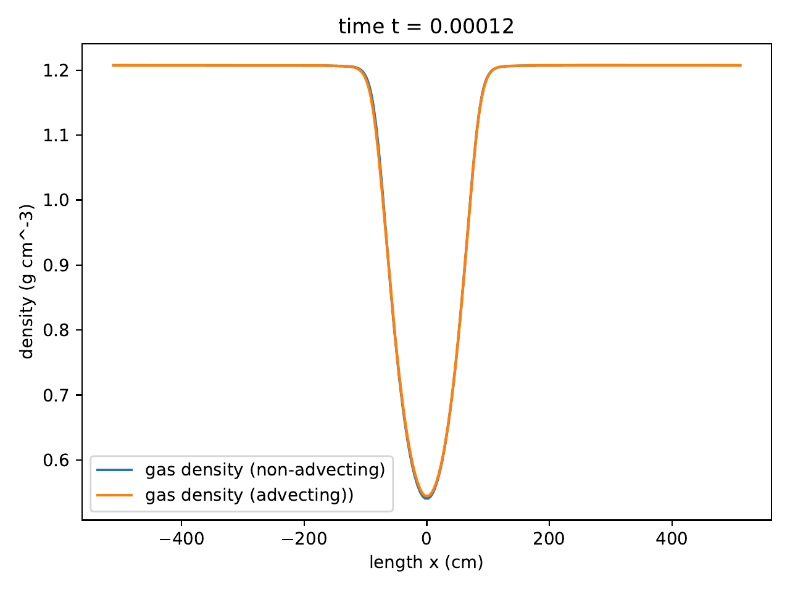

.. Advecting radiation pulse test

Advecting radiation pulse test
=========================

This test demonstrates the code’s ability to deal with the relativistic
correction source terms that arise from the mixed frame formulation of
the RHD moment equations, in a fully-coupled RHD problem. The problems
involve the advection of the a pulse of radiation energy in an optically
thick (:math:`\tau \gg 1`) gas in both static (:math:`\beta \tau \gg 1`)
and dynamic (:math:`\beta \tau \ll 1`) diffusion regimes, with a uniform
background flow velocity :cite:`Krumholz_2007`.

Parameters
----------

Initial condition of the problem in static diffusion regime:

.. math::

   \begin{align}
   T = T_0 + (T_1 - T_0) \exp \left( - \frac{x^2}{2 w^2} \right), \\
   w = 24 ~{\rm cm}, T_0 = 10^7 ~{\rm K}, T_1 = 2 \times 10^7 ~{\rm K} \\
   \rho=\rho_0 \frac{T_0}{T}+\frac{a_{\mathrm{R}} \mu}{3 k_{\mathrm{B}}}\left(\frac{T_0^4}{T}-T^3\right) \\
   \rho_0 = 1.2 ~{\rm g~cm^{-3}}, \mu = 2.33 ~m_{\rm H} \\
   \kappa_P=\kappa_R=\kappa = 100 \mathrm{~cm}^2 \mathrm{~g}^{-1} \\
   v = 10 ~{\rm km~s^{-1}} \\
   \tau = \rho \kappa w = 3 \times 10^3, \beta = v/c = 3 \times 10^{-5}, \beta \tau = 9 \times 10^{-2}
   \end{align}

The simulation is run till
:math:`t_{\rm end} = 2 w/v = 4.8 \times 10^{-5} ~{\rm s}`.

Initial condition of the problem in dynamic diffusion regime: same
parameters as in the static diffusion regime except

.. math::

   \begin{align}
   \kappa_P=\kappa_R=\kappa=1000 \mathrm{~cm}^2 \mathrm{~g}^{-1} \\
   v = 1000 ~{\rm km~s^{-1}} \\
   t_{\rm end} = 2 w/v = 1.2 \times 10^{-4} ~{\rm s} \\
   \tau = \rho \kappa w = 3 \times 10^4, \beta = v/c = 3 \times 10^{-3}, \beta \tau = 90
   \end{align}

Results
-------

Static diffusion regime:

.. figure:: attach/radhydro_pulse_temperature-1.png
   :alt: radhydro_pulse_temperature-static-diffusion

   radhydro_pulse_temperature-static-diffusion

.. figure:: attach/radhydro_pulse_density-1.png
   :alt: radhydro_pulse_density-static-diffusion

   radhydro_pulse_density-static-diffusion

.. figure:: attach/radhydro_pulse_velocity-1.png
   :alt: radhydro_pulse_velocity-static-diffusion

   radhydro_pulse_velocity-static-diffusion

Dynamic diffusion regime:

.. figure:: attach/radhydro_pulse_temperature.png
   :alt: radhydro_pulse_temperature-dynamic-diffusion

   radhydro_pulse_temperature-dynamic-diffusion

   radhydro_pulse_density-dynamic-diffusion

.. figure:: attach/radhydro_pulse_velocity.png
   :alt: radhydro_pulse_velocity-dynamic-diffusion

   radhydro_pulse_velocity-dynamic-diffusion
