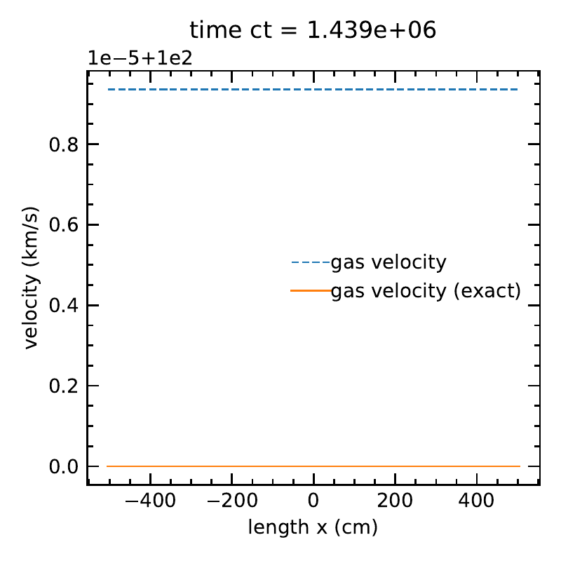

Uniform advecting radiation in diffusive limit
==============================================

In this test, we simulation an advecting uniform gas where radiation and
matter are in thermal equilibrium in the co-moving frame. Following the
Lorentz tranform, the initial radiation energy and flux in the lab frame
to first order in :math:`v/c` are :math:`E_r = a_r T^4` and
:math:`F_r = \frac{4}{3} v E_r`.

Parameters
----------

.. math::

   \begin{align}
   T_0 = 10^7~{\rm K} \\
   \rho_0 = 1.2 ~{\rm g~cm^{-3}}, \mu = 2.33 ~m_{\rm H} \\
   \kappa_P=\kappa_R=100 \mathrm{~cm}^2 \mathrm{~g}^{-1} \\
   v_{x,0} = 10 ~{\rm km~s^{-1}} \\
   E_{r,0} = a_r T_0^4 \\
   F_{x,0} = \frac{4}{3} v_{x,0} E_{r,0} \\
   t_{\rm end} = 4.8 \times 10^{-5} ~{\rm s}
   \end{align}

Results
-------

With :math:`O(\beta \tau)` terms:

.. figure:: attach/radhydro_uniform_advecting_temperature.png
    :alt: A figure showing the radiation temperature and material temperature as a function of time.

    The radiation temperature and matter temperatures, along with the exact solution.

.. figure:: attach/radhydro_uniform_advecting_velocity.png
    :alt: A figure showing the radiation velocity and material velocity as a function of time.

    The matter velocity, along with the exact solution.

Without :math:`O(\beta \tau)` terms:

.. figure:: attach/radhydro_uniform_advecting_temperature-nobeta.png
    :alt: A figure showing the radiation temperature and material temperature as a function of time.

    The radiation temperature and matter temperatures, along with the exact solution.

    The matter velocity, along with the exact solution.

Physics
-------

In the transport equation, both the radiation energy and flux are
unchanged because the radiation flux and pressure are uniform. In the
matter-radiation exchange step, the source term is zero since the
radiation and matter are in equilibrium. Finally, the flux is updated
following

.. math::

   \mathbf{F}_{r}^{(t+1)} = \frac{\mathbf{F}_{r}^{(t)} + \Delta t \left[ \rho \kappa_P \left(\frac{4 \pi B}{c}\right) \boldsymbol{v}c + \rho \kappa_F (\boldsymbol{v} :\boldsymbol{P}_r) c \right] }{1+\rho \kappa_{F} {c} \Delta t}.

With :math:`F_{r}^{(t)} = 4 v E_{r}^{(t)} / 3`, and
:math:`\kappa_P=\kappa_R=\kappa`, we have

.. math::

   \mathbf{F}_{r}^{(t+1)} = \frac{\frac{4}{3} v E_r^{(t)} + \Delta t \left[ \rho \kappa E_r^{(t)} \boldsymbol{v}c + \rho \kappa \boldsymbol{v} (\frac{1}{3}E_r^{(t)}) c \right] }{1+\rho \kappa {c} \Delta t} = \frac{4}{3} v E_r^{(t)} = F_{r}^{(t)}

Therefore, :math:`F_r` remains constant. This demonstrates that the code
is invariant under Lorentz transformation.

We can also show that, with the :math:`O(\beta \tau)` terms in the
matter-radiation exchange step, the space-like component of the
radiation four-force vanishes:

.. math::

   \begin{align}
   -G &= -\rho \kappa_F \frac{\boldsymbol{F}_r}{c} + \rho \kappa_P\left(\frac{4 \pi B}{c}\right) \frac{\boldsymbol{v}}{c}+\rho \kappa_F \frac{\boldsymbol{v} :\boldsymbol{P}_r}{c} \\
   &= -\rho \kappa \frac{4}{3} E_r v / c + \rho \kappa E_r v / c+ \rho \kappa \frac{1}{3} E_r v / c \\
   &= 0
   \end{align}

.. |radhydro_uniform_advecting_temperature| image:: attach/radhydro_uniform_advecting_temperature.png
.. |radhydro_uniform_advecting_velocity| image:: attach/radhydro_uniform_advecting_velocity.png
.. |radhydro_uniform_advecting_temperature-nobeta| image:: attach/radhydro_uniform_advecting_temperature-nobeta.png

