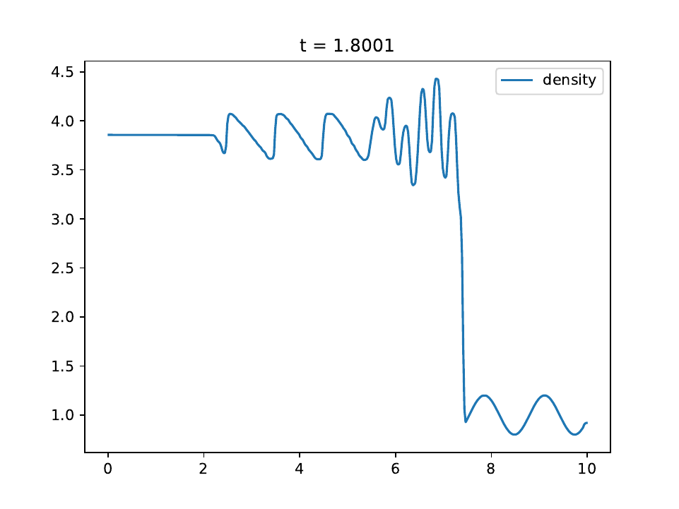

.. Shu-Osher shock test

Shu-Osher shock test
====================

This test problem demonstrates the ability of the code to resolve fine
features and shocks simultaneously. The resolution of our code is comparable to the
ENO-RF-3 scheme shown in Figure 14b of :cite:`Shu_1989`.

Parameters
----------
The left- and right-side initial conditions are:

.. math::
    \rho_0 = 3.857143 \\
	v_{x,0} = 2.629369 \\
	P_0 = 10.33333 \\

	\rho_1 = 1 + 0.2 \sin(5 x) \\
	v_{x,1} = 0 \\
	P_1 = 1
..

Solution
--------

We use the RK2 integrator with a fixed timestep of :math:`10^{-4}`
and a mesh of 400 equally-spaced zones. There are some subtle stair-step artifacts
similar to those seen in the sawtooth linear advection test, but these converge away
as the spatial resolution is increased. These can be eliminated by
projecting the primitive variables into characteristic waves and reconstructing
the interface states in the characteristic variables, as done in §4 of :cite:`Shu_1989`.

    The density is shown as the solid blue line. There is no exact solution for this problem.